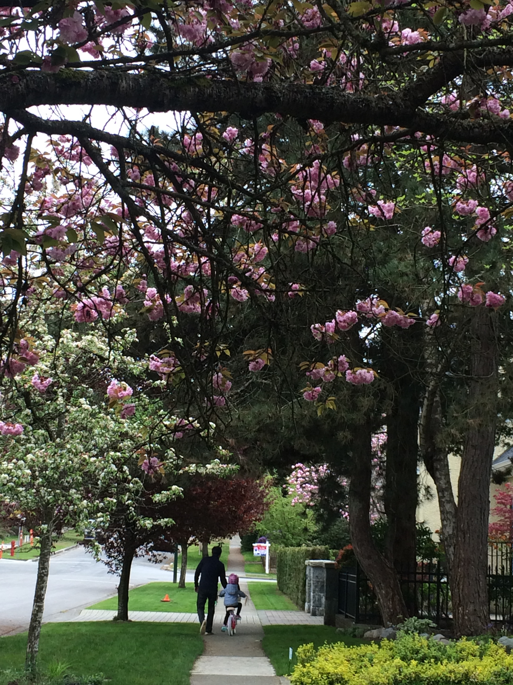

---

date: (2015-11-30 14:25:00)
categories:
    - 暖暖写作空间-writing
title: 2015 口头作文四则
description: "今天我可以不用爸爸扶，不用戴护膝、护腕，只戴头盔，骑着单车，直接从山坡上冲下去，而且还是在马路中间。"
image: image_0.jpg
---
# 目录

[1 我骑单车](#1我骑单车)

[2 小狗去暖暖家](#2-小狗去暖暖家)

[3 柔柔](#3柔柔)

[4 今天是情人节](#4今天是情人节)

# 1）我骑单车    
    2015/4/13

今天我可以不用爸爸扶，不用戴护膝、护腕，只戴头盔，骑着单车，直接从山坡上冲下去，而且还是在马路中间。

太可怕了？不怕，因为有爸爸在旁边保护呢。我一点也不怕。可是，也有过一次，我的心怦怦直跳，吓得我腿都是软的。

第一次骑单车，是爸爸一直扶着我，他一点也不轻松，他说太累了，要回家了。

第二次，我一下子就学会了。我什么也不怕了，不用戴护膝、不用戴护腕，只戴头盔，一下子就从坡上冲下去了。姐姐在一旁直喊：“太可怕了，要是有汽车过来，撞上暖暖怎么办？”

因为有爸爸在一旁保护着呢，所以不用怕。

我觉得我骑车像小鸟一样，不，就是一只飞着的小鸟。因为我轻轻的一跺脚，轻松地踩轮着，而且不用费一点力气就可以上坡（爸爸在推我呢），掉头后，一下子就从山坡上冲下去了。我说我像只小鸟，可姐姐说：“你不觉得你这只小鸟还在地上吗？”

我们家只有我一个人有单车，我想可能是因为他们觉得单车太贵了，所以只有我可以骑。

骑单车真的很快乐！

# 2) 小狗去暖暖家            

    2015.2. 6

从前，有一只小狗，他要去暖暖家。他先过了一条马路，又要过一个森林。在森林里的时候，一只狗熊从草丛里跳了出来，他对小狗说，我要吃掉你。小狗说：“不行不行，因为我是狗，你是狗熊，我们都有一个狗字，所以，我们应该是好朋友。”狗熊想了想说，觉得有道理，就没有吃掉小狗。小狗继续走，走到一个房子里，房子里住着一个女巫，女巫说：“我要把你变成魔法药水。”小狗就拿来一个镜子、一个戒指，还有一个创可贴。然后，女巫在小狗后面追呀追，小狗先是丢在草地上一个镜子，因为这个镜子有魔法。女巫想了想，他继续追小狗。第二次，小狗丢了一个创可贴在草地上，女巫又想了想，他又继续追。最后，小狗丢了一个戒指到草地上，这一回， 戒指变成了一根绳子，女巫被捆了起来。小狗去了警察局，告诉警察说：“我抓了一个女巫。”警察不相信，说：“女巫？”小狗说：“是的。”警察抓住了女巫，从此，女巫就没有了。小狗继续向前走，过了马路，进了一条街，又过了一条马路，到了酒店，上了电梯，按了27楼，顺利地找到了暖暖家。进了暖暖的房间，上到了暖暖的摇篮床，大声地说：“暖暖抱！”

# 3）柔柔

    2015.2

我有一个小兔子，名字叫柔柔。它很软，所以叫柔柔。可是，它总想吃胡萝卜，我家没有胡萝卜呀。让它先饿着吧！现在我要去找胡萝卜了！找到了。

看，它吃得多高兴呀！

晚上它在看星星的时候，嘴里还啃着胡萝卜呢！它睡觉都啃着呢。因为兔子最喜欢的零食就是胡萝卜了。

现在我要给小兔子出数学题了：

10+1= ？ 暖暖帮它说是 11。

14+4=  ？ 兔子说，等于16，暖暖说应该是18。

888888888888888，这是什么意思呢？我偷偷地告诉姐姐，是再见的意思。

# 4）今天是情人节

    2015.2. 14         

今天是情人节，暖暖我第一次在加拿大过情人节。今天棒棒糖来到我们家了，唐老鸭也来了，小蜡笔 也来了，彩色软糖也来了。

呵呵，东西太多了。这些都是我的朋友们送给我的情人节礼物。只是，今年我没有送给他们礼物，因为我不知道。明年，我一定要给我的朋友们准备情人节礼物。

我很高兴，赶快给我的小狗狗雅飞吃块棒棒糖吧！