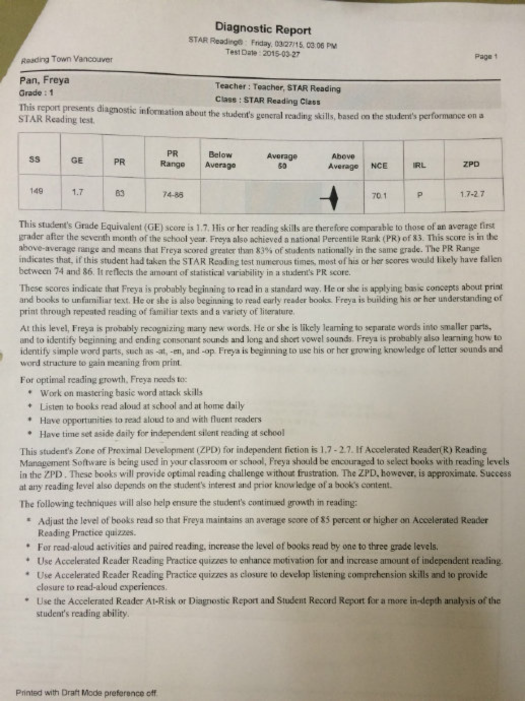
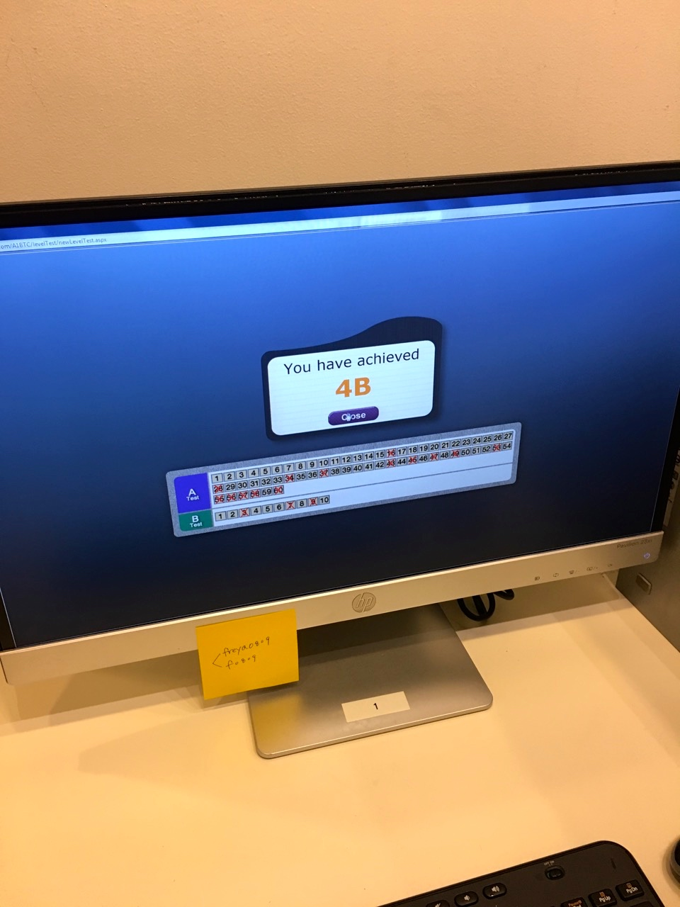
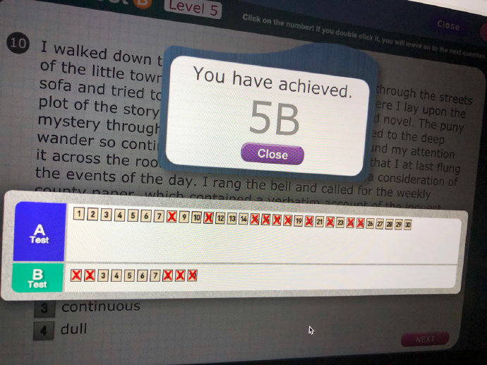

---

2015-11-30 15:52:48
categories:
    - 暖暖阅读脚印-reading
title: 2015.3.27  Reading Town Report

tags:
    - Reading Town
    
    - 英语
description: "RT，虽然考到二年级水平，但考虑到刚来半年不到，1C开始读。 2014.10 到加拿大，进Kindergarten 2015年 3.27 RT，虽然考到二年级水平，但考虑到刚来半年不到，1C开始读。 ..."
image: image_0.png
---

RT，虽然考到二年级水平，但考虑到刚来半年不到，1C开始读。

   

# 2014.10  
  
到加拿大，进Kindergarten

## 2015年

  

3.27  
  
RT，虽然考到二年级水平，但考虑到刚来半年不到，1C开始读。

  

3.29 RT  
  
1C开始------ 5.7  
  

5.14  RT, 2A开始\-------6.16

6.16  RT, 2B开始\------- 7.20 

7.27  RT,  
  
2C 开始\-------  
  
8.31

9.10  RT,  
--- 
3A 开始 
  
10.15

10.29  RT,  
--- 
3B 开始
  
11.26

12.10  RT,  
---  
3C 开始\-------2016.1.7

## 2016

### 1.7  RT, 4A开始\--------2016.3.16--STOP

## 2016.8.10 Learning Gate

2016.8.10---2017.4.10  
历时250天，在 Learning Gate 读了66本书

## 2017

10.9   
  
4C开始------------RT  RESTART 

10.26 5A开始-----

12.8  5B开始-----

  

## 2018

1.25  5C开始

2.22 6A开始

3.26  6B开始

  

4.6

2018.4.6--5.31  在Learning Gate 读了16本书