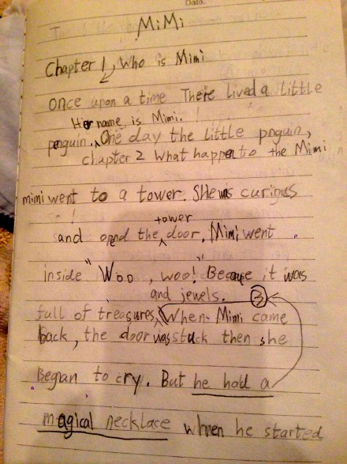
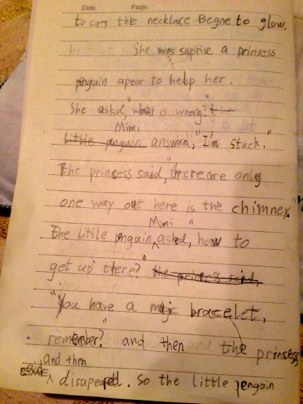
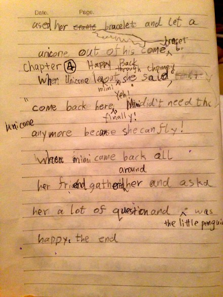

---

date: 2015-12-01 02:36:26
categories:
    - 暖暖艺术画廊-art
title: Mimi
description: "Once upon a time, there lived a little penguin. Her name is Mimi."
image: image_0.jpg
---

# Mimi
2015.11.23 

## Table of Contents

1. [Who is  MiMi](#chapter-1---who-is--mimi)

2. [What happened to the Mimi](#chapter-2--what-happened-to-the-mimi)

3. [Mimi had a magical necklace and bracelet](#chapter-3--mimi-had-a-magical-necklace-and-bracelet)

4. [Finally Back](#chapter-4--finally-back)

## Chapter 1   Who is  Mimi

Once upon a time, there lived a little penguin. Her name is Mimi.

## Chapter 2  What happened to the Mimi

One day, the little penguin, Mimi, went to a tower. She was curious and opened the tower door. Mimi went inside,” Woo, Woo!!” It was full of treasures and jewellerys!

## Chapter 3  Mimi had a magical necklace and bracelet

When Mimi came back, the door was stuck then she began to cry and her necklace began to glow. She was surprised a princess penguin appeared to help her,”What is wrong?”

Mimi answered,” I’m stuck.”

The princess said,”There are only one way out here is the chimney ”

The little penguin Mimi asked, ”How to get up there ? ”

“You have a magic bracelet, remember?” the princess said and then disappeared.

So the little penguin used her bracelet and let a unicone out of his bracelet.

## Chapter 4  Finally Back

When Unicone lead Mimi got out through the chimey, she said，“Come back finally! Yah!”

Mimi didn’t need the unicone anymore because she can fly!

When Mimi came back all her friend gathered around her and asked her a lot of questions and the little penguin was happy!

THE END

