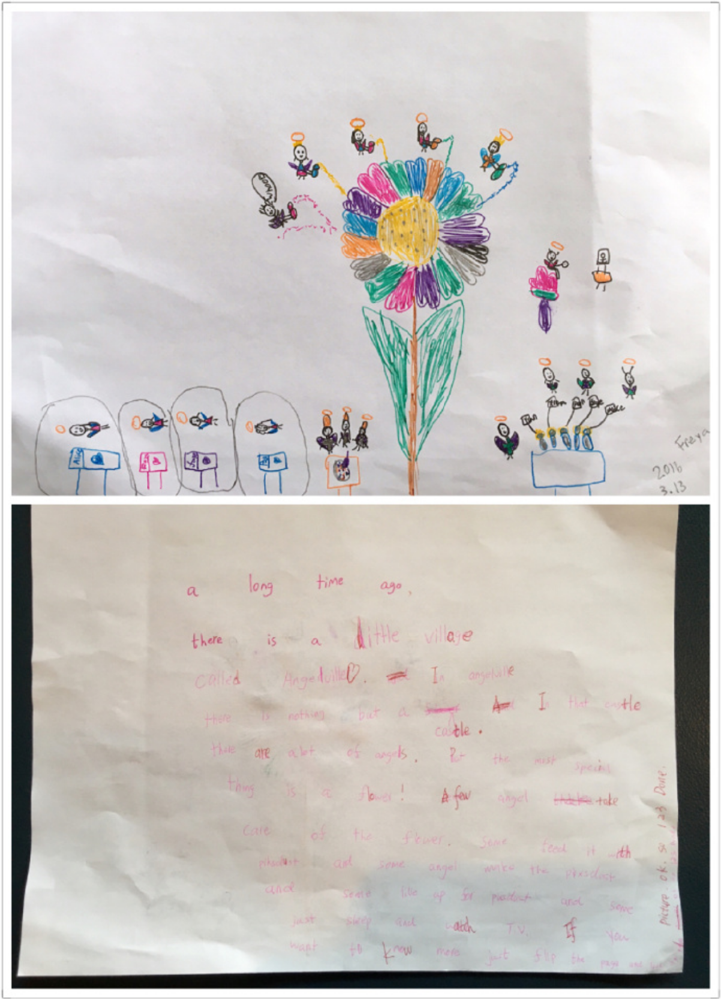

---

date: 2016-03-16 01:33:08
categories:
    - 暖暖写作空间-writing
title: 76@365 2016.3.15故事画：花丛里的小天使
description: "小女孩子 的世界真的很美好 A long time ago, there is a little village called Angelville. In Angelville there is n..."
image: image_0.png
---

小女孩子 的世界真的很美好

  

A long time ago, there is a little village called Angelville. 

In Angelville there is nothing but a castle.

In that castle there are a lot of angels.

But the most special thing is a flower !

A few angels take care of the flower.

Some feed it with pixsdust and some make the pixsdust and some live up for pixsdust and some just sleep and watch TV.

If you want to know more just flip the page and look at the picture.

Ok,So 1,2,3,Done.......