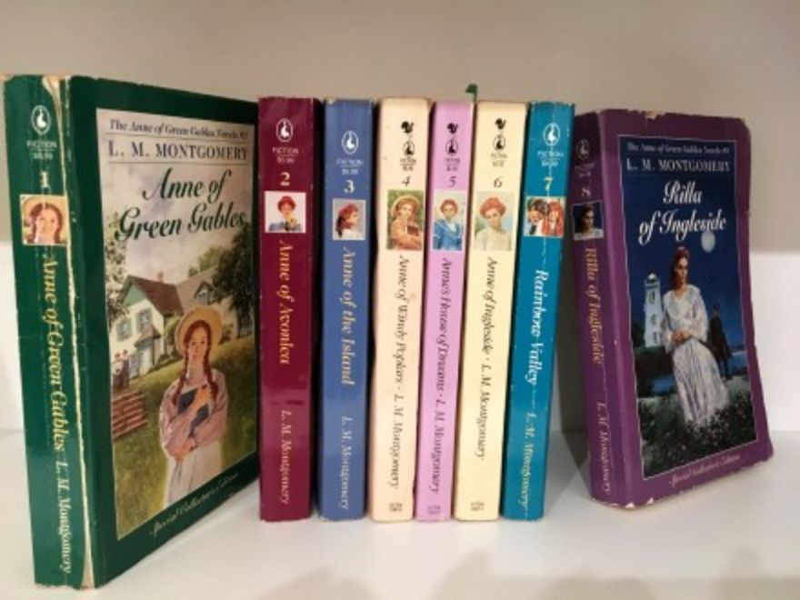
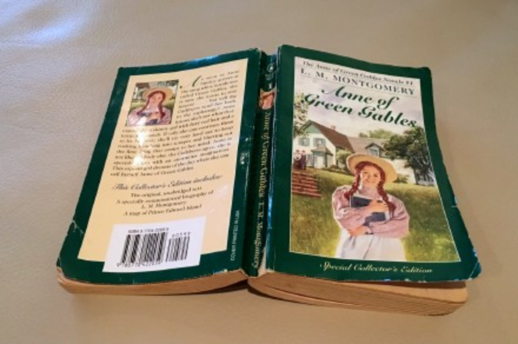
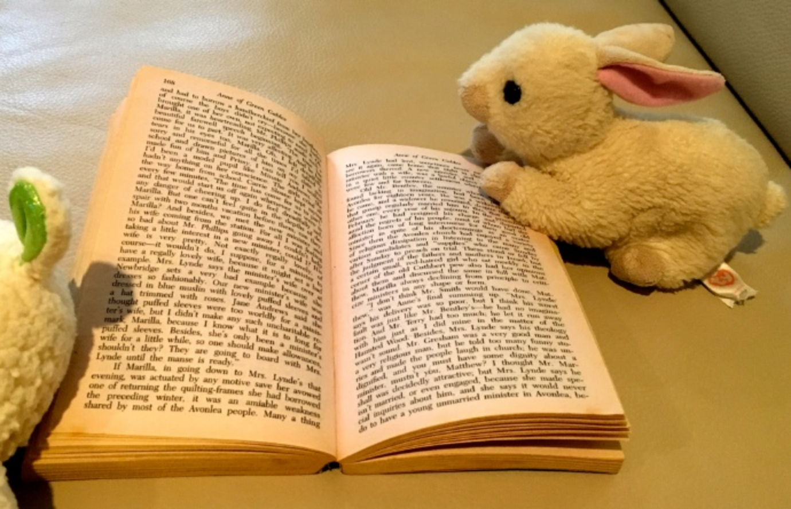

---

date: 2016-05-02 01:06:06
categories:
    - 暖暖阅读脚印-reading
tags:
    - 英语
title: '绿山墙的小女孩'
description: "暖暖说，只要随手把ANNE OF GREEN GABLE拿过来看两眼， 第二天再找，发现书会长腿，会自己跑回到书架里。 回回都是这样 怎么回事？？ 终于，有一天，姐姐挑明了，“这是我的书，不许拿” “..."
image: image_1.png
---

暖暖说，只要随手把ANNE OF GREEN GABLE拿过来看两眼，

第二天再找，发现书会长腿，会自己跑回到书架里。

回回都是这样

怎么回事？？

  

终于，有一天，姐姐挑明了，“这是我的书，不许拿”

“我也要看！这也是我的书”

  

抢来的永远是香饽饽

没几天，三百多页看完了

还能如数家珍的把之后几本每本大概讲什么说得头头是道

现在，只要我说，“这8本一套是心心的至爱珍藏，讲一个小女孩子从生到死的故事”

姐妹俩都会一起跳起来：“没有死，好嘛！！”

  

  

  

  

  

  
  
