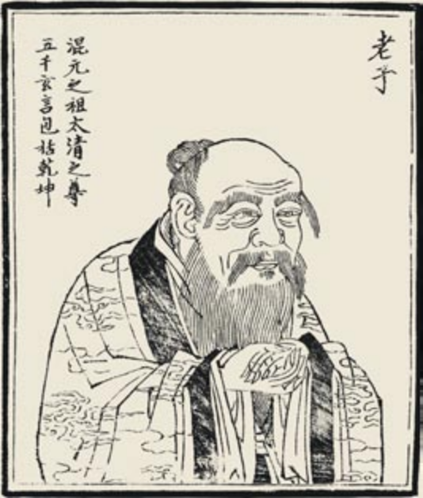
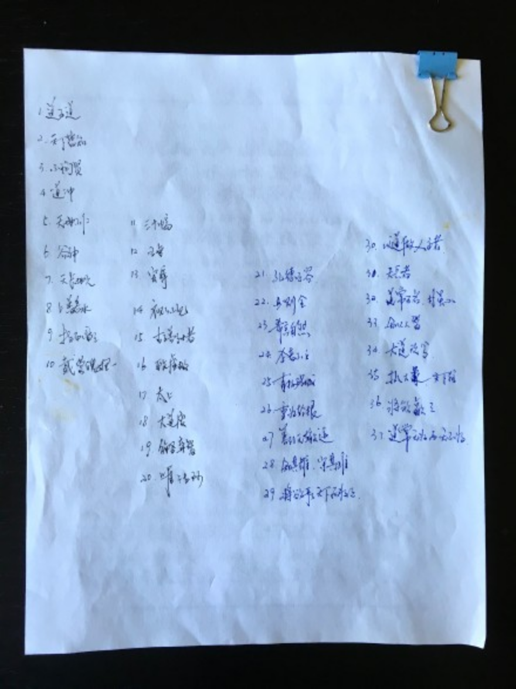
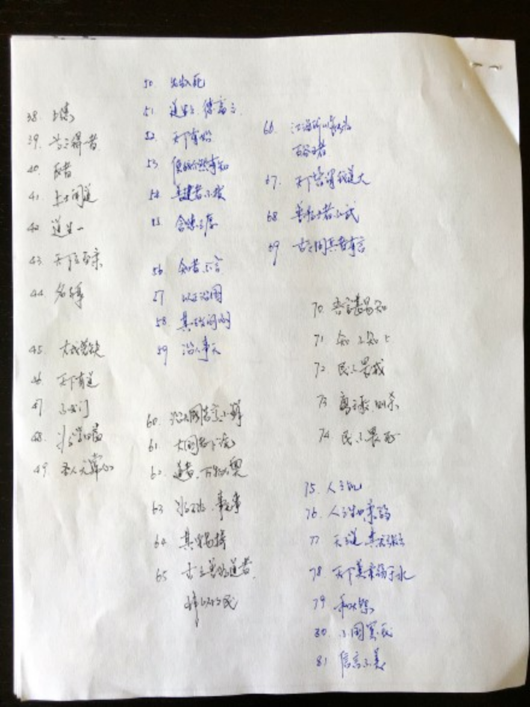

---

date: 2016-10-13 03:10:39
categories:
    - 暖暖阅读脚印-reading
title: 中：道德经
description: "从2016年4月19日到6月6日，用了48天的时间，每天早晚各半个小时，和小暖一起把81章的《道德经》背完了[胜利] 最大的感触就是＂道可道，非常道＂，真正是可意会不可言传，每每诵之总有心领神会，欢喜..."
image: image_0.png
---

从2016年4月19日到6月6日，用了48天的时间，每天早晚各半个小时，和小暖一起把81章的《道德经》背完了[胜利] 最大的感触就是＂道可道，非常道＂，真正是可意会不可言传，每每诵之总有心领神会，欢喜莫名。正如老师们所说，这么完美完整的大智慧，不要去给孩子解，＂道可道非常道＂，让孩子随着自己的成长常悟常新一一＂道之出口，淡乎无其味，视之不足见，听之不足闻，用之不足既＂

  
  
  

  

