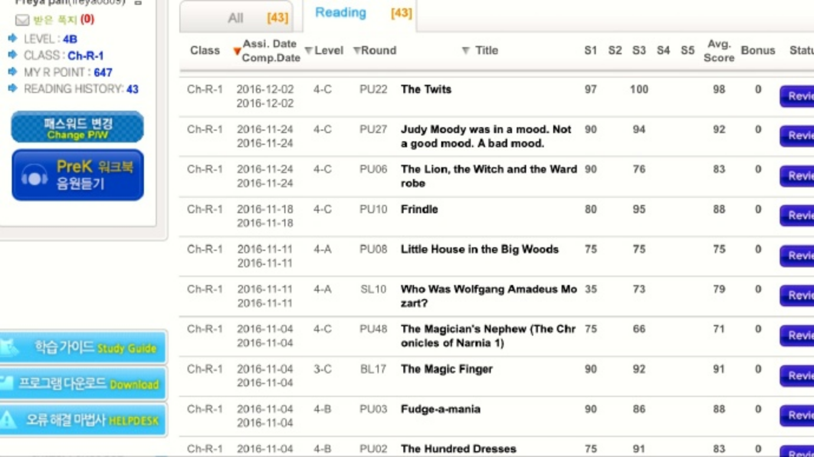
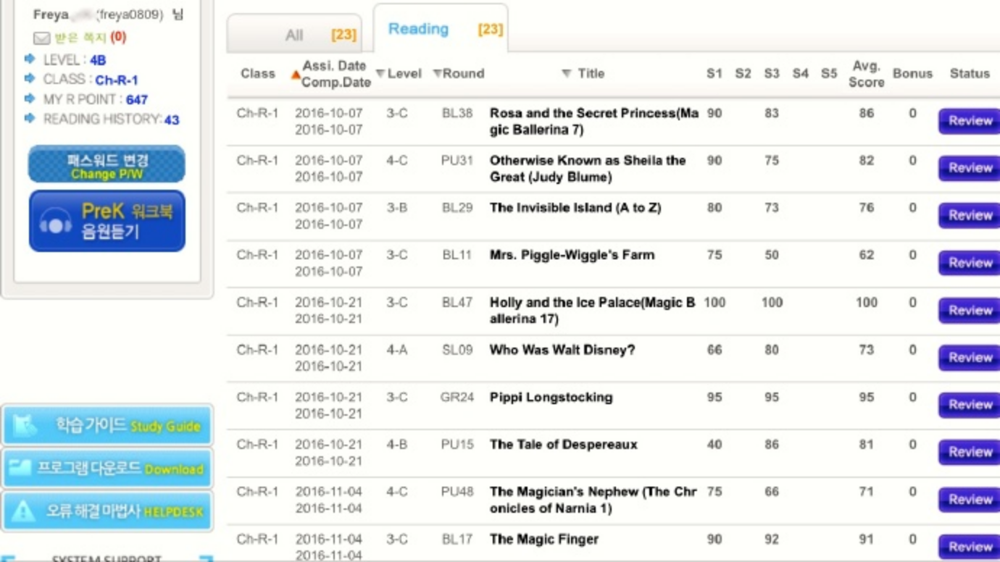
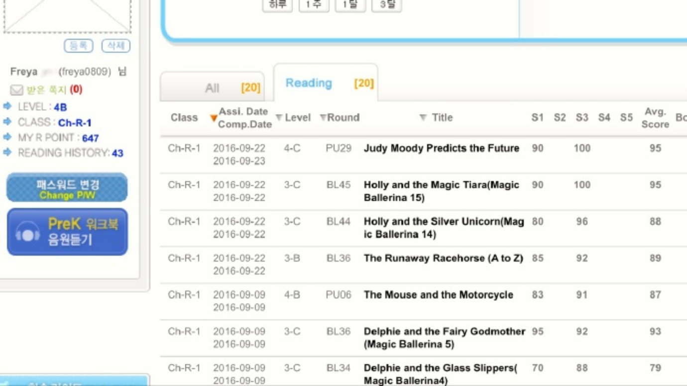
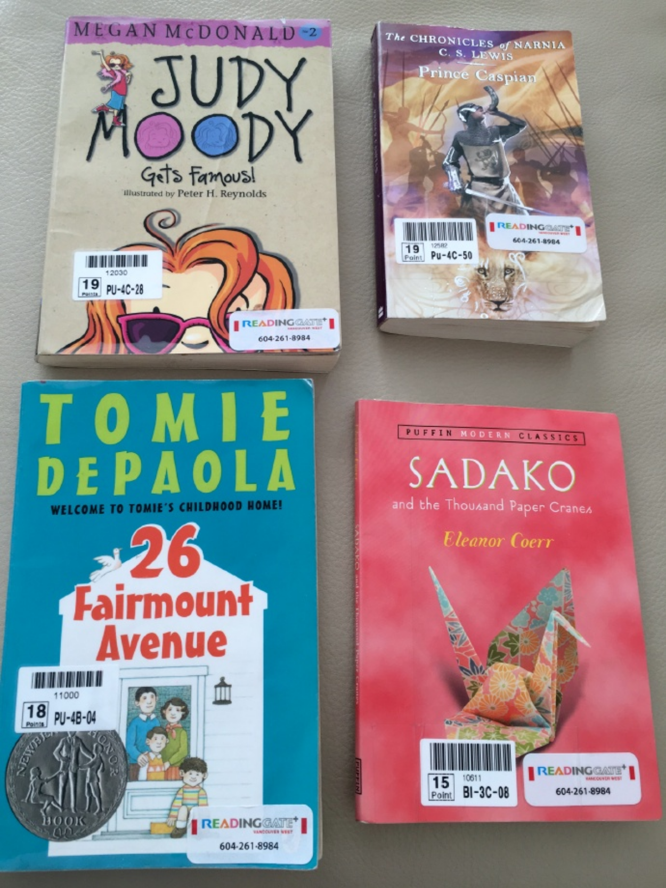
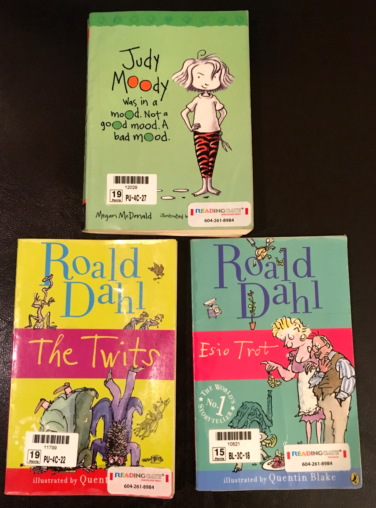
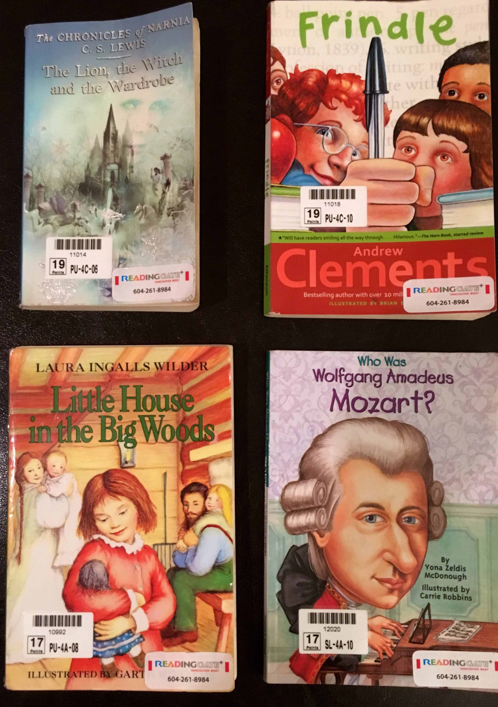

  

2016.8.10 - 12.30  ,不知不觉，在Learning Gate 读了43本书了

  

  
  
  
  
  

  
  

4-C  **Judy Moody gets famous!**

4-C  **Judy Moody Predicts the Future**

4-C  **Otherwise Known as Sheila the Great (Judy Blume)**

4-C  The Magician's Nephew (The Chronicles of Narnia 1)

4-C  Frindle

4-C  Judy Moody was in a mood. Not a good mood. A bad mood.

4-C  The Lion, the Witch and the Wardrobe1

4-C  The Lion, the Witch and the Wardrobe2

4-C  The Lion, the Witch and the Wardrobe4

4-C  The Twits

  

4-A  **Who Was Walt Disney?**

4-B  **The Tale of Despereaux**

4-B  **26 Fairmont Avenue**

**  
**

**  
**

3-C  **Holly and the Magic Tiara(Magic Ballerina 15)**

3-C  **Holly and the Silver Unicorn(Magic Ballerina 14)**

3-C  **Mrs. Piggle-Wiggle's Farm**

3-C  **Holly and the Ice Palace(Magic Ballerina 17)**

3-C  **Rosa and the Secret Princess(Magic Ballerina 7)**

3-C  **Pippi Longstocking**

**  
**

**  
**

**  
**

  
  

  

  