---

date: 2017-01-03 05:11:56
categories:
    - 暖暖数学思维-math
title: 寒假数学  MATH IN WINTER（七岁二年级）
description: "新加坡数学四年级+挑战应用题三年级 SINGAPORE MATH G4 + SINGAPORE MATH G3 CHALLENGING WORD PROBLEMS 正在做的两本书, from 2016..."
image: image_0.png
---

新加坡数学四年级+挑战应用题三年级 

SINGAPORE MATH G4 \+ SINGAPORE MATH G3 CHALLENGING WORD PROBLEMS  
  

  

正在做的两本书, from 2016.12

  

  

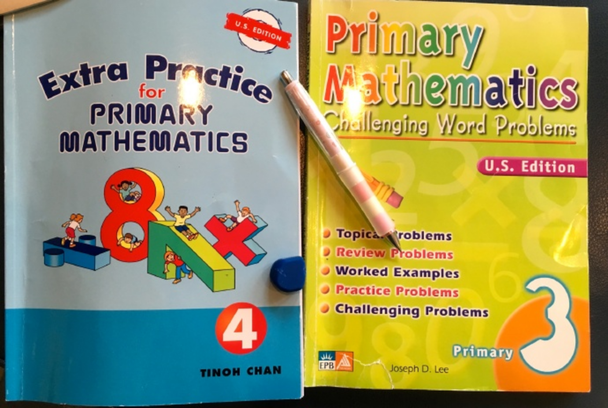  
  

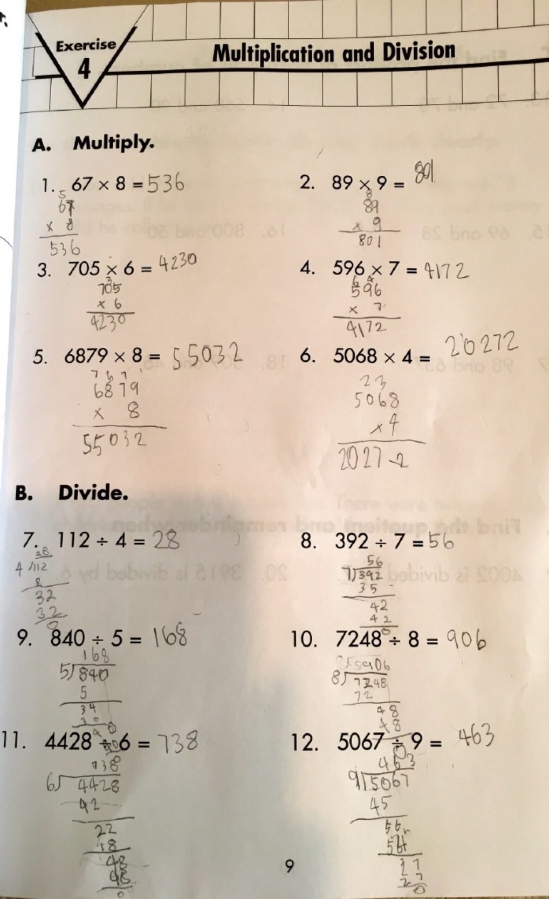

  
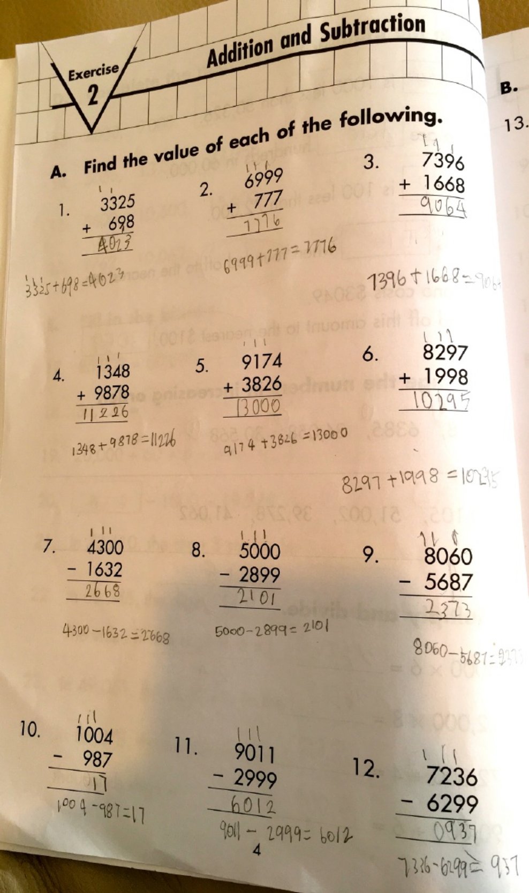

---
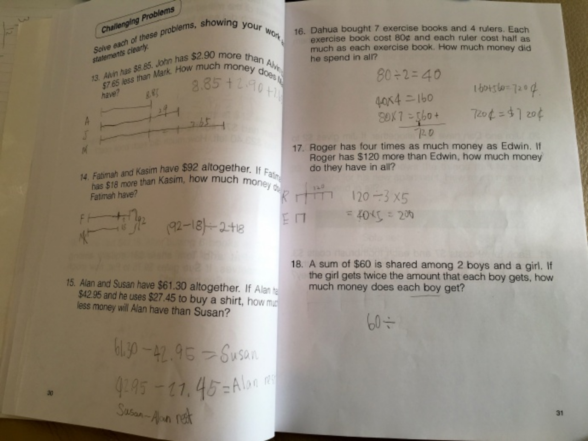  
  
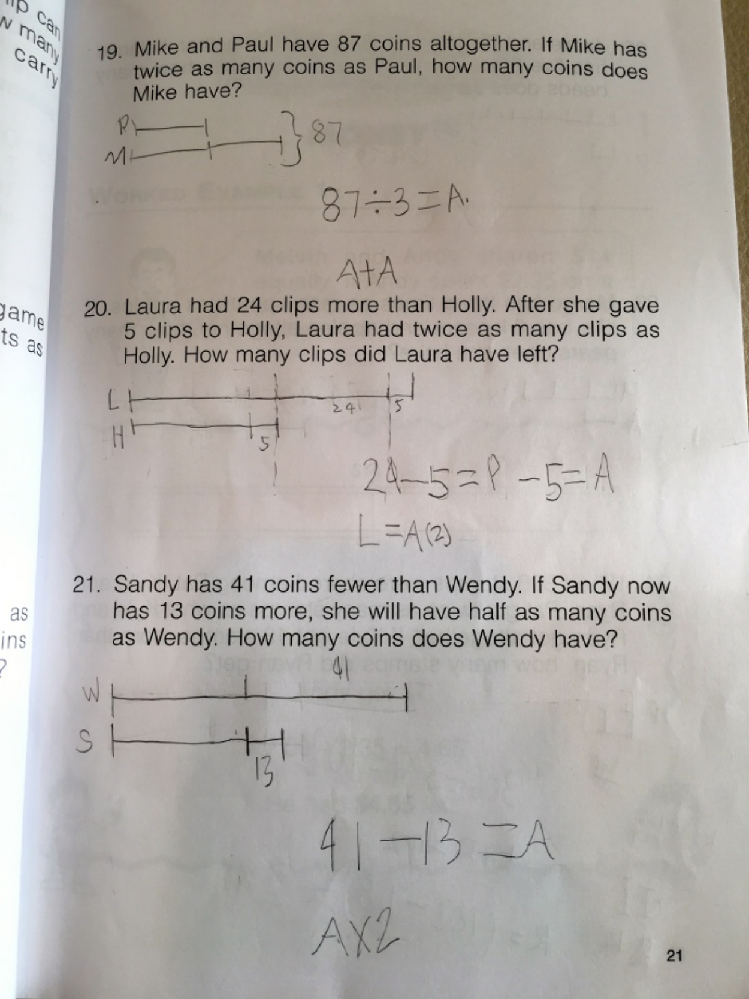  
  
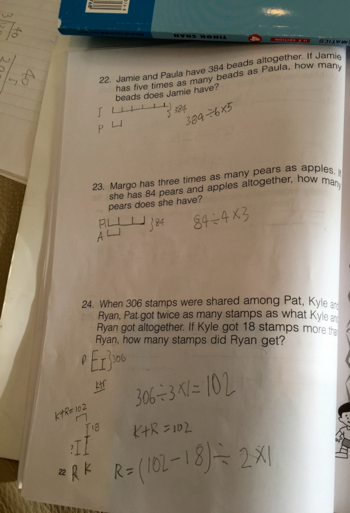  
  
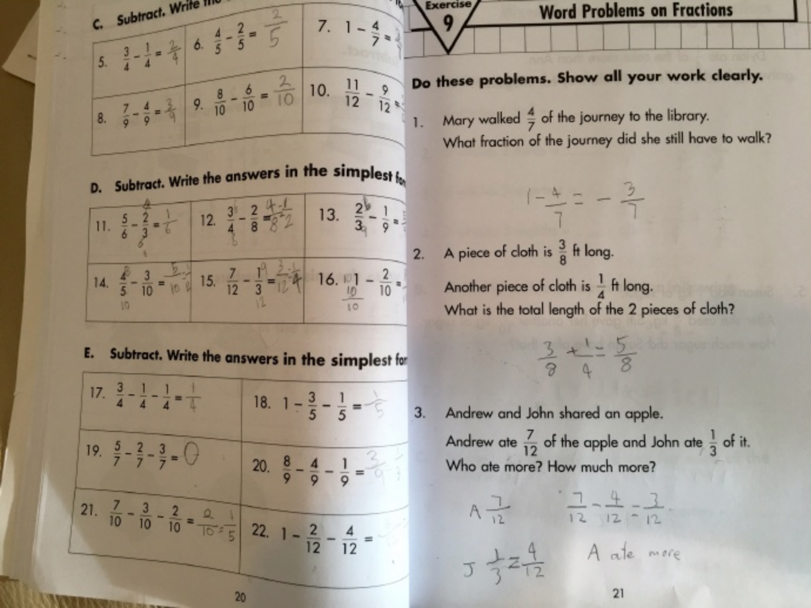  
  
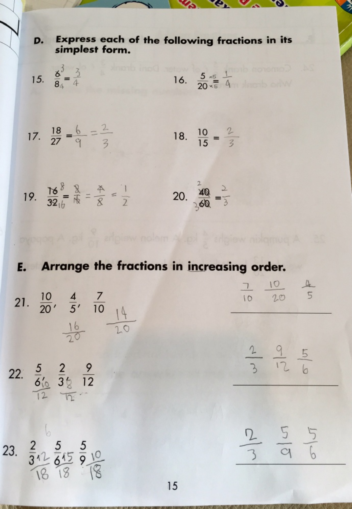  
  
  
  
  
  
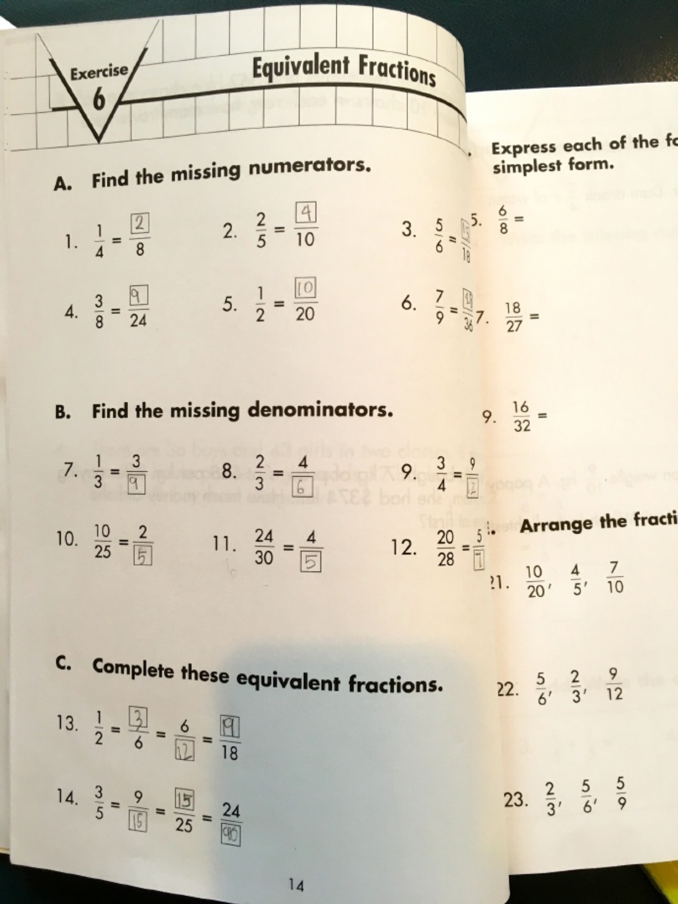

---

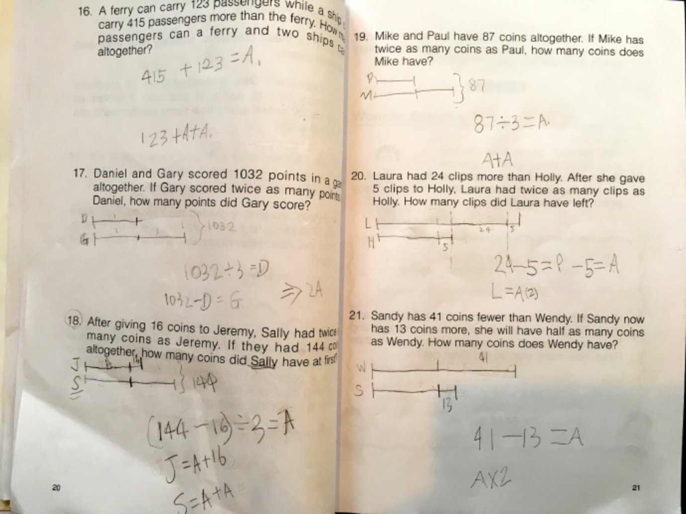  
  
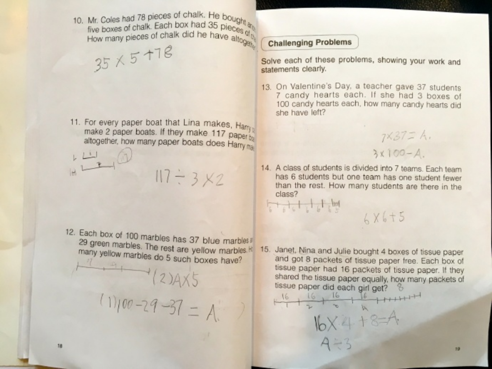  
  
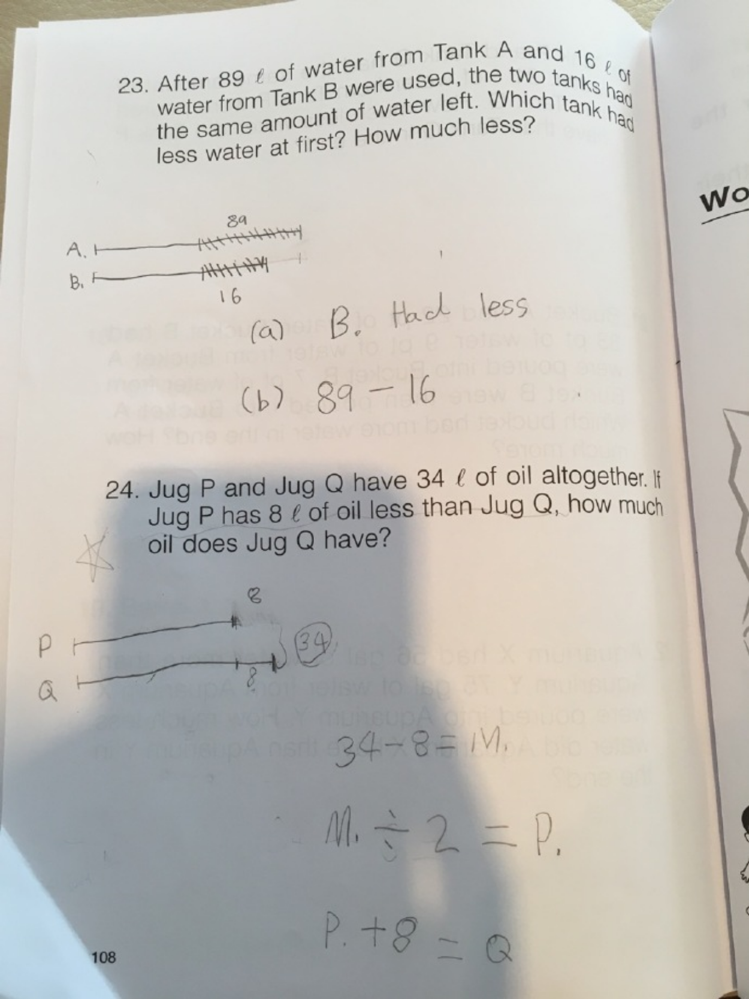  
  
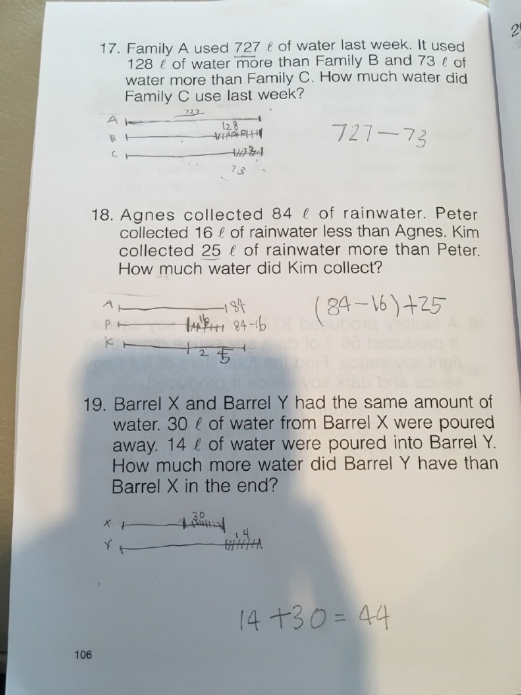