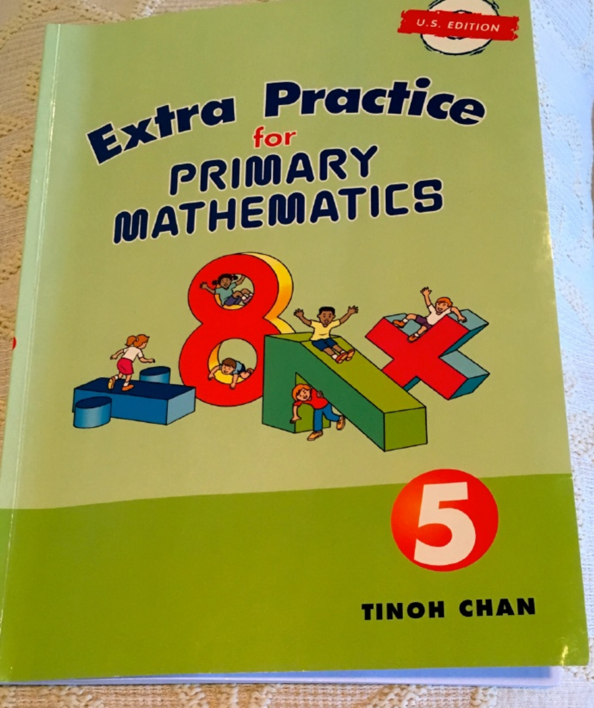
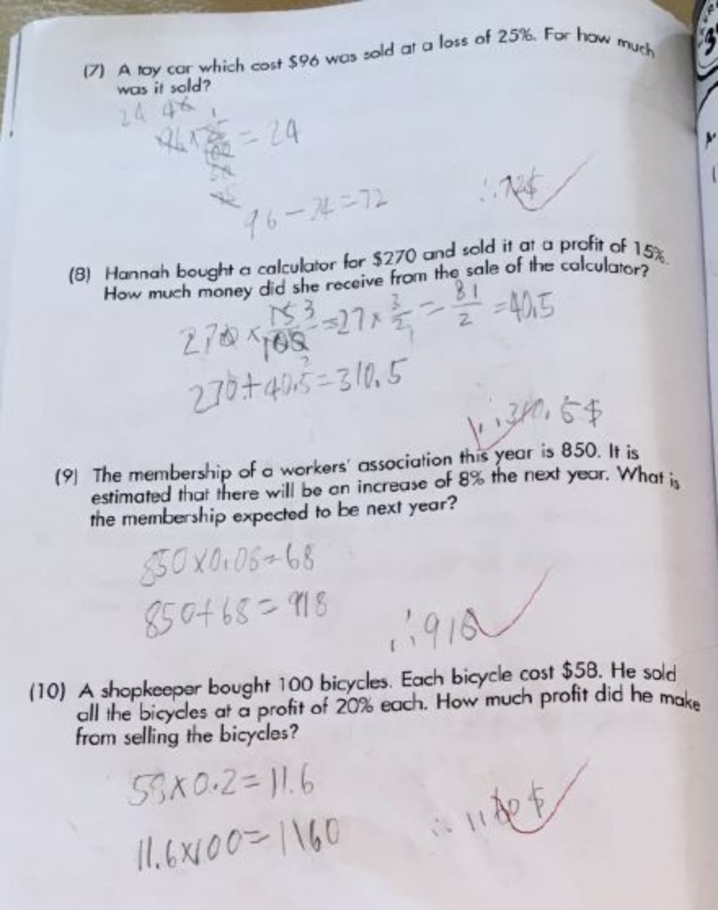
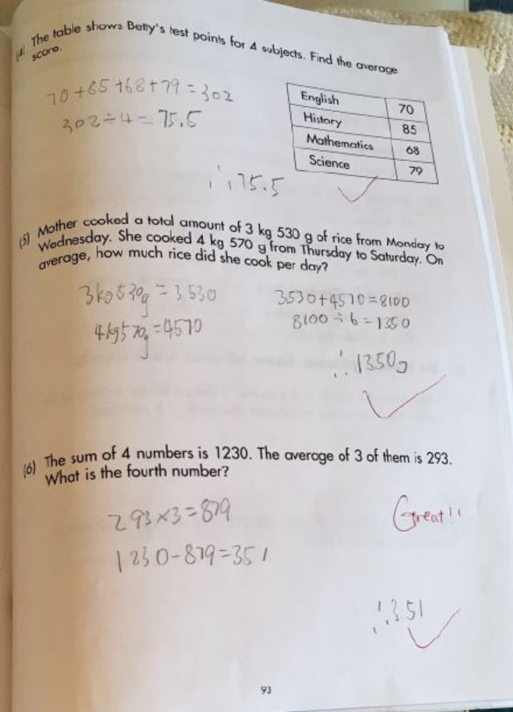
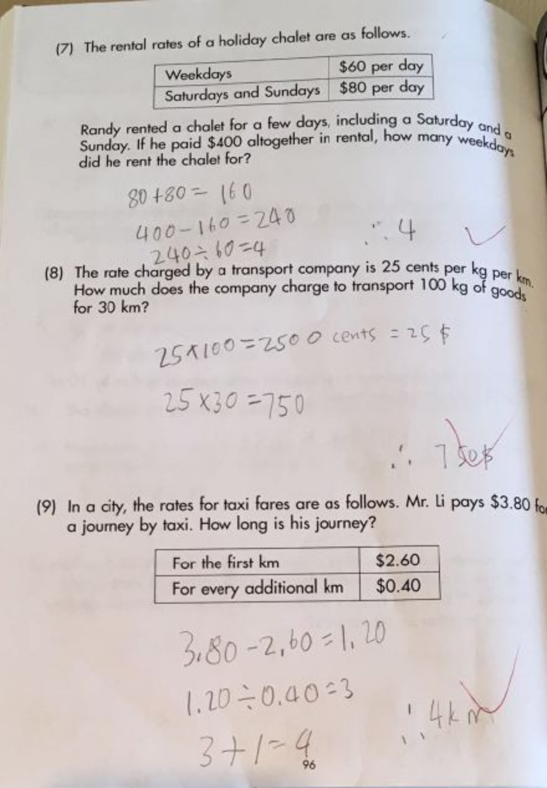
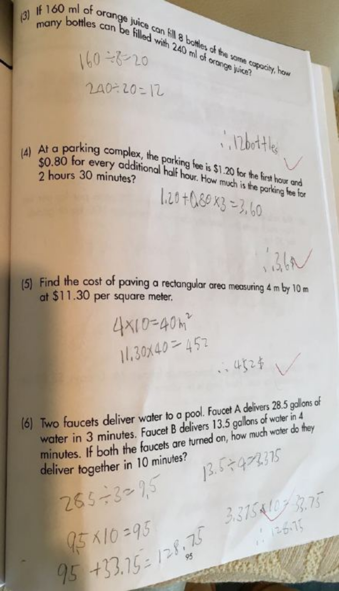
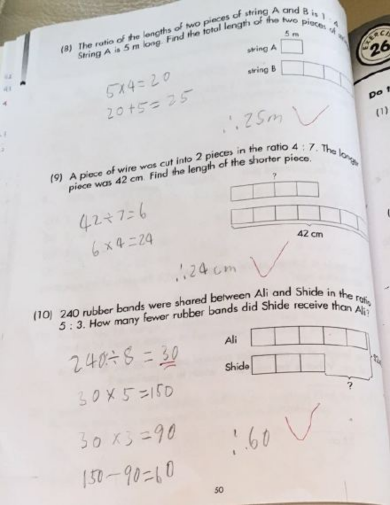

---

date: 2017-05-06 03:31:05
categories:
    - 暖暖数学思维-math
title: Percentage,Average,Rate,Ratio的应用题概念清晰
description: "小宝贝暖暖从4月23号开始，在做五年级的新加坡数学 这两天关于Percentage,Average,Rate,Ratio的应用题独立完成得非常棒，概念很清晰！ 分数，小数，比例和百分数的计算换算也开始..."
image: image_1.png
---

小宝贝暖暖从4月23号开始，在做五年级的新加坡数学

  

这两天关于Percentage,Average,Rate,Ratio的应用题独立完成得非常棒，概念很清晰！ 

分数，小数，比例和百分数的计算换算也开始熟练！

  

  

  

  
  
  
  
  

