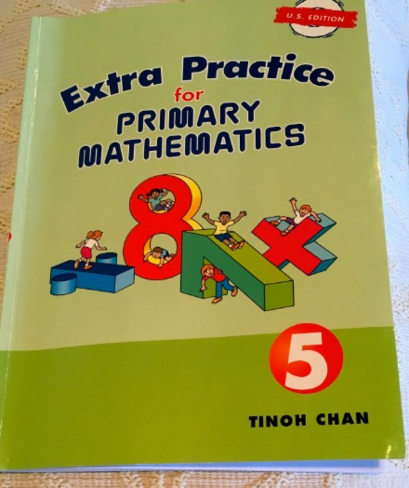
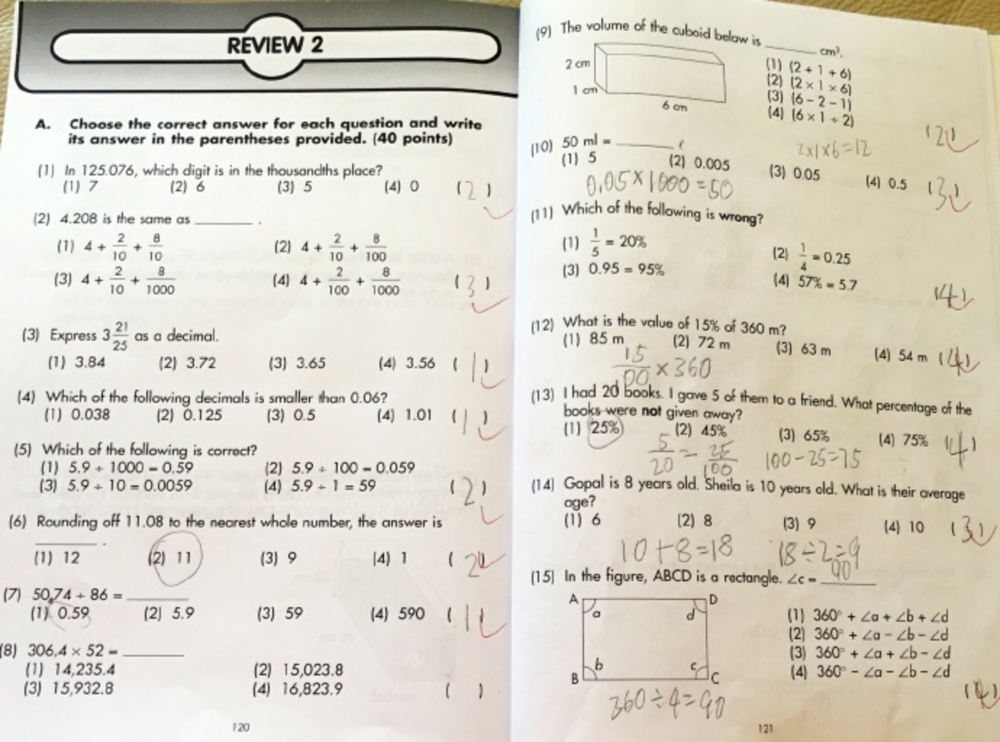
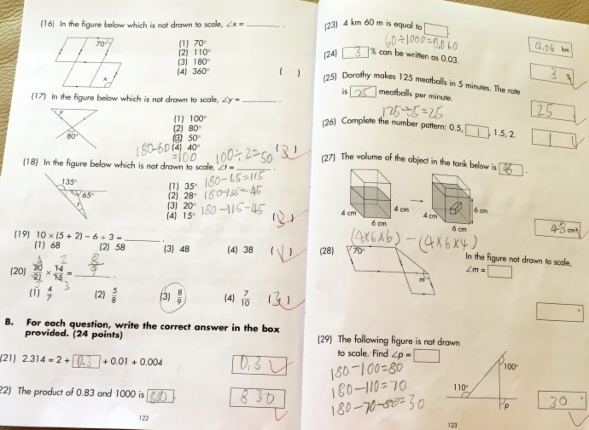
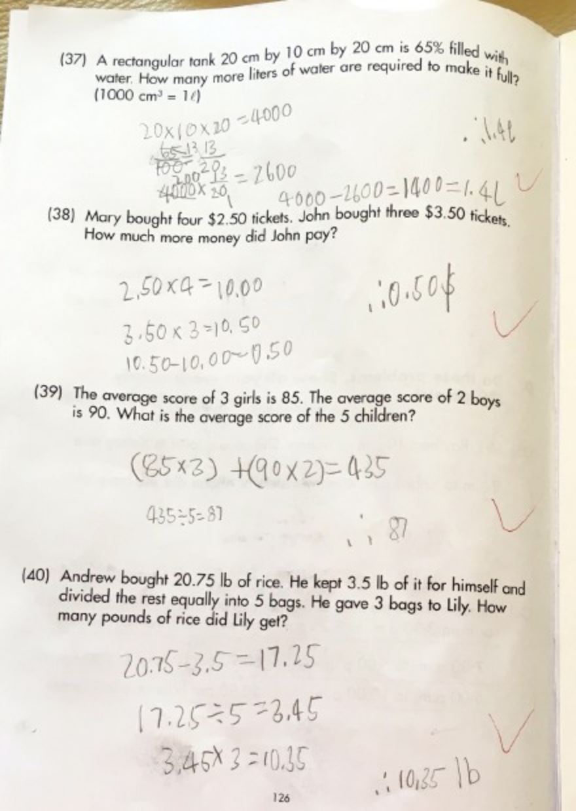
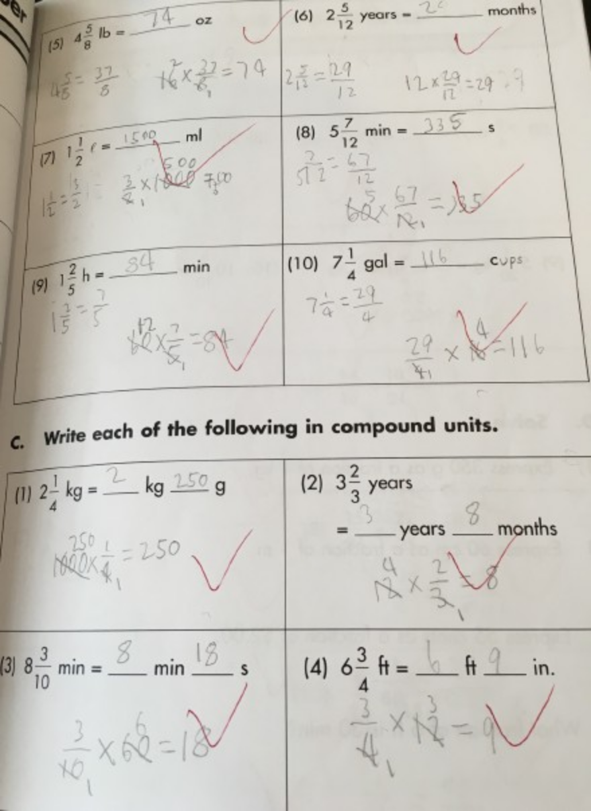
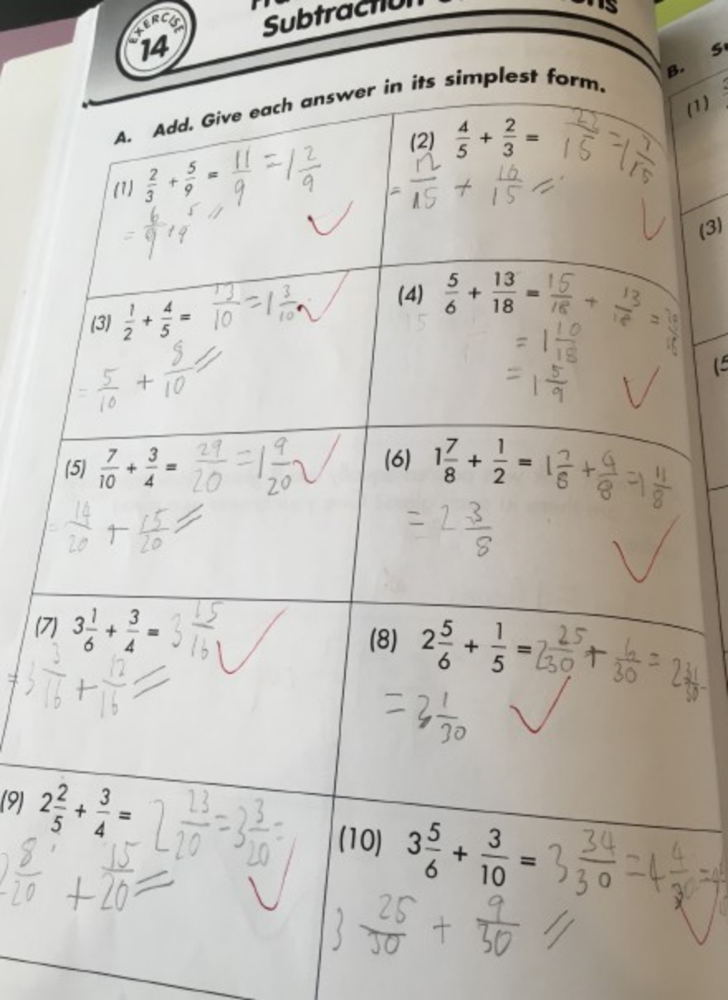
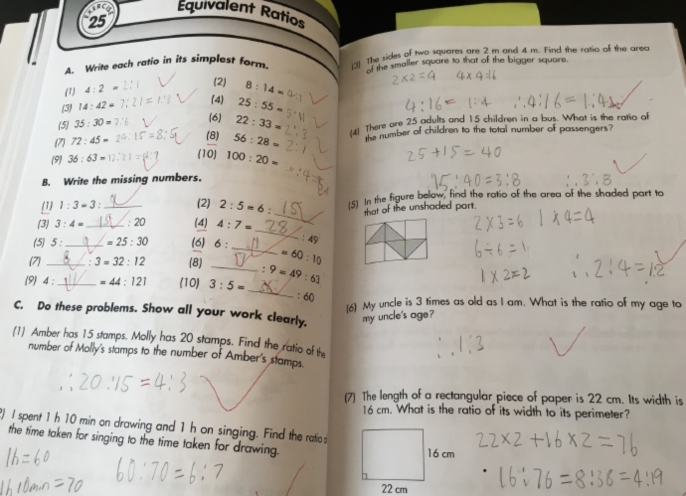
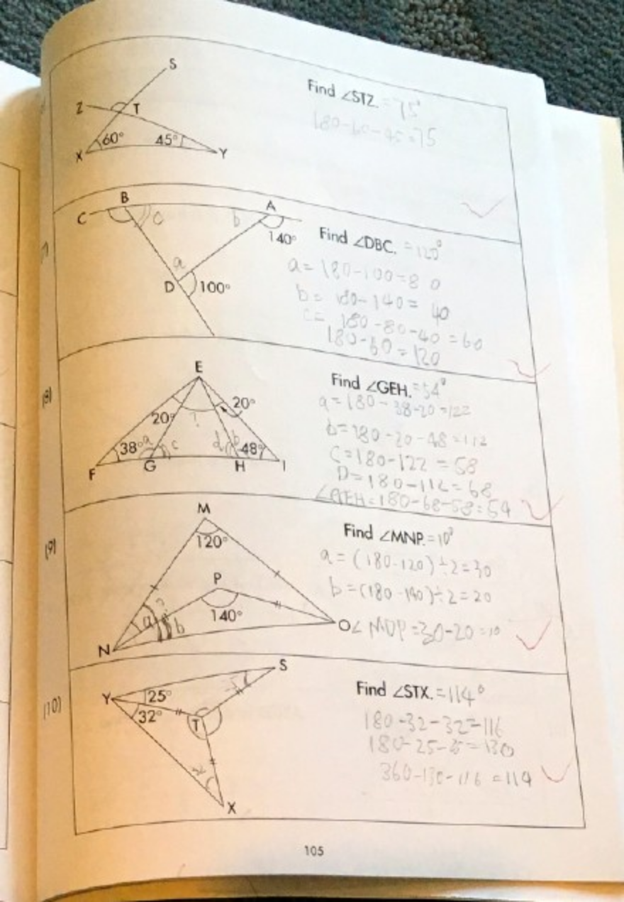

---

date: 2017-05-13 01:00:15
categories:
    - 暖暖数学思维-math
title: 2017.5.8   SINGAPORE MATH G5 FINISHED
description: "新增概念：比例，百分数，体积，小数，AVERAGE, RATE, 比例，百分数，小数混合运算 三角形面积，三角形和平形四边形角度，长方形正方形体积， _ _ _ _ _ _ _ _ _ _"
image: image_0.png
---

新增概念：比例，百分数，体积，小数，AVERAGE, RATE,

比例，百分数，小数混合运算

三角形面积，三角形和平形四边形角度，长方形正方形体积，

  

_  
_

_  
_

  
  
  
  
  
  

_  
_

_  
_

  
  

_  
_

  
  
  
  
