---

date: 2017-05-25 00:14:08
categories:
    - 暖暖数学思维-math
title: 2017.5  SINGAPORE MATH G6 FINISHED (AT 7.5 YEARS OLD)
description: "2017.5.8 — 5.25 新加坡6，EXTRA PRACTICE，做完 从2017年3月起至今，花了三个月走完了小学数学的四五六三个年级。很顺利。这归功于新加坡数学教材的编辑得清晰且系统。 六年..."
image: image_1.png
---

2017.5.8 — 5.25

新加坡6，EXTRA PRACTICE，做完

  

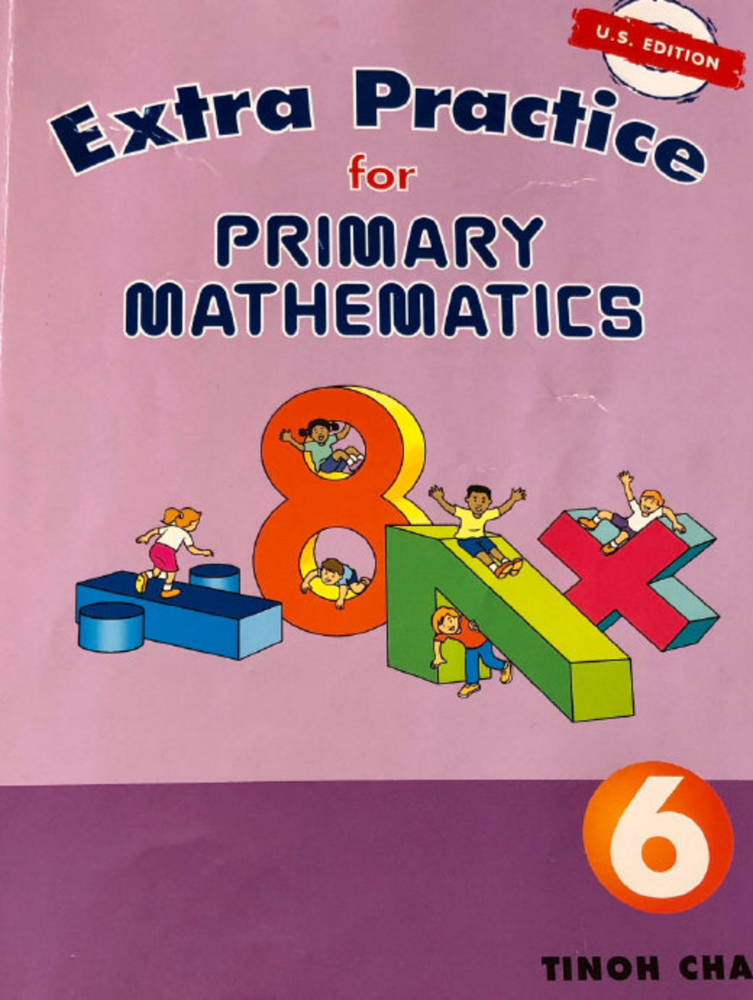

  

从2017年3月起至今，花了三个月走完了小学数学的四五六三个年级。很顺利。这归功于新加坡数学教材的编辑得清晰且系统。

  

  

六年级做下来很轻松，反而比上个月学做四年级和五年级的题更轻松，原因是五年级初步涉列了更多的延伸概念，和它们之间的互相换算关系，稍显生涩，到六年级反而已渐熟悉上手了。六年级的主要的新概念除了Changing Ratio 需要着重在新加坡数学特有的model-drawing的思维，其他如：圆和周长和面积，正方形长方形的体积等 都很简单。

  

  

  

  

下图是同样的题，姐妹俩不同的思路和解法。左图是姐姐九年前（刚好也是七岁半）做的题图。

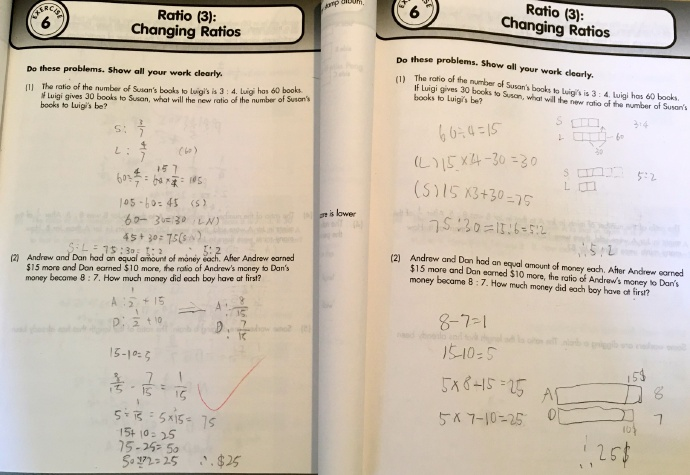

_  
_

_  
_

  

  
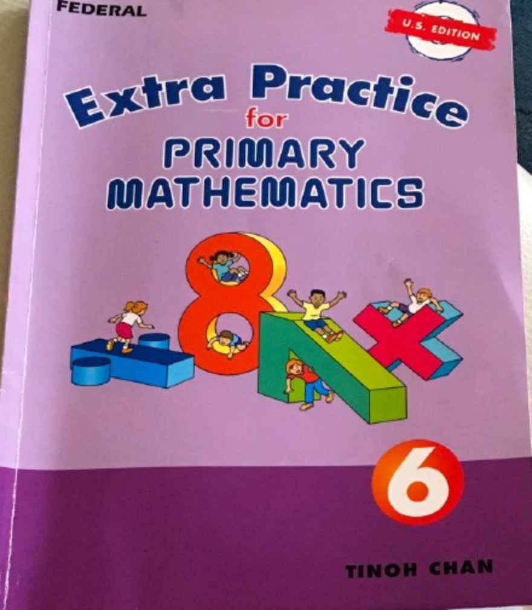  
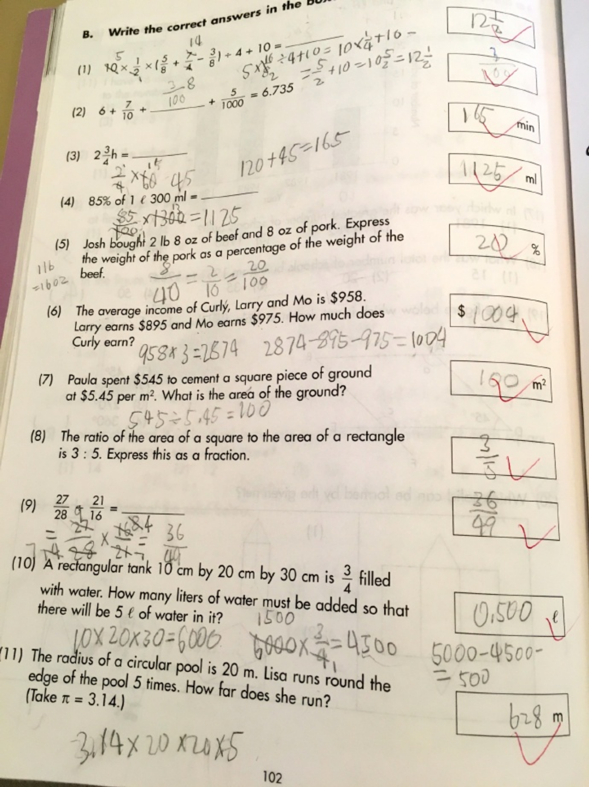  
  
  
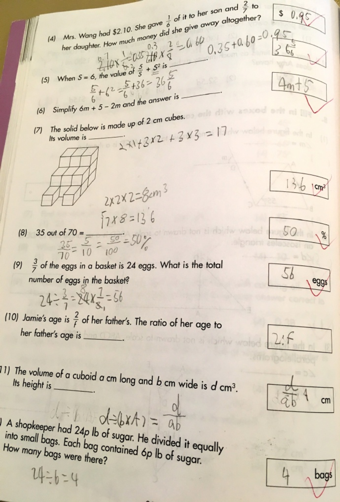  
  
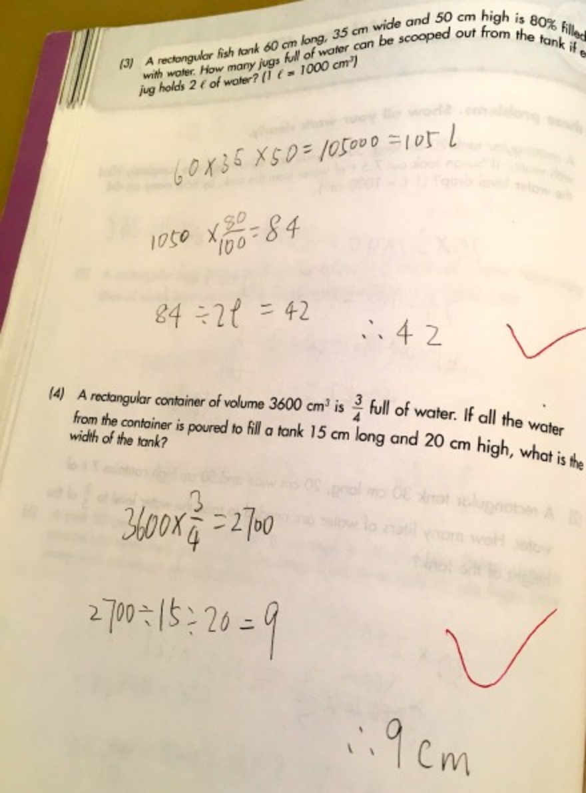  
  
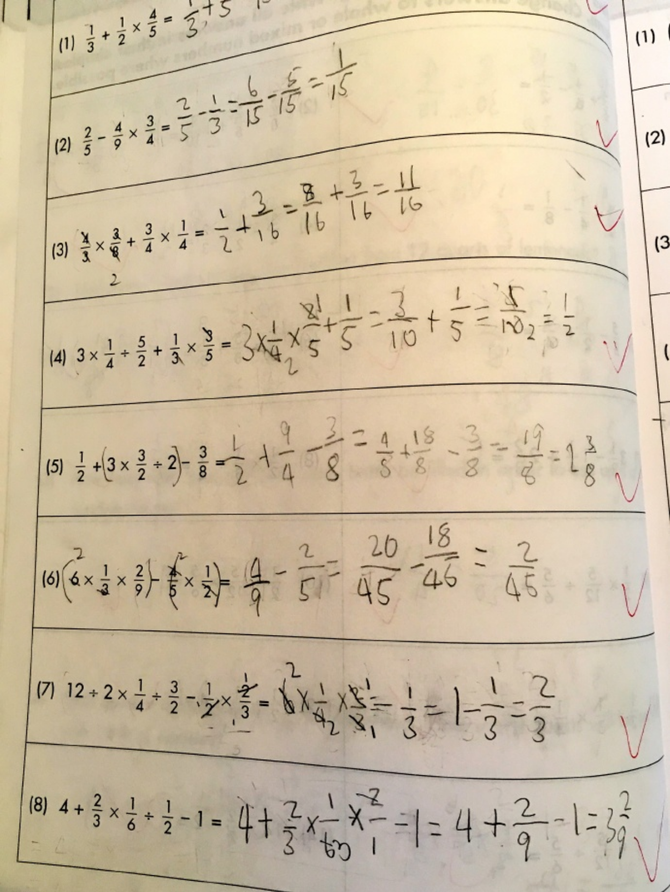  
  
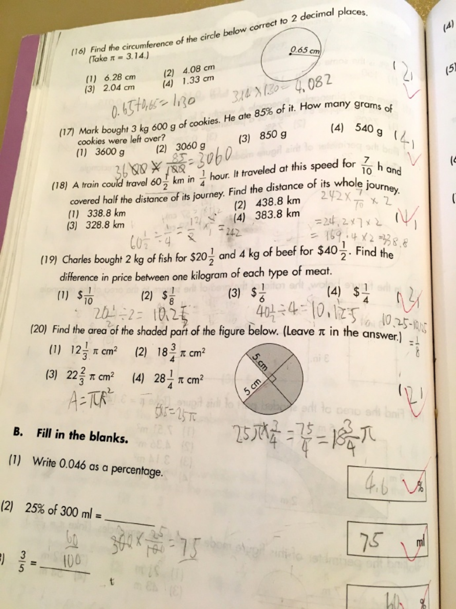  
  
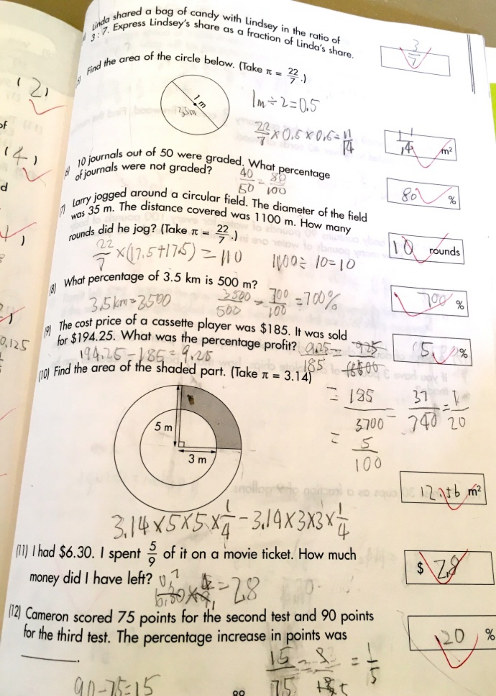  
  
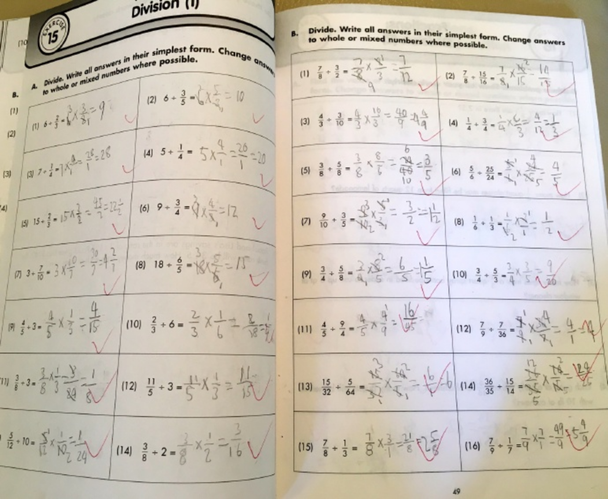   
  
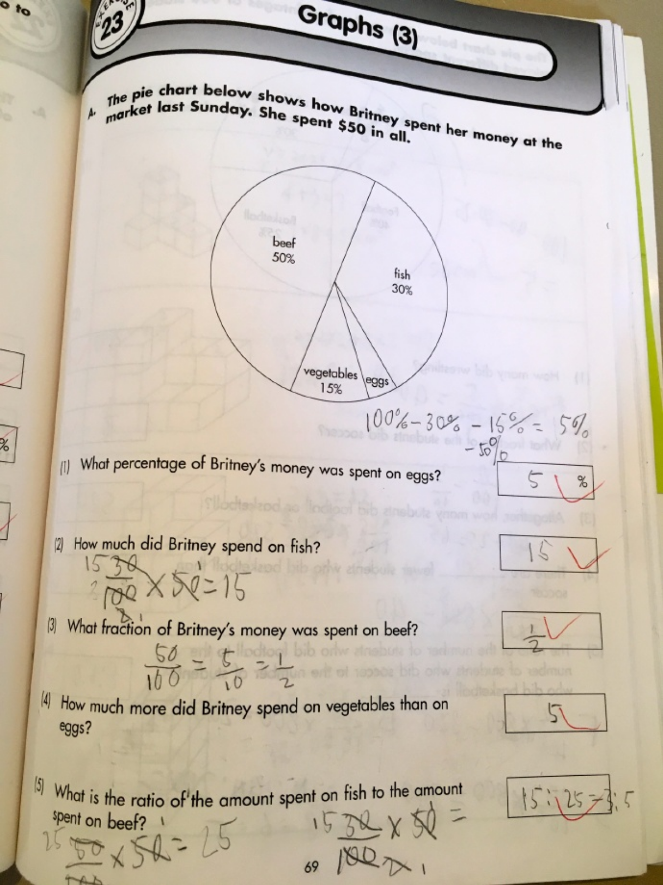  
  
  
