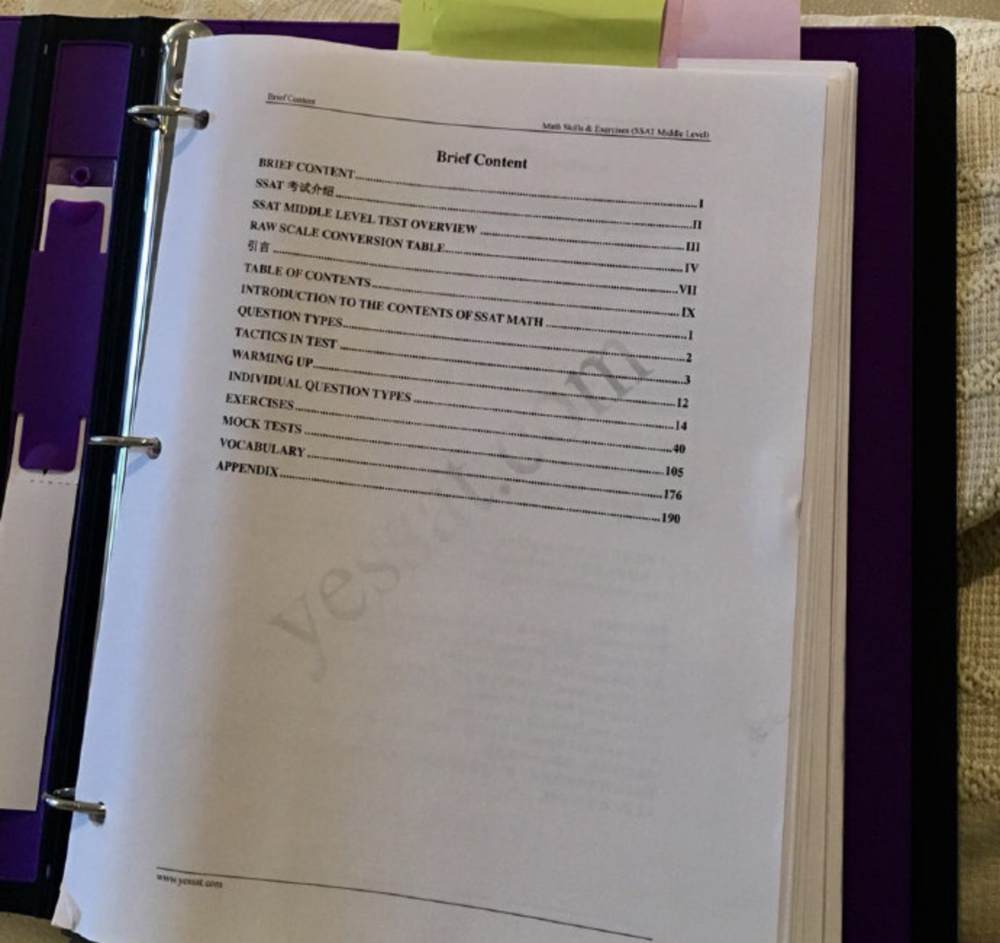

---

date: 2017-10-31 00:50:13
categories:
    - 暖暖数学思维-math
title: ssatmathbookstarted:2017.10.26finished2017.12.3
description: "每天十五分钟数学: ssat math 要求:更多地了解SSAT math的题型，步骤书写清晰，速度快（平均一分钟一题） started: 2017.10.26，每天两张四页，16道题。 finish..."
image: image_0.png
---

每天十五分钟数学: ssat math

  

要求:更多地了解SSAT math的题型，步骤书写清晰，速度快（平均一分钟一题）

  

started: 2017.10.26，每天两张四页，16道题。

finished: 

实际：12.3

  

  

  

  

