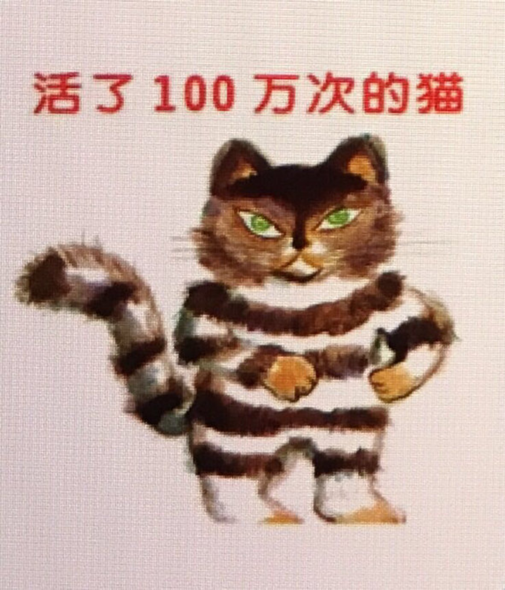

---

date: 2017-12-14 15:37:53
categories:
    - 书香书享（想）亲子共读
title: 馨暖聊绘本1：活了一百万次的猫
description: "​活了一百万次的猫 小暖暖先是自己读了一遍《活了一百万次猫》给我听 妈妈：小暖暖，你觉得这个故事是讲什么的 小暖：应该过自己的生活，过别人生活在一起只能听别人的话 妈妈：很好，所以呢 小暖：所以这只猫..."
image: image_0.png
---

​活了一百万次的猫

  
小暖暖先是自己读了一遍《活了一百万次猫》给我听

  
妈妈：小暖暖，你觉得这个故事是讲什么的

  
小暖：应该过自己的生活，过别人生活在一起只能听别人的话

  
妈妈：很好，所以呢

  
小暖：所以这只猫一开始觉得最大的幸福是爱自己，而不是被别人的爱，

后来猫最大的幸福是跟白猫和宝宝生活在一起，因为他们是它爱的人

妈妈：跟自己爱的人在一起会胜过爱自己吗？

小暖：唔，之前猫都是和自己讨厌的人在一起，因为他们都让猫做他们想猫的事情，没有考虑猫的感受

妈妈：所以真正的爱是要考虑互相的感受？假的爱是什么

小暖：假的爱，没有考虑猫的感受，只考虑到自己的，

妈妈：对，互相都有爱，是真正的爱，还有呢

小暖：猫更想要自己的LIFE CIRCLE，真的，妈妈，我觉得应该给猫一个名字

妈妈：唔，考虑到猫自己的感受，给猫一个名字，说明给了猫什么

  
小暖：尊重！尤其是小女孩子太不尊重它了

妈妈：说得太好了，这些都是很棒的CORE VALUES，我们来总结一下，第一个是要有自己的生活VS过别人的生活，

  
暖暖：过别人的生活是不幸福的生活

  
有自己的生活是幸福的生活

  
  

妈妈：然后你刚才说真正的爱是什么样的？

  
小暖：有privacy 和respect

  
妈妈：所以就有了第二个CORE VALUE，真正的爱是什么

  
小暖：相互要有爱，里面有尊重

  
妈妈：很棒哦，什么是尊重？这就是我们今天第三个CORE VALUE尊重是什么？

  

小暖：尊重对方内心的想法，尊重她的PRIVACY

  

妈妈：所以是尊重VS？

  

小暖：只考虑自己

一起总结： 

1， 幸福观：过别人的生活是不幸福的生活 VS 有自己的生活是幸福的生活

2， 真正的爱是什么\--- privacy 和respect

3， 尊重VS只考虑自己

  

  

妈妈记录：

第一次和女儿聊书， 对我而言最大的困难是怎么把大白话转换成一语中的的精简词，还要过度得自然，孩子能理解。一是想不到，二是觉得引导不上。

就象尊重VS？小暖说出“只考虑自己”时，我心下称妙，觉得在此文中很贴切，但又想用“自私”或者“强势”代替“只考虑自己”，觉得都不好。

又比如聊到：真正的爱是什么— privacy 和respect，我很难引导到“有条件的爱VS无条件的爱。”

我第一次觉得很多成人世界的语言不晓得怎么去和孩子套，我如果讲多了，很容易变成灌输和说教，比方什么是幸福，过自己的生活还是过别人的生活，我有很多话想说，我很想引出“生存VS活着”。但话几次到嘴边都不敢说，怕讲成大道理。

感觉孩子到后面不太愿意多思考，费脑油，

她不懂的，表达不出的，但感受已经在那里，就给个概念，大概解释一下

一次不需要讲太多。先抓住一两点容易操作的。

一本一本往下读，随着积累，这些内容会不断重复。重复多了就有感觉了。