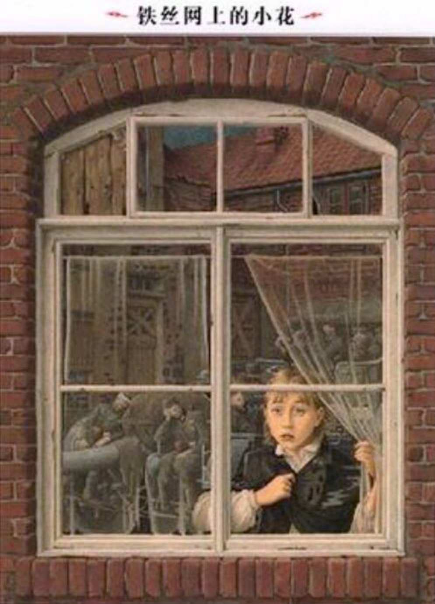

---

date: 2017-12-19 05:36:30
categories:
    - 书香书享（想）亲子共读
title: 馨暖聊绘本2：铁丝网的小花-聊战争题材之二
description: "妈妈：这个绘本和你之前看过的那几本书的差别 暖暖：前面两本都是讲犹太小孩子被抓或被杀，这本书因为女孩子带食物给被抓走的犹太小孩子，而被杀死的，和Number the Stars是有点象的，都在讲Ger..."
image: image_0.png
---

  
妈妈：这个绘本和你之前看过的那几本书的差别

  

暖暖：前面两本都是讲犹太小孩子被抓或被杀，这本书因为女孩子带食物给被抓走的犹太小孩子，而被杀死的，和Number the Stars是有点象的，都在讲Germany的小孩子在帮助犹太人

  

妈妈：小女孩子为什么要帮助犹太小孩子

  

暖暖：不然犹太小孩子会饿死的，说明小女孩子很勇敢，善良，有同情心

妈妈：女孩每天在书包里装满面包和黄油，但为什么她和铁丝网里的小孩都越来越瘦了

暖暖：因为不够食物，里面的小孩子越来越多了

  

妈妈：是，你一下抓到了重点，好棒！那为什么在战争中要有这么多让人悲伤的故事

暖暖：因为战争中许多小孩子会被饿死或杀死了，就会有很多悲伤的事发生

妈妈：咦？为什么用悲伤这个词？悲伤和伤心有什么不一样

暖暖：悲伤是一直很伤心，比伤心更严重，是depress，伤心是sad

  

妈妈：天，你好厉害！那小暖，你觉得人性在战争里人性是善的，还是恶的

暖暖： 杀人的那方是恶的，而那些去保护生命的是善的，

妈妈：唔，杀人者众是恶的，所以说，什么是最珍贵的，值得人去用生命保护的

暖暖：是人，所以说人的生命是最可贵的，尊重生命的人善的，不尊重生命的人是恶的

妈妈：是的，要尊重生命，人生来就都是平等的！ 那你说 Hitler为什么要杀犹太人

  

暖暖：为什么呢？他不喜欢他们

  

妈妈：不喜欢是一个原因，还有就是当时犹太人很有钱，他也想通过驱赶和消灭他们霸占他们的财产。你以前有没有读过关于种族主义和种族歧视的其他书？

  

暖暖：有啊，读过很多黑人白人的绘本

  

妈妈：是的，美国有这段种族歧视的历史。他们也有著名的南北战争。姐姐小时候看过一本书叫《汤姆叔叔的小屋》还有妈妈很喜欢的一本小说《飘》，都是讲那个时候的。  小暖，你觉得战争本质是什么吗？

暖暖：是有很多人死，我看到网上好象说战争每一天都要有几千人死掉。战争的本质是不尊重的生命的

妈妈：是啊，真是这样的！那书的最后一幅图画“春天在唱歌”是什么意思

暖暖：说明战争快结束了

妈妈：唔，春天很多时候都象征希望，铁丝网里的孩子囚衣上的明黄色的小星星，是什么意思

  
暖暖：是那些关在里面的小孩子希望战争快点结束，希望不要再饿了，希望小星星给他们带来好运气

  

妈妈：来，我们一起GOOGLE一下：这个明黄色的六角星也叫大卫之星又或者直接称为六角星，是犹太教和犹太文化的标志。

以色列建国后将大卫星放在以色列国旗上，因此大卫星也成为了以色列的象征。

德国纳粹时期，曾用此星来辨别犹太人；

纳粹集中营中所有犹太人都需戴着以两个重叠的黄色三角形所组成的大卫星。

  

妈妈：之前粉红色的小兔呢？

  
暖暖：小女孩子把小兔当成Family，所以代表Hitler把小女孩子的幸福抢掉了

妈妈：铁丝网外面那朵红色的小花象征什么

暖暖：这个大概就是指Remenberence Day里的那些小红花，代表死掉的人血

妈妈：那这本铁丝网的小花，铁丝网代表什么

暖暖：铁丝网把犹太小孩子锁在里面，所以它代表失去了自由，代表了和外面的世界disconnect

  

妈妈：disconnect中文是什么

暖暖：断绝联系，分开

妈妈：还有隔离，是的，很棒很棒，所以铁丝网在书里面也象征着的是里面的人和外面的人的隔绝的关系

暖暖：你过不去，他们也过不来，代表了距离，

妈妈：这个距离里面有些什么情绪

暖暖：有孤单，非常渴望自由（和外面失去连接），有绝望，有恐惧

  

  

  

妈妈：很好！小暖，我们来一起根据上面的记录，划出重点，然后跟着总结一下今天Core Values

1, 帮助=勇敢，善良，有同情心（帮助需要有行动！）

2，悲伤VS伤心

3，人性是善的，还是恶的？杀人的那方是恶的，而那些去保护生命的是善良的，

4，什么是最珍贵的，值得人去用生命保护的？

人，人的生命是最可贵的，尊重生命的人善的，不尊重生命的人是恶的

5，战争的本质是不尊重的生命

6，距离里面有的情绪：孤单，非常渴望自由（和外面失去连接），绝望，恐惧

7，种族主义和种族歧视：人生来就都是平等的！

根据联合国《[世界人权宣言](https://zh.wikipedia.org/wiki/%E4%B8%96%E7%95%8C%E4%BA%BA%E6%AC%8A%E5%AE%A3%E8%A8%80 "世界人权宣言")》对种族歧视的定义

the term "racial discrimination" shall mean any distinction, exclusion, restriction or preference based on race(一般意义上的种族), colour([肤色](https://zh.wikipedia.org/wiki/%E8%86%9A%E8%89%B2 "肤色")), descent(世系), or national(民族) or ethnic origin(族群) which has the purpose or effect of nullifying or impairing the recognition, enjoyment or exercise, on an equal footing, of human rights and fundamental freedoms in the political, economic, social, cultural or any other field of public life.[[7]](https://zh.wikipedia.org/wiki/%E7%A7%8D%E6%97%8F%E4%B8%BB%E4%B9%89#cite_note-7)

  

妈妈记录：

  

当我问小暖什么是最珍贵的，值得人去用生命保护的，她回答是“人”的时候，我内心突然一热，

很想在这个时候引入“人道主义”的概念，却欲言又止。。。。

  

怎么引导到一个普世的概念上，或在Core Values词语上提炼得更精简，

让孩子更容易在日后举一反三，这个方法我还在摸索。

  

很多时候，既想提一提，又对孩子本真的思想和情感备感珍惜，有两难！