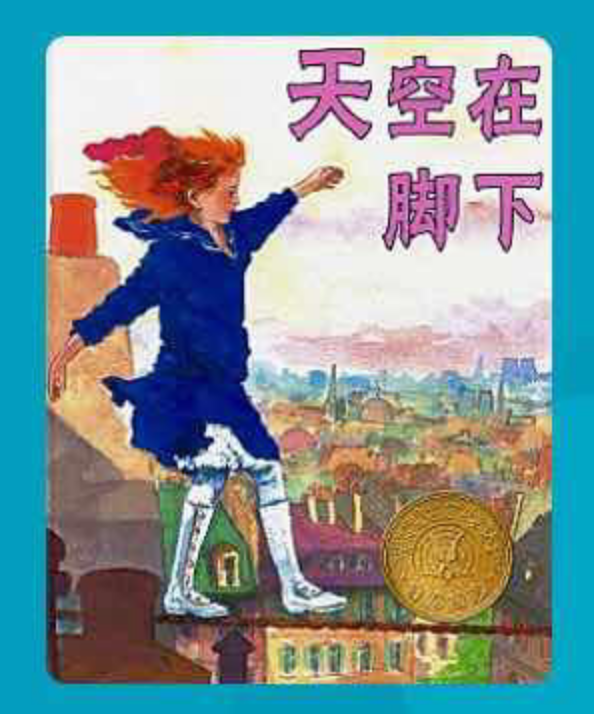

---

date: 2017-12-22 04:20:04
categories:
    - 书香书享（想）亲子共读
title: 馨暖聊绘本3：天空在脚下
description: "《天空在脚下》 2017.12.20 昨天晚上和小暖一起读了这本书，今天开聊： 妈妈：小暖我们先讲讲这本书你看到的Core Values 小暖：勇敢VS害怕，坚持VS放弃 妈妈：很好，贝利尼有没有想过..."
image: image_0.png
---

《天空在脚下》  
  
2017.12.20

  
昨天晚上和小暖一起读了这本书，今天开聊：

  
妈妈：小暖我们先讲讲这本书你看到的Core Values

  
小暖：勇敢VS害怕，坚持VS放弃

  
妈妈：很好，贝利尼有没有想过放弃

  
小暖：有的，但是他觉得不能战胜恐惧，就不能接受米瑞

  
妈妈：那他是怎么战胜恐惧的？

  
小暖：多走？

  
妈妈：多走是没有用的，尤其对贝利尼来说，他的害怕不是因为技术不好，而是，书上怎么说？

  
小暖：害怕过一次，就一直害怕，这是一种心理上的

  
妈妈：对，那怎么战胜这种心理上的情绪呢？如果你在生活中有这些心理上的情绪

  
小暖：逼自己去做

  
妈妈：我们先把怎么样战胜心理上的恐惧这个问题放一放，来看看贝利尼心理上是什么恐惧。先问你一个常识问题，走钢丝，有生命危险吗？这种运动有防护吗？

  
小暖：有危险的，需要有防护

  
妈妈：是，一般这种运动都应该会有防护，所以不会有生命危险，否则掉下来几次早死掉了，那既然不会有危险，贝利尼害怕的是什么

  
小暖：是掉下来的感觉

  
妈妈：唔，他害怕会掉下来的感觉和会掉来下后这么一个结果，所以他害怕的是？

  
小暖：失败

  
妈妈：所以我们回到刚才聊到的贝利尼要战胜的是心理上的什么恐惧？他恐惧什么？

  
小暖：恐惧失败

  
妈妈：对了，恐惧失败这个结果，那应该怎么战胜这种失败

  
小暖：呆在家里，不再去玩了

  
妈妈：你说得很好，贝利尼有没有选择你这种方式想战胜失败

  
小暖：有的，他呆在小旅店里

  
妈妈：呆在小旅店里的本质情绪是什么？

  
小暖：逃避

  
妈妈：对啊，是逃避。逃避作为一种情绪，能战胜失败吗？

  
小暖：不能，逃避的情绪里有害怕，恐惧，（焦虑）会让人觉得紧张，这种紧张更影响结果，所以碰到一件事情失败，不应该逃避，应该更注重这种事情本质

  
妈妈：很棒，一件事情的本质是一件事情的原来样子，一件事情有过程，（VS）有结果，哪个更接近一件事情的本质

  
小暖：过程，

  
妈妈：那怎么更注重一件事情过程

  
小暖：不要害怕，不要恐惧，不要想得太多，不要焦虑

  
妈妈：你说的就是一种叫哈姆雷特综合症，想得越多，行动力越差，（想VS做）而想得太多往往是因为什么

  
暖暖：害怕，紧张

  
妈妈：对啊，所以针对天空在脚下这个故事，米瑞和贝利尼要注重的过程是什么？

  
小暖：眼睛看着前面，往前走，到达目的地。

  
妈妈：很好，“眼睛看着前面，往前走，到达目的地。”这句话的本质是什么？说明我们在做一件事的时候要注重过程，具体要做的是？

暖暖：尽力走好每一步

  
妈妈：道德经里有句话，为学？

  
暖暖：为学日益，为道日损，损之又损，以至于无为，无为而无不为

  
妈妈：为学日益，（VS）为道日损，为学日益是什么意思

  
暖暖：学习的知识会越来越多

  
妈妈：为道日损呢？道是什么？损的是什么？道是一件事情本来的样子，为道日   
损，损的是

  
暖暖：情绪，（恐惧，焦虑，紧张，担心）

  
妈妈：是啊，损的是情绪，损之又损，损到没有情绪了，就只有这件事情本身，尽力而为就是了。所以我们在面对一件事情，要怎么样，   
不要怎么样

  
暖暖：不要紧张，不要害怕，不要想得太多，（不要有太多情绪），要尽力做好每一步，（去做，JUST  
DO IT），注重的是（做的）过程而不是结果

  
妈妈：对啊，要有好的心态，去做，做好当下的每一步。

  
我们回过来看之前的问题，所以要战胜对失败的恐惧，我们就是不要有太多的情绪，去注重事情的本质，JUST DO  
IT ,去做，去尽力地走好每一步。这也是我们去面对生活中每一件事情的人生态度。

  
情绪过多是我们自己内心的WAR（内耗），损害的自己的心情，就很难看清事情本质，并把它做好。

  
暖暖：可是我做数学题时很害怕，但是这样我会做得更对

  
妈妈：我觉得是紧张的情绪让你的专注力更强了，这里面又有一个Core  
Value,就是紧张VS放松，为什么紧张？

  
暖暖：因为害怕错

  
妈妈：错，是一个结果，害怕是情绪，如果很害怕结果，整天想着怎么害怕还能做得更对吗？

  
暖暖：不对，

  
妈妈：那为什么紧张反而让你更对了？这就要看你大部分错题如果因为紧张而对，说明你之前为什么会错？

  
暖暖：因为粗心

  
妈妈：对啊，所以说适度的紧张是可以加强专注力，过度的放松会分心的。如果你可以放松下情绪，做好笔下的每一步，我觉得应该是错误率最少的。但是，往往很多孩子一放松，就分心（VS专注）了，distract了，注意力散掉了，那反而更容易错了。所以在做一件事情过程中需要紧张吗？

  
暖暖：需要，但是要适度

  
妈妈：是，过度（VS适度）的紧张就是焦虑了。

  
妈妈：小暖，我们回到故事，米瑞和贝利尼的关系是什么

  
暖暖：师徒

  
妈妈：米瑞喜欢走高索吗

  
暖暖：当然喜欢，她觉得非常快乐，她觉得是世界上一个人能做的最好的事情，说明这件事情是她爱好，是非常想做的事情

  
妈妈：很好，是爱好，是梦想

  
暖暖：是，这个故事就是讲小女孩子怎么找到她的梦想，并且坚持她的训练，一直都没有放弃，还有怎么帮助她的师父不害怕

  
妈妈：小暖，你这一口气地把这个故事总结得很到位哦！小女孩米瑞是怎么帮助她的师父的呢

  
暖暖：她和他一起上去表演，帮助他克服了恐惧

  
妈妈：那为什么师父会害怕，徒弟不会害怕呢

  
暖暖：因为师父害怕的是丢脸（别人的看法），是一件事情的结果，而米瑞更享受走高索时候的快乐（过程）。

  
妈妈：如果米瑞有一天也在表演时从高索上掉下来，会不会象师父一样觉得丢脸，然后逃避呢？

  
暖暖：不会的，因为米瑞更热爱的是其中的经历，体验（过程）

  
妈妈：是，更注重过程就不容易有逃避的心态，想逃避的是结果！热爱走高索，喜欢走在上面极大的快乐的这种体验是米瑞对走高索这件事情的初心，初心就是对一件事情最初的信念和情感，爱好，梦想，兴趣 这些发自内心的热爱往往都是初心。贝利尼对走高索的初心是什么？和米瑞一样吗？

  
暖暖：一样的，他也很喜欢走高索

  
妈妈：是的，他们师徒两个的初心是一样的，但后来贝利有了更多的情绪后，

  
暖暖：就更在乎结果

  
妈妈：这样，是离初心越来越远了，还是越来越近了

  
暖暖：越来越远了，因为他开始害怕失败，害怕丢脸，害怕结果

  
妈妈：害怕失败，害怕丢脸，害怕结果，是一种什么样的心态？。。。。。。更在乎一件事情输了，还是赢了，在乎别人怎么看，是赞扬，还是嘲笑，更加患得患失，这是名利心，功利心，世俗心

  
妈妈：所以这又是一个Core Value,  初心  
VS名利心，功利心，世俗心

  
米瑞帮助她师父克服了患得患失的世俗心，找回了

  
暖暖：初心！

Core Values:

1，勇敢VS害怕

2，坚持VS放弃：放弃的原因往往是因为害怕情绪，坚持的原因来自勇敢和注重过程的收获

3，恐惧失败这个结果，逃避的情绪里还有害怕，恐惧，会让人觉得紧张，（焦虑），这种患得患失的情绪更影响结果

4，过程，（VS）结果，哪个更接近一件事情的本质：做一件事的时候要注重过程，

5，想VS做：更注重一件事情过程，哈姆雷特综合症，想得越多，行动力越差，（想VS做）

6，注重过程具体要做的是？面对一件事情，不要紧张，不要害怕，不要想得太多，（不要有太多情绪），要尽力做好一步，（去做，JUST  
DO IT）注重的是（做的）过程而不是结果

  
要有好的心态，去做，做好当下的每一步。

7，为学日益，（VS）为道日损，为道日损呢？道是什么？损的是什么？道是一件事情本来的样子，为道日  
  
损，损的是情绪，（恐惧，焦虑，紧张，担心）

9，紧张VS放松

10，过度VS适度   
  
过度的紧张就是焦虑

12，初心VS世俗心：初心就是对一件事情最初的信念和情感，爱好，梦想，兴趣 这些发自内心的热爱往往都是初心。患得患失，这是名利心，功利心，世俗心

更注重过程就不容易有逃避的心态，想逃避的是结果！

  
妈妈记录：

  
这篇绘本原来暖暖自己读过英文版的，这次共读了中文版，我很喜欢，觉得里面可以讲的东西特别多。而且完全可以和日常生活结合。所以之后有空，打算就最后总结的Core  
Values和生活体验结合起来聊聊，加深对过程VS结果，想VS做，初心VS世俗心的理解，包括怎么让自己有个好心态等等。。。。。。

  
这本书比较具体，孩子比较好理解，聊的过程也更顺畅，但我总结的能力还是有待提高