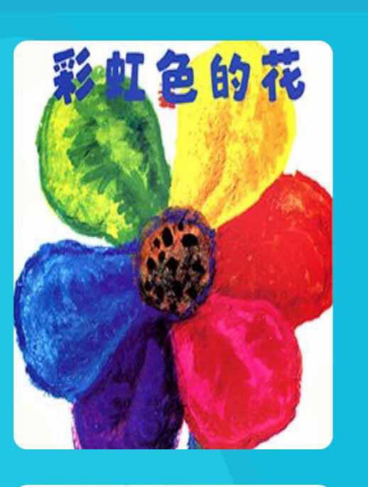

---

date: 2017-12-25 08:06:25
categories:
    - 书香书享（想）亲子共读
title: 馨暖聊绘本4-5：《彩虹色的花》和《有一天》
description: "亲子共读：《彩虹色的花》和《有一天》 妈妈：彩色的花的Core Values是什么？ 暖暖：1，分享VS独享，彩红色的花说我想分享我的所有的快乐 2，感恩VS帮助，彩红色的花被雪盖掉了，所有的小动物都..."
image: image_0.png
---

亲子共读：《彩虹色的花》和《有一天》

  

  
  

  

  

妈妈：彩色的花的Core Values是什么？

暖暖：1，分享VS独享，彩红色的花说我想分享我的所有的快乐

2，感恩VS帮助，彩红色的花被雪盖掉了，所有的小动物都跑到那里去，都想起了彩虹色的花曾经给过他们的帮助

  
妈妈：很好！！（我内心欣喜，说是国内大部分孩子会不自觉地先说彩虹花的“奉献”，也许是暖暖这孩子在生活中没有受过一星半点教条主义教育，所以一下子就抓到了“感恩”这个点？）

  
帮助，感恩得到的帮助，你生活中有什么互相帮助，相互感激的例子？

暖暖：AYMA教会了我爬树，我感激她的。我教会一群班上的小朋友怎么做数学，她们跟我说谢谢了。

妈妈：是，这就是帮助和感激的循环，这是一个正向的循环还是反向的？

  

暖暖：正向的

  

妈妈：正向的英文叫什么？反向的呢？

  

暖暖： Positives VS Negatives ,  Pros and Cons

妈妈：我们先来捋捋词的意思，感激和感恩是一个意思吗

  
暖暖：感激就是当别人教我学会爬树，感恩就是在别人把从天上掉下来的我接住，没让我摔死

  
妈妈：分析得很好，很透彻，感激和感恩就是一个程度的关系，那付出和奉献呢？

  
暖暖：付出就是一天给别人一次钱，奉献就是每天不仃地一直在给出去钱

  
妈妈：对，这也是一个程度的关系，用爱就更贴切了，付出就是给了别人短暂的帮助，奉献就是每天持续地一直在给出帮助。相似的递进关系还有，原谅VS

暖暖：宽恕

妈妈：嘲笑VS

暖暖：侮辱

妈妈：是，原谅VS饶恕VS宽恕，嘲笑VS羞辱VS侮辱，可怜VS同情VS悲悯。。。。。。

奉献/付出\-->感恩/回馈我们搞得很清楚了。那我再问问你平时看那么多小说，里面的小孩子饭前祈祷的？都会说些什么？

  
暖暖：有的，感谢那些食物这么美味，谢谢有了这些食物，谢谢自己不会饿死

  
妈妈：吃饭是人生存最基本的活动，竟然有这么多可以值得感恩的地方，那睡觉呢？小说里面的小孩子睡觉前祈祷吗

  
暖暖：也有的，谢谢我今天怎么开心了，得到了什么，谢谢今天看到的树，谢谢今天看到了河，再给他们一个名字。。。。。。

  
妈妈：原来我们每天的生活有这么多值得从内心感激的地方！！在感恩的过程中，我们首先是需要换位思维还是IT思维？

  
暖暖：换位思维

  
妈妈：是，换位思维，换位思维也叫W思维，W代表what and why,在上面感恩食物的例子里，

需要哪些W思维，或者你在生活中能不能说出些W思维的例子？

  
暖暖：感谢谢妈妈用爱来陪伴我，亲我抱我，感激爸爸用本来他工作的时间给我讲故事，

感激姐姐用勇气来保护我，感激老师（花时间精力）来教我东西，。。。。。。

  
妈妈：瞧，每天生活中都充满了感激和感恩，需要用W思维就很容易感受到其中的温暖。

彩虹花被覆盖后，有没有人来

  
暖暖：没有，直到出现一道彩虹。小动物们的内心温暖起来了

  
妈妈：“温暖”二字是全书最关键的两个字，彩虹花后面的复活，跟温暖这两个字有关。

暖暖，你叫暖暖，说说温暖背后的情绪是什么？

  
暖暖：暖暖是舒服，开心，

  
妈妈：你是在说自己吗？真好哎！暖暖在这里也可以作为我们今天的一个Core Value，温暖VS？

  
暖暖：冰冷！暖暖VS冷冷

  
妈妈：太好了，什么季节是暖暖的开始

  
暖暖：春天

  
妈妈：是啊，在暖暖的能量关照下，雪融化了，花开了，叶子绿了，枯萎的，冰冷的冬天复苏了，天地充满了生机，在这里，小动物们的内心温暖起来了，它们想起了彩虹花的帮助！

暖暖：所以这本书讲的就是彩虹花的帮助让小动物的内心温暖起了， 它们内心的温暖让彩虹花复活了 妈妈：很棒，这本书不光是告诉我们彩虹花的奉献，帮助，更多的是唤醒小动物们的内心， 温暖起来，这种温暖让它们内心涌起了感恩，感激，这个爱的能量循环让彩虹花复活了 所以，彩虹花的一个重要主题是循环（cycle）：奉献/付出\-->感恩/回馈，   
一定要循环起来，才能可持续发展。不要仅仅强调奉献，也要注意到感恩。   
人都是有情感的。奉献不是无止境的。激励这种奉献的是温暖。 因为一直付出没人搭理，最后会怎么样？   
暖暖：就不会再付出了，最后就是彩虹花那样，死掉了   
妈妈：是，彩虹出现了，小动物们的内心温暖起来了。彩虹代表什么   
暖暖：代表爱！   
妈妈：是，爱的，感恩心的温暖，促成了彩虹花能量的恢复，重新焕发生机， 但在具体生活中，死掉的彩虹花会不会复活呢？   
暖暖：不会，   
妈妈：那我们能做什么呢？   
暖暖：不仃地保持付出VS感激这个cycle的温暖的能量，当得到帮助的时候，要马上说谢谢   
妈妈：是哦，当你帮助了别人，别人对你说谢谢的时候，你内心会感觉到   
暖暖：暖暖的爱   
妈妈：对，就是温暖这个能量让帮助和感激之间循环起来！这个温暖的能量的本质是？   
暖暖：是幸福，是开心   
妈妈：对，这种舒服的感受的体验本质是缘于爱，爱！ 奉献/付出\-->感恩/回馈是一个爱的循环   
暖暖：爱！我知道了，暖暖要做个热水袋！哈哈。。。。。。   
妈妈：是的，内心暖暖的，总是绽放着一朵永生的彩虹花   
好的，我们来根据highlight出来的重点总结一下Core Values 1，分享VS独享 2，奉献/付出\-->感恩/回馈是一个爱的循环 3，平时生活中处处充满了这个爱的循环，所以要时刻保持有一颗感恩的心 4，W思维，换位思维VS IT思维\----- 每天生活中都充满了感激和感恩，需要用W思维就很容易感受到其中的温暖。   
5,  Positives VS Negatives ,  Pros and Cons   
6，递进程度的词，小词VS大词： 感激VS感恩，付出VS奉献，原谅VS饶恕VS宽恕， 嘲笑VS羞辱VS侮辱，可怜VS同情VS悲悯   
  
|    
有一天   
妈妈：《有一天》的Core Values是什么   
暖暖：Core Value是一个成长的循环，life cycle   
妈妈：很好！成长的循环，是这本书的主轴，能让这个life cycle流动起来需要什么   
暖暖：开心，快乐   
妈妈：是，我们当然希望每天的成长都是开心快乐的，但成长的过程中也会有痛苦，有泪水， 所以让人愿意去拥抱成长这个过程的最主要的能量是   
暖暖：爱   
妈妈：是啊，跟之前的《彩虹色的花》一样，是能让内心充满着温暖的爱！   
暖暖：life cycle成长需要的能量是：爱的循环   
妈妈：是，在爱的能量里，循环的不仅仅是一个人的life cycle， 我们一代一代的人都是这样循环传递下来的,就象爸爸妈妈成长起来，是因为？   
暖暖：外公外婆爷爷奶奶的爱   
妈妈：所以，有爱，才有生命的延续   
  
  
《有一天》的Core Values   
1，  life cycle成长需要的能量是：爱的循环   
2，  今天学了两个爱的循环：1，life cycle 2，感恩VS奉献，付出VS回馈   
运行的能量是一致的，都是：爱产生的暖暖 3， 有爱，才有生命的延续，一代又一代   
  
  
  
妈妈记录： 今天又讲两本小小的绘本《彩虹色的花》和《有一天》，讲了个大大的生命主题：   
爱的循环 \-------1，奉献-感恩的循环 2，成长的循环   
感恩，是我一直想讲的，没想到竟是薄薄的绘本给了我这个契机 聊《彩虹色的花》，然后就自然有了《有一天》 之后，想重拾起最先共读的《爱心树》， 当时暖暖读完就觉得很可怕 还特地跑到姐姐那里说今天看一本很可怕的书 可怕？孩子怎么会觉得这是本“可怕”的书？ 这个直觉感受是我始料未及的 听她这么一说，我也觉得很难讲， 树那么无私地付出并快乐着，小孩子那么无尽地索取并满足着， 很“可怕”？！我该怎么引呢？ 今天有了《彩虹色的花》和《有一天》的垫补 顺着 “爱的循环” 这个主题往下聊\------“不循环的爱”，“自循环的爱” 我心里有了底 虽然还没开聊，心下已是暗自欣喜。。。。。 一直觉得绘本很简单，起的作用就是让孩子习惯看书，喜欢看书，是作为识字和听读的启蒙。 听过了，读过了就丢了，不用怎么讲， 说实话， 也不晓得该怎么跟孩子讲才相互都觉得有意思。   
  
大女儿小时候，有个知心的网友一直在坚持和孩子聊绘本 我总不太理解 这个年龄完全可以独立阅读了，也已经有几百上千本书的阅读体验了 自己读不就得了，聊什么劲啊 更况且，平时的读物在广度和深度上都远比绘本“高级”多了 再去聊儿时的绘本会有乐趣吗？   
这次学习给孩子讲CORE VALUES,  结合大女儿中学这段学习时期常和我聊及的文学分析  
  
真正认识到绘本才是最好的思维训练的启蒙的读物。   
开始是从两本暖暖才上个月刚看过的讲二战小说 《Number the Stars》和《When Hitler Stole Pink Rabbit》开始的， 结合一篇《安妮日记》的阅读理解，互相聊的感觉不错，唯聊着聊着发现小说可以讲的主题太多， 一下就能跑得很散，对刚到八岁的孩子来说，不容易FOCUS。 后来转到讲绘本《铁丝网的小花》，最深的体会就是绘本比小说更加FOCUS， 更加贴近孩子的生活，所以也更好聊，更找得到心里一直想讲却不知怎么铺开的底层代码。   
绘本与长篇的小说比起来，确实容易操作一些， 与生活联系比较紧密，同时麻雀虽小五脏俱全， 文学，艺术，思想的一些基本要素都有了， 这些把握了，再读大部头也能够入门。   
和6—10岁这个年纪的孩子聊绘本真心是最适合不过的。 这个年纪已经有了一些自己的独立阅读的数量， 自己生活经验，体悟和自己的小心思， 独立思考开始荫芽， 经常会说出些让妈妈下巴都掉得下来的“圣言圣语”， 年纪太小的话聊起来会没那么多的反应和互动。 最关键的是这个年纪的孩子还满满的都是童眼童心， 聊起来这些“大”话题，童真童稚，清澄剔透，所以总是能一语中的， 时不时给已经老成世故的爸爸妈妈一记醍醐灌顶的松爽。 绘本主题明确，感受明晰 八岁的孩子在绘本里有简单的快乐和阅读的享受 更利于在孩子相对绘本更复杂的日常生活里找到类似的体验和体悟 不象小说，离孩子的真实生活相对更远些， 同时可以讲的主题很多，一下就能讲得很散，哗哗地不自觉地就跑好远。 不容易FOCUS 我一般都是前个晚上先和孩子共读绘本，然后让孩子有一个晚上身体沉淀， 第二天找松散的时间开聊。 边聊我边打字 孩子也正好趁我打字的时间里， 边翻着绘本，边随着我的引导语可以更深入的思考和组织语言 最后一起在成文里划颜色重点， 总结CORE VALUES 同时在共同划出的重点上再来一次掰开了揉碎了互聊深讲 这样最后和孩子通读一遍， 完成的一本书的共读 印象就非常深刻 双方的收获都是满满的   
。。。。。。 从简单的绘本中（去提练）其中核心价值观CORE VALUES，   
（用W思维去思考）作者要表达什么样的想法和情感，   
学习迅速地抓取到“中心思想”和CORE VALUES的能力， 再（用IT思维去想想）结合具体日常生活能怎么运用到这些CORE VALUES，   
最后去（做）学习怎么用总结到的的思维方法解决日常生活中碰到的情绪，事情等等。   
一旦形成思维和行为的习惯反射模式， 再回到已读的海量读物在小身体里，在小脑海里的不断激活，   
也许才是真正学会了阅读，思考和生活。。。。。。我思故我在。。。。。。 如是这般，这般如是， 等到十二三岁开始更独立自主的生活和阅读更深广更泛量的文史哲时， 主心骨应该已经很硬朗了。   
  
希望自己可以做得好。   
  
  
  
  
---