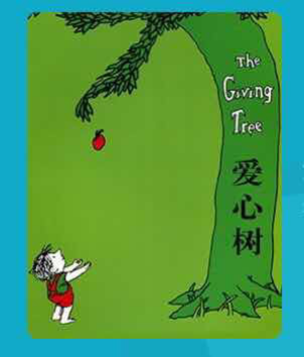

---

date: 2017-12-25 12:31:08
categories:
    - 书香书享（想）亲子共读
title: 馨暖聊绘本6：道德经和《爱心树》
description: "亲子共读：爱心树 昨天讲了两本小小的绘本《彩虹色的花》和《有一天》，讲了个大大的生命主题： 爱的循环 -------1，奉献-感恩的循环 2，成长的循环 感恩，是我一直想和孩子聊的，没想到竟是薄薄的绘..."
image: image_0.png
---

亲子共读：爱心树

昨天讲了两本小小的绘本《彩虹色的花》和《有一天》，讲了个大大的生命主题：

  
  
  
  
爱的循环 \-------1，奉献-感恩的循环

2，成长的循环

  
  
  
  
感恩，是我一直想和孩子聊的，没想到竟是薄薄的绘本给了我这个契机

聊《彩虹色的花》，然后就自然有了《有一天》

  

http://blog.sina.com.cn/s/blog_1581b7b9b0102x578.html

  

之后，想重拾起最先共读的《爱心树》，

当时暖暖读完就觉得很可怕

还特地跑到姐姐那里说今天看一本很可怕的书

可怕？孩子怎么会觉得这是本“可怕”的书？

这个直觉感受是我始料未及的

听她这么一说，我也觉得很难讲，

树那么无私地付出并快乐着，小孩子那么无尽地索取并满足着，

很“可怕”？！我该怎么引呢？

有了《彩虹色的花》和《有一天》的垫补

顺着 “爱的循环” 这个主题往下聊\------“不循环的爱”，“自循环的爱”

我心里有了底

虽然还没开聊，心下已是暗自欣喜。。。。。

  

  

  
妈妈：《爱心树》的Core Values是什么

  
暖暖：爱VS不仃地要东西

  
妈妈：索取，爱VS索取

  
妈妈：你刚看完这本书时说觉得可怕，为什么会觉得可怕，可怕在哪里

  
暖暖：小孩子对待那颗树象是要把它杀死的感觉，他把所有的东西都拿掉了，

  
包括树杆，最后就剩个树墩，但被杀掉的那棵树好象还一直很快乐

  
妈妈：所以这本书里的爱，有没有cycle？

  
暖暖：大树不仃地在付出，但小男孩子没有感恩，好象没有cycle

  
妈妈：那如果没有cycle，没有循环起来的话，大树为什么没有象彩虹花那样死掉呢？

  
暖暖：因为大树生命力更强，有很多东西可以给出去，彩虹花小小的，很快就没什么可以给的了

  
妈妈：你说的是表面，是身体，彩虹花是身体死了吗？彩虹花是因为没有得到什么能量

  
暖暖：爱的能量，暖暖的能量，所以彩虹花是心死掉了

  
妈妈：是，中国有句话，叫哀莫大于心死，心死掉，但身体没有死掉，会变成什么样

  
暖暖：心死掉的就变得很冷漠，很麻木，

  
妈妈：说得太好了！心死掉的话，对爱就没有反应了，对温暖也没有感觉

  
暖暖：需要爱的暖暖的能量才能让心复活

  
妈妈：我们有没有学过一种爱，是可以一直给予，不需要回报的？

想想，道德经里有没有学过？在德经里面找找看（我给了暖暖德经）

  

暖暖：49章？圣人无常心，以百姓为心？

  
妈妈：是的！是的！大树有没有常心？以谁的心为心？

  
暖暖：没有，以小男孩子的心为心。

  
妈妈：然后？

  
暖暖：善者，吾善之；不善者，吾亦善之；德善。信者，吾信之；不信者，吾亦信之；德信。

  
圣人在天下，歙歙焉，為天下浑其心，百姓皆注其耳目，圣人皆孩之。

  
妈妈：  很好，这是不是很象大树和小男孩子的关系？

  
暖暖：  是的

  
妈妈：  你六岁背道德经的时候，背到这里问过这样一个问题

  
不善者，吾亦善之，不信之，吾亦信之，这不是会吃亏吗？” 这有点象谁？

  
暖暖：  大树

  
妈妈：  是，大树吃亏吗？圣人最后开心吗？哪里看出来？

  
暖暖： 它很开心，只要小男孩子开心，大树就很开心，百姓皆注其耳目，圣人皆孩之，圣人也很开心

  
妈妈： 大树以小男孩子的心为心，所以它一点没觉得吃亏，和小男孩子一样高兴

是啊，百姓皆注其耳目，耳目就是眼耳鼻舌身意，我们就是百姓，都注自己的耳目，圣人是把众生皆孩之

  
暖暖： 大树以小男孩子的心为心

  
妈妈：  是啊，大树以小男孩子心为心，对众生皆孩之，所以只要众生快乐，它就快乐。

  
暖暖：  但“不善者，吾亦善之，不信之，吾亦信之”不能太过度，

太过度，就要懂得说不

  
妈妈：你说得太好了，你把我的话都说去了，远远超出我的预期，

施和受得有个界限，超过这个界限，要说不！！

那大树为什么不说不呢？

  
暖暖：因为大树喜欢小男孩子

  
妈妈：大树是只对小男孩子这样吗？如果换个小女孩子，如果换成你，

暖暖最近很喜欢爬树，它会让你爬

  
暖暖：会的，大树是以百姓心为心，以所有的人心为心

  
妈妈：是，以众生的心为心，只要你高兴就好，这就是为什么彩虹花会心死？大树不会

  
暖暖：因为彩虹花的心还是它自己心的为心，大树是以小男孩子的心为心，

以百姓心为心，以所有的人心为心

  
妈妈：为什么会有这样的差别呢？

  
暖暖：不知道

  
妈妈：那你说说道德经的38章，失道而

  
暖暖：失道而后德，失德而后仁，失仁而后义，失义而后礼。

夫礼者，忠信之薄，而乱之首。

  
妈妈：大树在哪个位置？道，德，仁，义，礼，从上往下，大树在哪里

  
暖暖：德

  
妈妈：很棒！为什么？

  
暖暖：德善，德信

  
妈妈：很棒！彩虹花在哪里？

  
暖暖：在仁或者礼

  
妈妈：我话还没说完，你就找到了，为什么呢？

  
暖暖：因为彩虹花肯定在德下面，我是用数学逻辑推理出来的

  
妈妈：很棒！彩虹花的爱是需要有双方互相的循环的，

象仁，看这个字的字形，两个人，组成一个仁（爱），仁就是互相要友爱的意思，

  
暖暖：哦，那彩虹花就在仁这里

  
妈妈：你刚才说的施和受得有个界限，超过这个界限，要说不！！这样的互相的爱是在哪里

  
暖暖：要有底线！

  
妈妈：是，一定要有底线，这个底线，是一个互相需要为自己负责的底线，

  
暖暖：大概在“礼”

  
妈妈：你太棒了，就是在礼，义还不太要讲道理，

我想这个礼，礼者，已是忠信之薄，而乱之首。

需要通过讲礼，通过你一再强调的界限来循环，

有点象我们平时说的要“守规矩”，

而法制更在其后了。是用来管束人性的。

这都已经不是老子要讲的事了。

老子讲的道德经是“仁”往上的世界，

到礼---礼者，已是忠信之薄，而乱之首。

但在我们人界，礼就是我们互相都要懂讲道理，为自己负责

暖暖，我觉得要回答这类问题，首先得把一个角度确立，

那就是老子写的道德经，或者是你今天看到的爱心树，

类似这样的作品讲的是天之道还是人之道？

  

暖暖：天之道

妈妈：是，道德经通篇写的是人道走向天道的路径。

如果我们完全从人道的角度去行天道，能行得通吗？

暖暖：不能，

妈妈：是的，是行不通的，为什么？

暖暖：因为如果没有底线，象小男孩子那样索取，会发生很不好的事情，

妈妈：比如？

暖暖：小男孩子不懂得感恩，没有爱的循环，大树的心会死掉的，

它已经什么都没有了，只剩下一个树墩

妈妈：所以大树的爱，循环吗？

暖暖：一半循环

妈妈：说得很好，循环的，自循环，就是大树自己的那一半在循环

大树 一半的循环和彩虹花整体的循环哪个更多

暖暖：整体的

妈妈：我们先把这个问题放一放，妈妈问你，爱心树， the giving tree，

很多人会把大树和小男孩子理解成妈妈和小男孩子，你同意吗？

  

暖暖：不同意，因为我的妈妈最不喜欢的就是小男孩子，她喜欢女孩子

妈妈：哈哈，那把大树和小男孩子理解成妈妈和小女孩，妈妈和小暖暖，你同意吗？

暖暖：不同意！

妈妈：叫这么大声，这么坚决，为什么

暖暖：你觉得我还不够爱你吗？我得再加把劲亲你，抱你！（小暖边说边亲我抱我）

妈妈：好，好，妈妈感受到小暖的爱了，感受到我们之间的爱的循环了

我想问的是妈妈和小暖之间爱的循环有没有大树的自循环这么深广

  
暖暖：有的，没有

  
妈妈：到底是有，还是没有

  
暖暖：有

  
妈妈：你觉得我会象大树那样只剩下树墩还很傻乐着

  
暖暖：没有，终于

  
妈妈：所以母爱和大树的爱，哪个更深更广

  
暖暖：大树

妈妈：是啊，为什么呢？

暖暖：因为大树已经完全不需要界限，

  

妈妈：是的是的，妈妈是人，是人就有局限和承受力

妈妈和小暖之间的爱需要循环的，如果不循环，我也会心死的

母爱已经在人道里最接近天道的，人们天天歌颂母爱，本质就是对大爱的向往

  
但人往上看，往大树这个方向  ，往圣人这个方向看，是他们更开心还是妈妈更开心

  
暖暖：当然是他们更开心，

  
妈妈：是的，人往上看，会觉得“施比受更有福”，更开心，因为给出去一方无所求，

所以能量自体周流，“独立不改，周行而不殆，可以为天下母”

无穷无尽，更合道，是道德经哪章

  
暖暖：25章，但是在人的世界，自体循环的爱是不持久的，给的一方会心死，

妈妈：所以再回到刚才那个问题天界里大树的爱的自循环，

就是它那里的一半循环着和仁界里整体的循环哪个更多

  

暖暖：大树自己的，因为它没有底线，是无穷无尽，

妈妈：是的，“独立不改，周行而不殆，可以为天下母！可以为天下母！

你说的很好，在仁和人的世界，自循环的爱是不持久的，

  
暖暖：所以人的世界爱的循环要有底线

妈妈：妈妈还有最后一个问题，既然大树的自循环的爱，

这种天界的爱在人界是行不通的，因为人心死了是不会复活的

那 为什么还有《爱心树》这本书的存在呢，

这些经典的文学作品为什么会成为经典

暖暖：因为这些书可以让我们看到爱的最大的，最强的程度

妈妈：说得太好了，可以让我们看到爱的最大的包容度。

在这样的最高最大的爱里，有感动，有真正的快乐

我们人也可以通过积德修德，身心同修

让自己的觉知更敏锐，凡事拿得起放得下，

心胸更宽大，心态和心境都会更平和

我们昨天最后总结《彩虹花》的时候说道

爱的付出没人搭理，最后大家都不付出，彩虹花在人界是不会复活的，

人对爱的循环还是内心存有疑虑和恐惧，

因为没有感恩，没有回馈，这个世界的人心会

  
暖暖：越来越冷漠，心会死，

  
妈妈：是越来越麻木，心会死。有没有人就是不懂感恩，对爱没有回馈

  
暖暖：有的

  
妈妈：那如果碰到这样的人，我们还会不会象彩虹花那样不仃付出

  
暖暖：不会

  
妈妈：所以啊，人对爱的循环还是内心存有疑虑和恐惧，如果感恩越来越少

付出也会越来越少，这个社会就会越来越冷

所以需要象小说，戏剧，音乐，画画等更多的艺术表现形式去展现，去诠释神性的＂大爱＂，化解人心的这个恐惧点，一一 为化众生

  
接近经典的本质其实就是在释放每个人心中的恐惧和疑问，

激活每个人内心的那朵莲花（佛心道心一神心）。”

这样，人心会越来越美好

  

**《爱心树》的Core Values：**

1，爱的层次：失道而后德，失德而后仁，失仁而后义，失义而后礼。

大树-------德\----不需要感恩的大爱，爱的自循环

彩虹花---- 仁\----需要爱VS感恩的循环

人----------礼\----施和受得有个界限，超过这个界限，要会说不！

2，层次的本质

德：天之道：爱的能量自体周流，“独立不改，周行而不殆，可以为天下母”

49圣人无常心，以百姓为心？善者，吾善之

不善者，吾亦善之；德善。信者，吾信之；不信者，吾亦信之；德信。圣人在天下，歙歙焉，為天下浑其心，百姓皆注其耳目，圣人皆孩之

  

25能量自体周流，“独立不改，周行而不殆，可以为天下母”

“施比受更有福”，因为给出去一方无所求，能量无穷无尽

仁：彩虹花的爱是需要有双方互相的循环的， 象仁，两个人，组成一个仁（爱），仁就是互相友爱的意思，

爱VS感恩有循环

  

礼：人之道：爱和感恩未必有循环，彩虹花会复活，人不会复活，需要礼和界线来坚守

人就有局限和承受力，通过讲礼，通过界限来循环人道

3，人道VS天道

从人道的角度去行天道，是行不通的，

施和受得有个界限，超过这个界限，要会说不！

4，为什么还有《爱心树》这本书的存在呢，

经典的文学艺术作品为什么会成为经典

  

大爱为化众生

接近经典的本质其实就是在释放每个人心中的对“小爱”恐惧和疑虑，

激活出每个人内心的那朵莲花（神性）。”