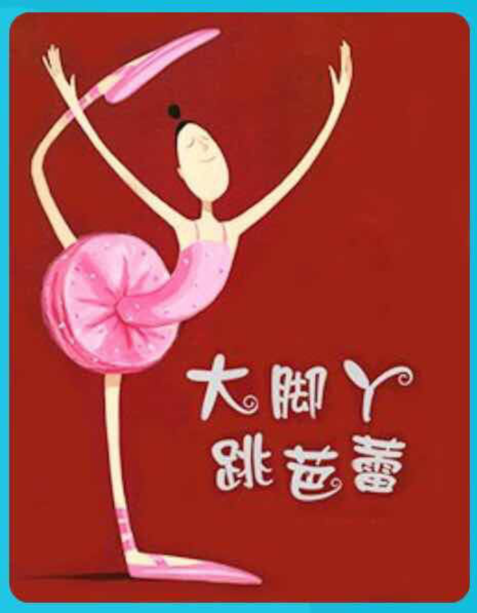

---

date: 2017-12-28 18:31:36
categories:
    - 书香书享（想）亲子共读
title: 馨暖聊绘本7：大脚丫跳芭蕾
description: "大脚丫跳芭蕾 妈妈:《大脚丫跳芭蕾》的CV是什么？ 暖暖：坚持VS放弃 妈妈：很好，还有呢？大脚Y坚持的是什么？ 暖暖：兴趣，爱好，初心 妈妈：初心VS什么，初心是最初的情感和信念，如果不守住 ，后面..."
image: image_0.png
---

大脚丫跳芭蕾

  
妈妈:《大脚丫跳芭蕾》的CV是什么？

  
  

  
暖暖：坚持VS放弃

  
  

  
妈妈：很好，还有呢？大脚Y坚持的是什么？

  
  

  
暖暖：兴趣，爱好，初心

  
  

  
妈妈：初心VS什么，初心是最初的情感和信念，如果不守住 ，后面慢慢会穿上些什么情绪的衣服，想想《天空在脚下》的贝利尼

  
  

  
暖暖：穿上患得患失情绪的衣服，穿上更加看重别人的看法的情绪衣服

  
  

  
妈妈：对，穿上这些衣服的叫世俗心，功利心，名利心，

  
  

  
暖暖：初心VS世俗心，功利心，名利心

  
  

  
妈妈：是的，那个假装懂的评审委员，有没有看大脚Y跳舞

  
  

  
暖暖： 假装懂的评审委员没有看大脚Y跳舞是因为觉得芭蕾舞需要小脚才能够跳得好看，大脚肯定跳不好

  
  

  
妈妈：这叫偏见，bias ,prejudice,，反义词是什么

  
  

  
暖暖：公平，平等，fair

  

  
妈妈：偏见，bias ,prejudice VS公平，fair, 平等,  背后的本质的情绪和心态是什么

  
  

  
暖暖：看到事物的每一面，不是光看一面，需要心态大一点，不要那么小

  
  

  
妈妈：心态大一点，更加OPEN，开放，包容的心态，

  
  

  
暖暖：心胸不要那么小，那么CLOSE，

  
  

  
妈妈：(偏见（close，封闭）VS公平（open，开放，包容）)\----如果一个人心胸狭窄（隘），会是IT思维还是W思维

  
  

  
暖暖：心胸CLOSE当然只能是IT思维，心态OPEN是W思维

  
  

  
妈妈：是W思维是换位思维，中文还有一个词叫“客观”，就是要站在“客人”的角度，“对方”的角度的观点，也更接近本质，objective sticks to the facts，but anything subjective has feelings

  

  
暖暖：所以我只知道又多了一个Core Value，objective VS subjective，客观VS主观

  
  

  
妈妈：是滴，是滴！这是从 IT思维和 W思维里派生出来的一个 CV。

  
妈妈：评审委员因为大脚Y脚大，没有给她跳舞的机会就让她下去了，她有没有生气？有没有放弃跳舞？

  
  

  
暖暖：她没生气，但想想他们说得对，就放弃了

  
  

  
妈妈：是一直放弃了吗？

  
  

  
暖暖：后来又不知不觉地跳起芭蕾，因为有音乐的地方就可以跳舞，她喜欢音乐和跳舞

  
  

  
妈妈：是，“不知不觉”这个词用得很好，说明大脚Y她对跳芭蕾是什么样发自内心的，心底的情绪？

  
  

  
暖暖：热爱,

  

  
妈妈：如果没有这种发自身体和心灵里面的热爱，她还会重新跳舞吗？

  
  

  
暖暖：不会，就象我上次还蛮想学唱歌的，可去了几次就放弃了，平时听到音乐也不会想起来要唱

  
  

  
妈妈：这个CORE VALUE是：热爱VS成功

  
妈妈：再说有没有生气，如果你弹琴比赛的时候，有个评审说小暖你怎么手这么小，这怎么可能弹得好琴，就让你下去吧，你会不会生气

  
  

  
暖暖：不会，因为我是个脾气非常好的人

  
  

  
妈妈：那会不会影响你回家继续练琴呢？

  
  

  
暖暖：不会

  
  

  
妈妈：那说明你很热爱弹钢琴哦，大脚Y和你一样，是个脾气好，还坚持做回自己的人，可以跟那些不欣赏自己的人和平相处。不欣赏我，OK，不影响我坚持做自己

  
  

  
暖暖：你说过这个世界是只有三件事，我的事，别人的事，老天的事，我做好自己的事情就可以了，不过我也很喜欢管老天爷的事情，就象今天你说珍珠奶茶店前要是有车位，你才会买，后来我就一直对老天爷说一定要有车位，一定要有车位，后来老天爷给我弄烦了，果然我们到的时候就有一个车位。

  
  

  
妈妈：哈哈，蛮好玩的。做好自己，是真正的自信，VS在别人眼里建立的自信。这里就有了一个CORE VALUE:

  
依赖型自尊（依赖在在别人的认可里建里起来的自信自尊）VS独立型自尊（坚持做自己的自信，自尊）

  
妈妈：暖暖，这篇文章还有个很有意思的现象，最开始的时候，那些评委看贝琳达大脚Y，都没给她表演的机会，第二次为什么一致叫好呢？

  
暖暖：一个是先看到她的大脚Y,一个是先看到她跳舞

  
  

  
妈妈： 对，说得好！同样是大脚Y上台跳舞这件事，第一次评委是带着什么心态？

  
  

  
暖暖：是带着挑剔的心态

  
  

  
妈妈：你实在太厉害了！表达精准！是带着挑剔的心态，就好象如果让你当评委的时候，你是不是也会这样？你给人评分，打分的时候。往往就是一种挑剔的眼光，挑毛病。那第二次是带着什么心态呢？

  
  

  
暖暖：不挑剔，因为朋友介绍的去看的，所以带着好奇的心态

  
  

  
妈妈：好奇什么？

  
  

  
暖暖：好奇她会跳得有多好

  
  

  
妈妈：是！是准备欣赏的心态，这个时候评委还关注她的大脚吗？

  
  

  
暖暖：不关注了，评委第二次关注是她的舞蹈，就想看看她跳得有多好

  
  

  
妈妈：是，是，第一次带着挑剔的眼光，第二次带着欣赏的眼光，评委的表现和态度完全不一样，这也告诉我们：People only see what they are prepared to see.

  
暖暖：不要看表面，要看表现

  
  

  
妈妈：道理上是这样，但人很多时候会因为跟着植入的初始的意识雷达，选择性倾听，选择性失忆，选择性记忆，就好比，一幅非常抽象的画作，事先知道这是毕加索的作品，和不事先不知道，一般人的反应会是完全不一样的。

  
暖暖：People only see what they are prepared to  
see.

  
妈妈：这就是为什么天上人间，一念之间，转个念头就可以改变思维，改变心的世界，我们也可以把这个念头想象成一个雷达，脑子里装着不同的雷达，就会有不同的格局，看到的东西也不同。这个以后还可以慢慢细讲，今天就到这儿，

  

  

  
好，那我们一起来划出重点，然后根据颜色总结下这个《大脚丫跳芭蕾》的CV:

1, 坚持VS放弃

  

  

1, 坚持VS放弃

2, 初心VS世俗心，功利心，名利心

  
3, 热爱VS成功

4, 做好自己，是真正的自信，VS 依赖在别人眼里建立的自信====

独立型自尊VS依赖型自尊

5, 偏见，bias, prejudice VS公平，fair, 平等========(背后的心态)

偏见（close，封闭）VS 公平（open，开放，包容）)＝＝＝（主导的思维）

  
  
objective VS subjective，客观VS主观，（I THINK 思维 VS WHAT,WHY思维）

  
6, People only see what they are prepared to  
see. 偏见产生的部分原因：意识雷达决定，你是否看见这个事情。人都会陷入不同程度的选择性倾听，选择性记忆，选择性遗忘。。。。。。