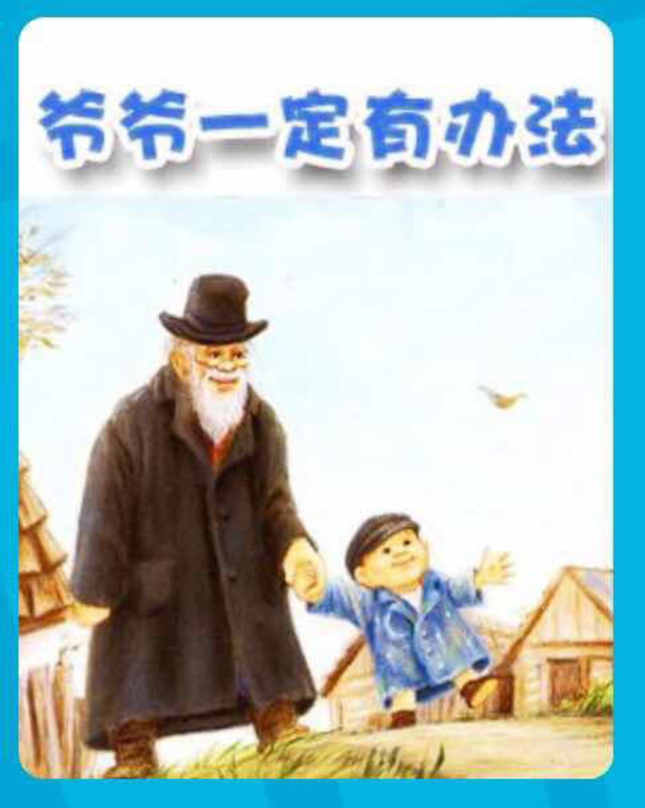

---

date: 2017-12-29 12:32:11
categories:
    - 书香书享（想）亲子共读
title: 馨暖聊绘本8：爷爷一定有办法
description: "妈妈：《爷爷一定有办法》这本书有个英文名 暖暖：肯定是Grandpa Can Do Anything 妈妈：哈哈，这个绘本原来的英文名叫Something From Nothing，你喜欢哪个名字，为..."
image: image_0.png
---

妈妈：《爷爷一定有办法》这本书有个英文名

暖暖：肯定是Grandpa Can Do Anything

妈妈：哈哈，这个绘本原来的英文名叫Something From Nothing，你喜欢哪个名字，为什么？

暖暖：当然是《爷爷一定有办法》，这个名字更舒服，让我想到就觉得很温暖，

而Something From Nothing，这个名字把这个故事的ENDING和TITLE connect上了，用你的话，就是显得更“高级”（是平时车上听熟的梁某人的话）

妈妈：小暖，你太“高级”了！你不仅感受到了《爷爷一定有办法》这个名字里不光是有“办法”，还有“爱”，

还能分析出这个名字和但跟故事的ENDING不搭，真的是很厉害！

所以真正把Something From Nothing是爷爷吗？

暖暖:  不是，是那个孩子，爷爷是Something From Something，哈哈。。。。蛮好玩的

妈妈：你很棒，小暖，和你聊天真的很有收获，Something From Nothing VS Something From  
Something,天，想得真好，这些我都想不到呢！现在我们来看看这本书的Core Values 有些什么？

暖暖：有办法VS没办法，Nothing VS Something

妈妈：暖暖，妈妈对你只有佩服，就是 有VS无，这是个最高级的发现！

暖暖：妈妈，你注意到下面的小老鼠一家吗？他们太可爱了！他们把上面没用的东西都拖下来了，这里面有个CV应该是CYCLE

妈妈：CYCLE，循环，是个什么循环？

暖暖：没用VS有用

妈妈：暖暖，你很棒，你看到了没用和有用不是个相反的关系，而是个CYCLE的关系，这又回到了我们上面的谈论，天下万物生于有，有生于无。这是道德经的第40章

暖暖：第40章，反者道之动，弱者道之用，天下万物生于有，有生于无

妈妈：比如妈妈练功，道之有无相生的关系是，形化气，气化神，神化虚，虚明而万物通。所以我现在冬藏养膘三个月，等开春辟谷十几天，形化气，气化神。。。。。

暖暖：冬藏养膘，哈哈，放开了大吃大喝，

妈妈：哈哈，是，人活着，大吃大喝也是对生命的尊重。不吃不喝也一样是对生命的尊重，这个有无相生的关系，道德经在第11章里也有举了三个例子

妈妈：哈哈，道德经在第11章里举了三个例子，也讲了这个有无的关系

暖暖：三十辐共一毂，当其无有车之用。埏埴以为器，当其无有器之用。凿户牖以为室，当其无有室之用。故有之以为利，无之以为用。

妈妈：是，是，有之以为利，无之以为用！就拿你经常看到的妈妈辟谷来说，用有形之肉肉练无形之气，化无形之神。。。。。。无和有的辩证关系就是整部道德经的哲学根基，从第1章就开始了，无，名天地之始，

暖暖：无，名天地之始，有，名万物之母。故常“无”，欲以观其妙；常“有”，欲以观其徼。此两者，同出而异名，同谓之玄。玄之又玄，众妙之门。你是想让我把所有的道德经背一遍吗？

妈妈：呵呵，是啊，道德经来来回回地都是讲有无是一体的，

老子说的天下万物生于有，有生于无是道的本质，

道的本质：“道生一，一生二，二生三，三生万物。（42章）”

这就有点象你说的，是个CYCLE

妈妈：我们再想想这本书还有什么Core Values吗？说说爷爷把小毯子变了几样东西？  
  
暖暖：外套、背心，领带，手绢，纽扣、  
  
妈妈：那每次东西破了，脏了时，约瑟的妈妈说什么吗？  
  
暖暖：真该把它丢了。。  
  
妈妈：那每次约瑟怎么回答的？  
  
暖暖：爷爷一定有办法！  
  
妈妈：为什么妈妈看到东西破了，说真该把它丢了  
  
暖暖：因为这个世界上所有的妈妈都是这样的，你看到我的袜子有个洞，也是这么做的

妈妈：那是因为妈妈认为破了的东西还有用吗？  
  
暖暖：没用了。但约瑟就觉得不应该这么浪费，  
  
妈妈：唔，浪费VS节约 那约瑟碰到破了的东西，脑子里有个意识雷达是什么

暖暖：爷爷一定有办法，东西可以RECYLE，可以变成很多有用的东西

妈妈：约瑟总是深信爷爷一定有办法，这个意识雷达背后的情绪是什么

暖暖：是相信，还有爱

妈妈：是，是信赖感和安全感，信赖感和安全感的本质也是爱，暖暖，你是不是也觉得爷爷很厉害

暖暖：是的，因为爷爷总是可以something from something ，不过那个孩子更厉害，可以something from nothing

  
妈妈：是的孩子他做到了无中生有。当然，孩子能够这样想，也是建立在爷爷平时言传身教的基础上。所以说，不是爷爷多厉害，而是那个看似无用的东西本质上就是有用的。如果我们碰到问题要积极去找办法，你也会像爷爷那样厉害，会象约瑟那样超过爷爷。我们来试试好吗？

暖暖：试什么？

  
妈妈：狼吃羊有没有用

暖暖：因为羊太多了呀，会把草地上草都吃掉，这是ruin the  
world, 狼把羊吃掉，就是一个很好的Recycle

妈妈：不问不知道，这么一聊天，我发现你知道的东西还不少呢，小暖又告诉了我一个非常好的生态循环的例子。看似有害的，看似无用的东西，实际上

暖暖：是有用的。没用VS有用，又是个CYCLE的关系

妈妈：拔掉的牙齿，有没有用

暖暖：有用的，可以和tooth fairy 换硬币，tooth fairy拿它们去做sculpture

妈妈：tooth fairy拿它们去做sculpture？这个也是我从来不知道的, 那哭有没有用？

暖暖：是身体排毒，也是身体的Recycle，必需的

妈妈：犯错误有没有用？

暖暖：我可以从错误里学到一点东西，这样错误会越来越减少，这也是一个Recycle

妈妈：生病有没有用

暖暖：可以看一整天电视，可以吃火锅，还可以跟姐姐吓唬说我是个大病毒，别靠近我，这样就可以一直抱着妈妈，用处就是能享受

妈妈：看来你的病还不够重，但无论如何，你说的那些生病时让自己更舒服方法也是对身体的一个安慰。

所以暖暖，你看，爷爷的变化是物质的，是有限的，但刚才我问你的这些例子都不仅仅是物质的，也有很多无中生有的，你这么快就掌握了方法，比爷爷和约瑟更厉害了！平常的日常生活中会碰到很多问题，这时候脑子里要装一个意识雷达，把“爷爷一定有办法”转变成

暖暖：我回家抱一下妈妈就会有办法了

妈妈：谢谢你对妈妈的信任和安全感，最好还是自己开动脑筋，给自己脑子上装上一个意识雷达，一个可以驱动自己去努力找方法的念头，告诉自己

暖暖：我一定有办法

妈妈：是的，不仃地跟自己说：不着急，我一定有办法！那这样想着，心里自然就会有什么

暖暖：有信心了，就能找到有办法的路

妈妈：对极了，把信任和安全感给自己，相信自己，让思维跟着“我一定有办法”这个驱动念头，这个意识雷达走，就一定能找到办法。

  

  

  

  

  
好，那我们一起来划出重点，然后根据颜色总结下《爷爷一定有办法》的CV:

  

1，植入一种心智模式：我一定有办法，

跟着 “我一定有办法”这个驱动念头，这个意识雷达走，就一定能找到办法。

2，没用VS有用，是个CYCLE的关系，Nothing  
VS Something，有VS无，

3，看似无用的东西本质上都是有用的。

4，信赖感和安全感的本质也是爱，

5，浪费VS节约

6，道德经：来来回回地都是讲有无是一体的：

老子说的天下万物生于有，有生于无是道的本质，

道的本质：“道生一，一生二，二生三，三生万物。

第1章:无，名天地之始，有，名万物之母。故常“无”，欲以观其妙；常“有”，欲以观其徼。此两者，同出而异名，同谓之玄。玄之又玄，众妙之门。

第2章讲了有无相生，互相依存的关系:天下皆知美之为美，斯恶已。皆知善之为善，斯不善已。故有无相生，难易相成，长短相形，高下相倾，音声相和，前后相随。

第11章里也有举了三个例子：三十辐共一毂，当其无有车之用。埏埴以为器，当其无有器之用。凿户牖以为室，当其无有室之用。故有之以为利，无之以为用。

第40章，反者道之动，弱者道之用，天下万物生于有，有生于无

第42章，道的本质：“道生一，一生二，二生三，三生万物。

练功，道之有无相生的关系是，形化气，气化神，神化虚，虚明而万物通。

  

  

妈妈记录：

我觉得这个故事最深层的含义是给孩子**植入一种心智模式：我有办法，我能创造 ；**

同时，这个绘本比较深的哲学思想。是探讨有用和没用这个辩证关系。

那些看起来没用的东西，实际上思考一下，都是有用的。

因为不想聊得太开，没有在“节约”和“惜物”上铺开