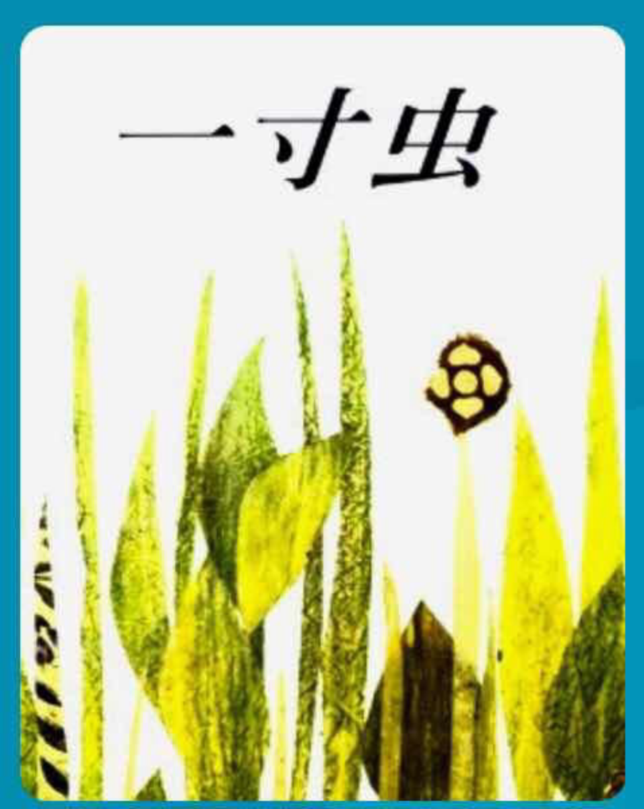

---

date: 2017-12-31 11:58:34
categories:
    - 书香书享（想）亲子共读
title: 馨暖聊绘本9：一寸虫
description: "一寸虫 妈妈：一寸虫愿意给那些鸟儿们量尺寸吗？ 暖暖：愿意啊， 妈妈：那它在给小动物们量尺寸的时候开心吗， 暖暖：很开心， 妈妈：你再仔细看看，它为什么要给小动物们量尺寸 暖暖：因为那些动物要吃它 妈..."
image: image_0.png
---

一寸虫

  
妈妈：一寸虫愿意给那些鸟儿们量尺寸吗？

  
暖暖：愿意啊，

  
妈妈：那它在给小动物们量尺寸的时候开心吗，

  
暖暖：很开心，

  
妈妈：你再仔细看看，它为什么要给小动物们量尺寸

  
暖暖：因为那些动物要吃它

  
妈妈：那一寸虫给那些鸟儿们量尺寸开心吗？

  
暖暖：蛮开心的吧

  
妈妈：你可以知道妈妈现在不开心吗？你这样解读一寸虫是什么思维

  
暖暖：IT思维

  
妈妈：是吧，我看你读这本书的时候就忍不住乐，能感觉到你看到虫可以用来量尺寸很好玩

暖暖：好吧，一寸虫不愿意量尺寸，但是又怕被鸟儿吃掉，所以应该是不开心的

  
妈妈：这是什么思维？

  
暖暖：W思维，是从一寸虫的角度的W思维

  

妈妈：是的，阅读时用IT思维，而忽视了原著本身要表达的意图，是很常见的一个阅读问题，因为很多人在阅读时一不小心就会把自己的觉受代入，所以在思考的时候一定要注意让自己回到W思维

  
妈妈：一寸虫愿意给那些鸟儿们量尺寸吗？

  
妈妈：一寸虫碰到夜莺，夜莺要他量自己的歌声时，一寸虫说了什么？  
  
暖暖：我只量东西，不量歌。  
  
妈妈：夜莺听了怎么说的？  
  
暖暖：要虫子量它的歌，否则就把它吃掉

  
妈妈：一寸虫又是怎么做的？  
暖暖：一寸虫说它可以量歌的，然后量着量着就逃跑了。

  
妈妈：那一寸虫答应量夜莺歌声的话是不是谎话?  
暖暖：是的。  
  
妈妈：那一寸虫到底该不该撒谎呢？  
  
暖暖：可以撒谎了，因为是为了逃命，

  
妈妈：这样的撒谎对不对

  
暖暖：如果一个人要把我杀死，我也会撒谎

  
妈妈：   
是的，但是在特殊的情况下，撒谎并不是坏事，反而是很聪明，有智慧的表现。就象这条一寸虫，面对的是天敌或者坏人时，它撒谎就是一种策略，并不是不好的行为，否则就会有生命危险，这种情况下还坚持说实话就是愚蠢了。  
  
暖暖：是的，你也说过对坏人可以说谎。

  
妈妈：   
又比如你收到一件礼物，打开一看不喜欢，如果送的人问你喜欢不喜欢这份礼物

  
暖暖：如果很讨厌，也只能说还可以

  
妈妈：为什么？这不也是说谎吗？

  
暖暖：因为这个时候要考虑到对方的感受

  
妈妈：是的，因为考虑到对方的感受而不得已说谎，叫善意的谎言。从这个对谎言的分析角度，我们也可以看到，很多事情不能一根筋思维，要根据具体情况来分析，来变通，找最合适的方式解决，这叫弹性思维。

  
妈妈：一寸虫是很弱小的动物，它有用吗？

  
暖暖：本来小动物都觉得它是没用，但是它自己说它可以量东西，正因为这个用处，得到了一个Chance可以Survive

  
妈妈：是的，说得很好，因为这个量东西的用处，一寸虫得到了一个Chance可以Survive

  
妈妈：什么叫survive，survive和live有什么不一样

  
暖暖：survive就是在危险的情况下终于活下来了，背后的情绪是紧张，害怕，  
  
不过逃出一来的那一刻是很开心的，Survive是为了可以活着

  
妈妈：是的，你这句很厉害！Survive是为了可以活着，在情绪上是很紧张的，心理上有压力，一直很stressful，所以说survive生存和live活着有什么不一样？

  
暖暖：所以说活着比生存更加自在，更加舒服

妈妈：  
  
好，妈妈再问一个问题，你觉得一寸虫是条有勇气的小虫子吗？  
暖暖：是的，它在要吃掉它的动物面前没有表现害怕，反而表现得脾气很好，能想办法逃走  
  
妈妈：是，在恐惧面前能脾气好，我们叫这种情绪叫“忍耐”，“能忍”也是种勇气，还很机智，随机应变。

  
妈妈：一寸虫被迫去量各种鸟，那些鸟看得起一寸虫吗？  
  
暖暖：看不起。  
  
妈妈：那一寸虫自卑吗？

  
暖暖：它不自卑，它一直在琢磨着怎么逃跑

  
妈妈：做最好的自己，才是自信，记得大脚Y时CV自信有哪几种？

  
暖暖：真正的自信是独立性自尊，依赖在别人的眼睛里建立的自信叫依赖型自尊

  
妈妈：独立性自尊VS依赖型自尊，一寸虫是什么？

  
暖暖：一寸虫和大脚Y一样，都是独立型自尊

  
  

好的，暖暖自己够把CV用蓝色划出来并注明下来，然后作一个Core Values的总结：

1， 阅读时的把自己代入后的IT思维VS W思维

2， 害怕VS勇气

3， 撒谎（善意的，机智的谎言）VS诚实

因为考虑到对方的感受而不得已说谎，叫善意的谎言。

对坏人可以说谎

4， 弹性思维（变通）VS一根筋思维（僵化，固化，没有变通）

5， 没用VS有用

6， survive生存(要活下去) VS live活着＝有压力VS自在

7， “忍耐” VS抗争save the day

8， 自卑VS自信

9， 独立性自尊VS依赖型自尊