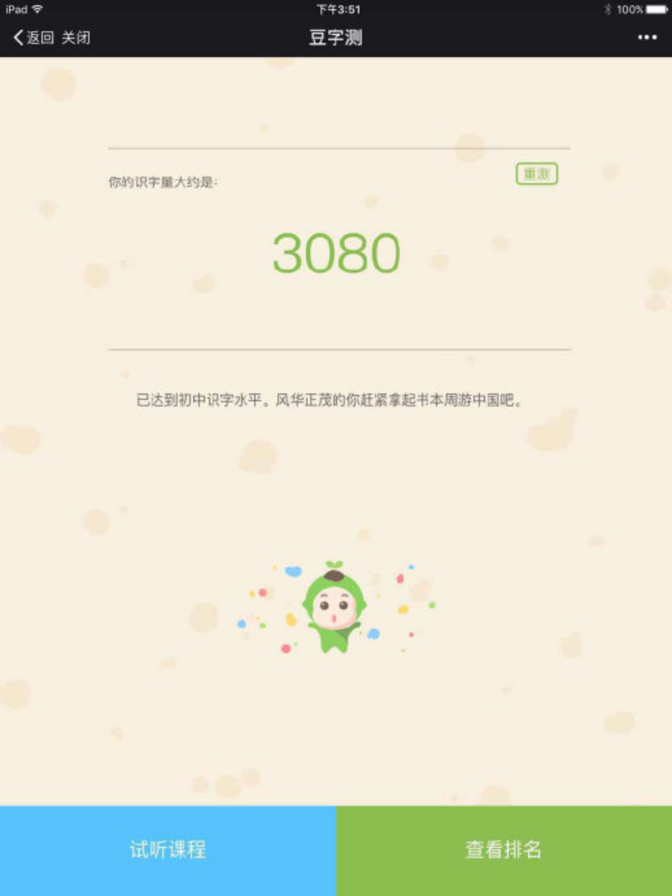

---

date: 2018-01-03 01:09:31
categories:
    - 大语文
title: 中：中文的识字量3080（八岁一个月）
description: "2018年1月1号一大早，小暖做了个识字量测试，看到结果达到了初中生的水平，有几个字竟然连爸爸妈妈都不认识，开心极了。。。小人儿随即很兴奋地表示要和姐姐比一比💪💪 12.12 母女共读了第一本绘本，《..."
image: image_0.png
---

2018年1月1号一大早，小暖做了个识字量测试，看到结果达到了初中生的水平，有几个字竟然连爸爸妈妈都不认识，开心极了。。。小人儿随即很兴奋地表示要和姐姐比一比💪💪

  

  

12.12 母女共读了第一本绘本，《活了第一百万次的猫》

12.12--12.31 母女共读同聊了10本绘本，两本小说

12.31 在共读完第10本绘本《蚯蚓的日记》后，  

我简单地教了下暖暖QQ拼音打字，她一看不难  

即写了平生第一篇中文日记  

一直在我梦里的孩子的中文写作竟是以这样的情境起步的

实在是没想到！！  

真是让我惊喜惊喜加惊喜。。。。。。  

不需要多，就这样几句话，只要每天坚持，  

那该有多棒！  

  

暖暖四岁不到的时候在悟空识字的软件里玩玩认认了三个月，当时统共不过1300的识字量之后就出国了，再没管过识字，就是独立阅读，米小圈小屁孩之类读了一大堆（绘本太沉了，我们就带了几箱半文半图的桥梁书）

看似完全没有营养，很多能力还是水到渠成的吧  

但水怎么流，得靠积累