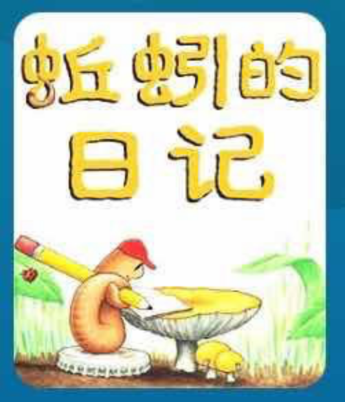

---

date: 2018-01-03 10:50:27
categories:
    - 书香书享（想）亲子共读
title: 馨暖聊绘本10：蚯蚓的日记
description: "蚯蚓的日记 妈妈：《蚯蚓的日记》和《一寸虫》有没有象的地方 暖暖：有的，蚯蚓更象是活着，一寸虫是survive,生存 还有，蚯蚓和一寸虫都很害怕被伤害 妈妈：是的，它们都属于很弱小的的小动物，蚯蚓有没..."
image: image_0.png
---

蚯蚓的日记

  
妈妈：《蚯蚓的日记》和《一寸虫》有没有象的地方

  
暖暖：有的，蚯蚓更象是活着，一寸虫是survive,生存

  
  
还有，蚯蚓和一寸虫都很害怕被伤害

  
妈妈：是的，它们都属于很弱小的的小动物，蚯蚓有没有需要面临survive的时候

  
暖暖：也有的，书里有两次讲到跳房子，跳房子是很危险的游戏，蚯蚓很容易会被抓走，还有钓鱼的时候拿蚯蚓做鱼食

  
妈妈：书里两次讲到跳房子游戏？

  
暖暖：是的，一次是在梦里，因为蚯蚓最害怕大鸟，所以那是个天大的恶梦

  
妈妈：我们生活中有没有一些很弱小的人

  
暖暖：姐姐在downtown给homeless的睡在大街上的人发过好几次面包，他们怎么连几块钱的汉堡包都买不起啊

  
妈妈：是啊，对这些弱势的人群，我们首先应该做什么

  
暖暖；帮助他们

  
妈妈：是，要帮助他们，你觉得我们首先应该做什么

  
暖暖：不要小看他们，不要对他们有偏见，要给他们机会

  
妈妈：你说得很棒！在帮助他们之前，不要瞧不起他们，首先要尊重他们，不要对他们有偏见，要给他们机会！有了这个以尊重弱小为前提“意识雷达”做出的爱心行为才是真正的帮助

  
  
小蚯蚓它这么弱小，他有用吗？

  
暖暖：有的，蚯蚓妈妈说应该永远记住三件事：一、地球给了我们需要的一切；二、我们钻地道的时候，也同时帮忙照顾了地球；三、绝对不要在爸爸吃报纸的时候烦他。

  
妈妈：你怎么看得都背下来了，是的，人家可以给地球松土呢，好伟大的工程，还有哪些弱小的动物是有用的

  
暖暖：小苍鼠最有用，你把它买回来，可以让你心情好

  
妈妈：哈哈，这是典型的阅读中的IT思维，不过也可以，还有吗

  
暖暖：一寸虫可以量东西，蜜蜂可以做蜂蜜，小熊很喜欢

  
妈妈：唔，这些小动物们都很有用，你还记得蚯蚓的日记最后一句话是怎么说的

  
暖暖：地球永远会记得我们，地球需要我们。

  
妈妈：就象爷爷一定有办法里面讲的，所有看上去没有用的东西其实都是有用的

  
暖暖：都是有用的，它喜欢当个蚯蚓，它热爱它的生活，总能用optimistic，hopeful的态度对面对生活中

  
妈妈：很棒，乐观是一种生活态度，optimistic  
  
乐观VS  
pessimistic悲观，乐观，我们之前的绘本还有哪几个人物有脑子里装了“乐观”这个积极思维的意识雷达面对生活

  
暖暖：蚯蚓，大脚Y，爷爷和小孩子都是，一寸虫，米瑞，二战里的小女孩子们

  
妈妈：是，统共讲了十本绘本，怎么就有这么多人物是乐观面对人生，你是乐观还是悲观的，你怎么看

  
暖暖：鼻子摔破的时候我没有哭，发现丢东西后马上要求老师帮我找，我长得小但我觉得我是班上最可爱的，想到中药就象有点苦的巧克力就会觉得还是蛮好喝的。。。。。。

  
妈妈：唔，能想到这么多例子，蛮不错的，我们要像小蚯蚓学习，虽然很平凡普通，很弱小，但一样有很大的用处。一样要乐观。

  
这几天都是小暖自己用颜色画重点，总结CV:

1，   
活着VS survive,生存

2，   
有用  
VS  
  
没用

3，   
optimistic   
乐观VS  
pessimistic悲观，脑子里装了“乐观”这个积极思维的意识雷达面对生活

  

  

  

妈妈新年第一天的记录：

  

2017\. 12.12  母女共读了第一本绘本，活了第一百万次的猫  
  
12.12--12.31 母女共读同聊了10本绘本，两本小说  
  
12.31 在共读完第10本绘本《蚯蚓的日记》后，  
  
我简单地教了下暖暖QQ拼音打字，她一看不难  
  
即写了平生第一篇中文日记  
  
（我心下已想好，不学中文写字了，能熟练拼音打字一样的），  
  
一直在我梦里的孩子的中文写作竟是以这样的情境起步的  
  
实在是没想到！！  
  
真是让我惊喜。。。。。。  
  
不需要多，就这样几句话，只要每天坚持，  
  
那该有多棒！