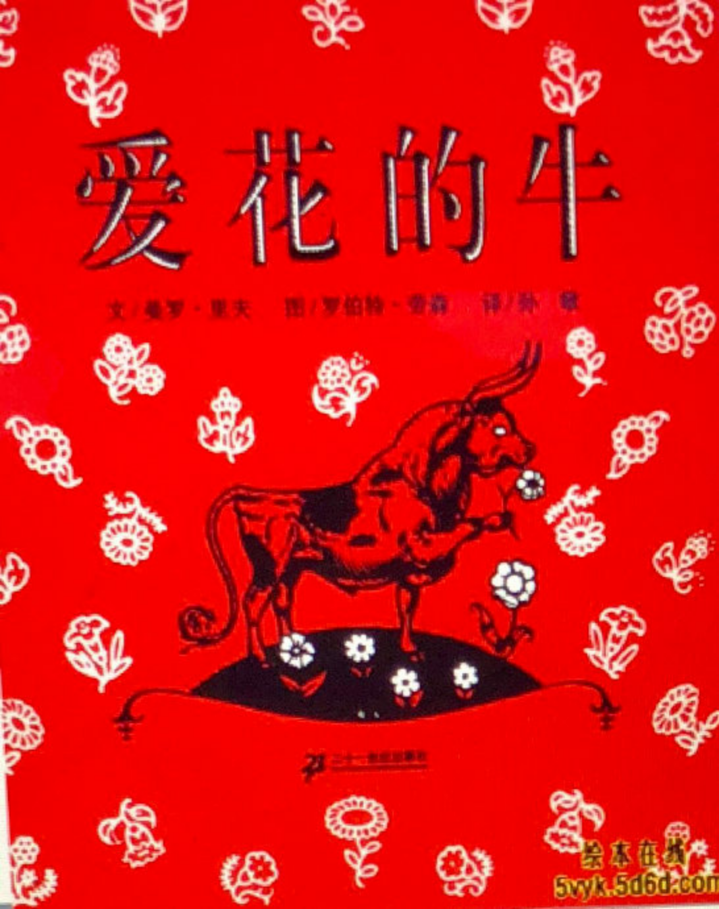

---

date: 2018-01-06 06:06:16
categories:
    - 书香书享（想）亲子共读
title: 馨暖聊绘本11：道德经和《爱花的牛》
description: "爱花的牛 妈妈的话： 今天共读《爱花的牛》，翻开PPT，才读了两三页，暖暖就嚷嚷说，这不就是前几天和Cynthia一起去看的电影吗？于是一查，果然！！Ferdinand，这实在太巧了！我心下大喜，有了..."
image: image_0.png
---

爱花的牛

妈妈的话：

今天共读《爱花的牛》，翻开PPT，才读了两三页，暖暖就嚷嚷说，这不就是前几天和Cynthia一起去看的电影吗？于是一查，果然！！Ferdinand，这实在太巧了！我心下大喜，有了看过的电影埑补，这本书应该会聊得顺畅好多

爱花的牛的作派，整个就是道家风骨，“静”、“朴”、“不欲”都是无为的内涵。

我自己觉得这本书最根本的Core Value是出世VS入世。道德经的第20章简直就是一首“爱花的牛之歌”。让我和孩子聊，可能又是一篇《道德经》和《爱花的牛》。如果从道德经的角度铺开来讲，这本书简直可以作为道德经的儿童版范本，从战争VS和平，从有为VS无为，从清静VS燥扰，从坚强VS柔弱 ，从勇于敢VS勇于不敢，从尚贤VS慎独，从宠辱若惊VS宠辱不惊 ，从反者道之动，弱者道之用，。。。。。。。，直接涉及就有二十多章，涵概内容覆盖整本道德经。。。。。。这从哪入手呢？

而从已经讲过的Core Values来讲，此书也能我和暖暖最近讲的10本绘本的主题，比如战争的本质是不尊重的生命，有用VS无用，自我认同VS社会认同，依赖型自尊VS独立型自尊VS无条件自尊, 弹性思维VS一根筋思维, 本心VS初心VS世俗心，关于勇气的多元理解（抗争VS不逃避VS忍耐VS宠辱不惊） 。。。。。。，捋个遍，尤其是最近几本一直有涉及的：有用VS无用，从“有用”的爷爷一定有办法，蚯蚓，一寸虫，到“无用”的爱花的牛，一路走来，也完全可以成个系列

我们现在开聊。。。。。。

妈妈：爱花的牛是一只什么样的牛

暖暖：爱花，喜欢坐在树下的牛，它平静，安静，喜欢大自然，peaceful。和别的牛不一样的，是独特，Unique, 别的牛都很喜欢的东西它一点也不CARE

妈妈：别的牛都很喜欢的东西它一点也不CARE，看来爱花的牛一点也不盲从

暖暖：RESPECT自已的INTER

妈妈：是，说得很好！尊重自己的内心，首先是有自我认同，不会被别人的想法带走，接受自己的特点，叫有自我认同，然后就是你说的，接受并尊重自己的内心需求

暖暖：还有就是爱花的牛很很很不合群

妈妈：很不合群是孤僻，喜欢一个人呆着，在树下闻花香。。。。。。

“静”、“朴”、“不欲”是爱花的牛的特点，也是道德经里“无为”的内涵。不欲以静，天下将自正（道37），这要细讲的话，你今天就得改背全本道德经了，妈妈就问你一个问题，之前我们讲过初心VS世俗心，那些公牛代表世俗心这个应该没有争议，爱花的牛是什么心呢？

暖暖：初心

妈妈：初心还是有动心的。爱花的牛应该是本心，“静”、“朴”、“不欲”，保持心如如不动，根本就不动心的心是本心。本心VS初心VS世俗心

所以再回到我们之前说过的依赖型自尊VS独立型自尊VS无条件自尊, 爱花的牛是什么自尊

暖暖：无条件

妈妈：对对，无欲则刚的无条件自尊，我们听到别人的否定，攻击，质疑，我们为何要生气？为何要在意？我想，关键还是心里有杂念。

本心和无条件自尊都是一个境界

暖暖：妈妈能做到吗？

妈妈：妈妈会生气吗？妈妈会在意吗？

暖暖：会的

妈妈：所以妈妈离这个境界还有距离，而无条件自尊和本心的最大的本质是不欲，不为所动。

那么那些公牛有什么样的特点

暖暖：不仃地在打架

妈妈：好斗，争强好胜，还有呢？

暖暖：所有的公牛的梦想都是参加斗牛，其实它们不知道事实，它们是被骗的，而且不是别人骗他们，是它们自己骗自己，它们自己觉得肯定能赢的，事实上斗牛就是看它怎么输的，人手里刀总比它们头上的角厉害，这个比赛本身就是不公平的

妈妈：你说得很好，这个现象说明公牛的最本质的特点是

暖暖，很蠢，ridiculous

妈妈：非常棒！蠢，就是这个字。因为他们完全是被利用的，却不自知！

他们最大的心愿就是参加斗牛大赛，为什么？

暖暖：因为它们都想要别人知道它很厉害，如果说费迪南是自我认可，那这些公牛是追求别人的认可

妈妈：很好，自我认可VS他人（社会）认可，道德经里第3章，也讲到关注他人认同和社会认同之间的问题，不尚贤，使民不争

暖暖： 不尚贤， 使民不争。不贵难得之货，使民不为盗。不见可欲，使民心不乱。是以圣人之治，虚其心，实其腹，弱其志，强其骨；常使民无知、无欲，使夫智者不敢为也。 为无为，则无不治。

妈妈：尚贤的“贤”就有个大家都认同的“好的榜样”，尚贤的本质就是统一价值观。

不尚贤，用现在的话来讲，就是不要去盲从“主流”，去追星，树偶像，就不会有争夺，有伤害。

“尚贤”的过程中很容易会以社会认同和他人认同的标准建立自我认同。尤其是女孩子，生活完全被社会上充斥的垃圾信息带着转，满脑子明星，时尚，名牌，八卦，整天想着跟自己不着调的事，还觉得这样的生活才是主流，前卫。从来不去想怎么样回归自己真实的需要，找到自己的心的真正的归属。。。。。。

暖暖：姐姐这方面做得很好！没有偶像，从来不会在乎别人喜欢什么，我也不太在乎，衣服舒服就好。

妈妈：唔，费迪南它不会在意别人怎么想，凡事不会盲从别人，一定要怎么样，而是问自己内心，我现在最需要什么，这点很灵的。

** **

** ** 小暖，你觉得费迪南的妈妈是什么样的?

暖暖：是个好的妈妈呀，因为她会尊重自己的孩子的内心

妈妈：是哦，费迪南有个足够好的妈妈，理解、接纳孩子的妈妈。

斗牛是件什么样的事情啊？

暖暖：不尊重生命，不公平

妈妈：唔，说得很好，不尊重生命，这跟上次我们聊的什么很象

暖暖：WAR

妈妈：是，你很棒，所以在斗牛这一PART，这本书的CORE VALUES很多可以和战争相联系看看的

妈妈：费迪南喜欢斗牛吗？它的理想是什么

暖暖：不喜欢，它的理想是平静，平安，电影里它最后一直在HILL上和小女孩子，和树，和花呆在一起，

妈妈：听上去很美好，费迪南因为什么最后活下来了

暖暖：因为斗牛是需要跟人斗的，可是牛不肯跟人斗，所以人就把它送回来了

妈妈：是的，牛不肯跟人斗，它不合作！

反者道之动，弱者道之用(40)，费南迪作为一头野牛因为没有斗的价值，因为在斗牛场上“没用”，反而出奇不意地救了它的性命。是不是有点“塞翁失马，焉知非福”的意思？你听过这个故事吗

暖暖：知道的，知道的，我来讲给你听：

首先有个老人，有一天他的马走丢了，所有的邻居都来安慰他，但这个老人说，这可能是个好事，

过了几天，走丢的马带了新马回来，所有的人都来恭喜他，但这个老人说这可能是个坏事，

他的儿子骑上新马摔下来，骨折了，所有的人又来安慰他，可是这个老人又说这可能是个好事，

过了几天，所有的年青男人都要去打仗，很多人因为战争死了，可他的儿子因为骨折不用去打仗。

这个故事说明一件好事可以变成坏事，一件坏事可以变成好事

妈妈：“塞翁失马，焉知非福”这个故事你讲得真好，是讲，人总是相信表面的直接感受，而接受生命中的“无常”往往需要超过表面认知的局限。在道德经第58章有差不多的话，祸兮，福之所倚；  
  

暖暖：

祸兮，福之所倚；  
福兮，祸之所伏。  
孰知其极？其无正也。  
正复为奇，善复为妖。  
人之迷，其日固久。  
是以圣人方而不割，廉而不刿，直而不肆，光而不耀。

妈妈：面对欢呼，面对虚荣，世上有谁能对此毫不动心呢？费迪南可以活下来还有个很重要的原因是在充满尖叫声和鼓掌声的斗牛场里，不管如何刺激他，刻意激怒他，他都不理会，只是静静地坐着，平和天真。这个在道德经里叫什么？13章讲了，是宠辱不惊

暖暖：宠辱若惊，贵大患若身。何谓宠辱若惊？宠，为下得之若惊，失之若惊，是谓宠辱若惊。何谓贵大患若身？吾所以有大患者，为吾有身，及吾无身，吾有何患？故贵以身为天下者，则可以寄於天下；爱以身为天下者，乃可以托於天下。

妈妈：老子在这里讲的就是人的尊严问题，说一个人如果能不贪恋被宠，不害怕被辱，这就可以保持自己完整、独立的人格。

暖暖：牛格

妈妈：呵呵，唔，对爱花的牛是牛格。宠辱不惊才能生静，生定，才能得天下，道德经45章大巧若拙，其用不辍，静胜躁，寒胜热。清静为天下正。爱花的牛正是用静定克制了燥扰的斗牛场，最后完胜。静定VS燥扰

道德经50章还从另一个角度来解释了爱花的牛为什么完胜，

****

暖暖:50出生入死。生之徒，十有三；死之徒，十有三；人之生，動之于死地， 亦十有三。 夫何故？以其生之厚。蓋聞善攝生者，路行不遇兕虎，入軍不被甲兵；兕無所投其角，虎無所用其爪，兵無所容其刃。夫何故？以其無死地。

妈妈：费南迪即是在老子所指的在危机四伏，出生入死的险境里最后得以保全生命，成为独善其生的“善摄生者”，一直到现在还在那棵树下幸福地闻着花香\-----兕無所投其角，虎無所用其爪，兵無所容其刃。夫何故？以其無死地。\---- 因为其少私寡欲，清静质朴、纯任自然，敌人根本找不到对他下手的机会。

暖暖，《爱花的牛》这个故事我们捋得差不多了，这里面还有一个CV是我们之前讲的爷爷一定有办法，一寸虫，蚯蚓的日记都讨论过的，你想想是什么

暖暖：有用VS无用

妈妈：是，之前讲的都是有用，爱花的牛有用吗？

暖暖：它不肯跟人斗，没用。它永远都是那么平静，安静，PEACEFUL

妈妈：是，你一下又用了这么多“静”，让我想起道德经16章

暖暖：致虚极，守静笃。万物并作，吾以观其复。夫物芸芸，各复归其根。归根曰静，静曰复命。复命曰常，知常曰明。不知常，妄作，凶；知常，容。容乃公，公乃王，王乃天，天乃道，道乃久，没身不殆。

妈妈：守静笃的“静笃”在这里是回复到自身的本来，保持纯真自然的本性、清静无为的本心才是长生久视之道；知常曰明。不知常，妄作，凶；懂此道且依此行之是“明”，不知常，无明，是凶。

在斗牛场上没有娱乐价值，但正因为它的没用保全了自己，这是有能力始终保持如如不动的本心的爱花的牛的高境界大智慧。

因为无用得以保全这方面的例子庄子也讲过，有棵树，因为没用而没被砍伐。但是在二战中，犹太人的集中营里，是有用的还是没用的最后可能有生存的机会？

暖暖：有用的，因为有用的可以干活

妈妈：是，那些没用的，会被纳粹屠杀，所以我们应该怎么看这其中有用和没用的关系呢？

暖暖：根据实际不同的情况，来选择有用或无用

妈妈：小暖，你说得太好了，有用和无用，不是绝对对立的关系，非此即彼的关系。不能做僵化的判断。  
  
把这个判断悬搁起来。注意悬搁是一个重要的哲学概念。悬搁，就是去除成见，去除先入之见的一个状态。再从实际出发做判断。  
  
我们讨论绘本最主要要学的能力就是哲学的思维能力

暖暖：弹性思维，变通思维

妈妈：你有点上路了，弹性思维，变通思维，辩证思维，开放思维，多元思维 VS固执思维，僵化思维，一根筋思维

暖暖：我们以前一寸虫讲过，考虑到对方的感受不得已时可以说谎，对坏人可以说谎，一根筋思维就是所有的说谎都是不对的

妈妈：是的！分析问题要有W思维，弹性思维，才能如你所说根据实际出发作判断

小暖，你觉得爱花的牛有勇气吗？

暖暖：有的，它敢出来就已经很厉害了，如果是我的话，我就不会出场的。还坐在那里不动也是很厉害了。

妈妈：是的，在斗牛场上不合作比拒绝更需要勇气！在外部纷杂的环境里依然可以做到宠辱不惊，可以守静，守定，守朴更是需要天大的勇气！

我们之前已经学过很多种勇气，有二战中小女孩子敢于帮助犹太孩子的勇气，有米瑞走高索和大脚Y跳芭蕾不逃避，勇于面对失败的勇气

暖暖：还有象一寸虫那样，懂得忍耐也是勇气，现在的牛，宠辱不惊也是勇气。

妈妈：是的，这就是对勇气的多元的理解。

之前我们也过《爱花的牛》在斗牛这个PART和战争和象，都是不尊重生命的，这本书是美国是第一本被禁的儿童绘本。在西班牙内战期间（二十世纪三十年代），这本书曾经被禁；另外，它也曾遭德国纳粹列为焚书书单之一。就是因为书中阐扬“反战、和平主义”的观点。

暖暖，你想过为什么一头不动的无用牛也会让HITLER害怕吗？

HITLER害怕的肯定不是一头无用的，不动的牛，他怕的是什么？

暖暖：它怕这种POWER

妈妈：唔，这是一种什么POWER

暖暖：PEACE，完全不管不理

妈妈：是，是，完全无惧无畏，完全不当一回事，对方害怕的是一种无欲则刚的能量，就是你说的POWER，对战争不合作，无惧无畏，尊重生命，主张和平，平安是人心所向的巨大的能量POWER。

  
  

妈妈： 暖暖，能不能要用W思维和弹性思维，想想作者究竟是想让我们通过费迪南的故事明白些什么道理？

暖暖：没有用未必就是坏事，大家都去抢的东西不一定是你需要的

妈妈：很好，还有吗？

暖暖：“塞翁失马，焉知非福”

妈妈：是，是，在我们固有的观念中，人还是要追求有用的。这应该是社会的主流价值观。

所以从这个故事里，我们看到：有用未必都是好的，没用未必都是坏的，大家都认可的，都蜂拥去抢的，未必是好的，大家都不看好的，未必是不好的，成功有部分取决于一股傻劲，

所谓傻人有傻福，这个傻是真傻吗？

暖暖：当然不是，这是一种很聪明的傻。就象全班的小朋友都喜欢这个斑点狗，但是我不喜欢，我会坚持

妈妈：唔，聪明的傻叫大智若愚。你说的这个是不盲从，这是一种自我认可。

道德经说天道无亲 常与善人（79），天道没有偏心，给懂得的深谙天道的智者。

爱花的牛的这个“傻气”不是运气，是深谙天道的境界，无论在什么领域，遇事能做到心不慌行不乱，能静心，有定力，就会更容易获得成功。

你觉得爱花的牛的作者是鼓励孩子们去做爱花的牛吗吗？为什么这本书会两次被拍成电影？

暖暖：爱花的牛和爱心树一样都是神仙

  
妈妈：哈哈，爱花的牛给我们展现的是另外一个不欲则刚，战无不胜的世界，记得我们讲爱心树的时候，最后也点到这个问题，我们是要学做爱心树吗？

暖暖：不是，它的能量比我们大得多！

妈妈：是，虽然爱心树和爱花的牛我们都不可能学得了，但我们可以让自己往那个方向去走，去成长。。。。。。。向爱心树学爱，向爱花的牛学静定。

学《爱心树》时我们讨论过：爱心树自身的巨能量可以释放化解人们对现实生活的恐惧和疑问，化解人内心深藏的这个恐惧点，一一 为化众生

  
现在聊的爱花的牛是一样一样的，出世VS入世，记得道德经划的道，德，仁，义，礼。。。。。的阶次吗？爱花的牛在的层次比我们高得多，而我们人在礼以下的层次，每天在入世的路上走得很辛苦，要面对各种争夺，各种竞争内心有天然的疑虑和恐惧，

所以需要象静，朴，不欲，能不战而胜的爱心牛这样的角色出现，以绘本，小说，戏剧，电影，音乐，画画等更多的艺术表现形式去展现，去诠释神性的＂本心本性＂，化解人心的这个恐惧点，一一 为化众生

人们一遍遍重看经典，翻拍经典的本质其实就是在释放每个人心中的恐惧和疑问，激活每个人内心的那朵莲花（佛心道心一神心）。

这样，人心会越来越释然。

暖暖： 怎么真的和《爱心树》一样一样的

妈妈： 是，大道至简，都是相通的，

如果我们的内心更释然，更开怀，象爱心树那样“爱”的能量和能力，象爱花的牛那样的“静定”的能量和能力自然都会提升得更快，离真正的幸福也更近。

妈妈：最后妈妈想和你分享一下，我发现道德经的第20章简直就是一首“爱花的牛之歌”  
  
暖暖：

唯之与阿，相去几何？  
美之与恶，相去何若？  
人之所畏，不可不畏？  
荒兮其未央哉！   
众人熙熙，如享太牢，如春登台。  
我独泊兮其未兆，如婴儿之未孩，傫傫兮，若无所归。  
众人皆有余，而我独若遗。  
我愚人之心也哉，沌沌兮！  
俗人昭昭，我独昏昏。  
俗人察察，我独闷闷。  
澹兮其若海，飂兮若无止。  
众人皆有以，而我独顽似鄙。  
我独异于人，而贵食母。

妈妈：我简单地给你翻译一下你肯定觉得就是在讲爱花的牛：

不在意唯诺附从和呵斥抗拒的差别，

也无所谓欣赏还是厌弃，

别人所畏避的，

我也不在意

盲从之风没完没了，但，与我何干

人们每天都追逐喧闹喜乐

唯独我像婴儿，

因不附合外面的热闹

而显得无所归属。

人们好象都喜欢要拥有更多，

而我却喜欢遗落于世。

我是愚人的心，混混沌沌的。

人们好象都显得精明洞悉，

而我乐于糊里糊涂。

人们都要勤快利索，

而我享受无拘无束。

人们都有可仗恃的本领，

而我就像不成器的拙朴一样。

我之所以如此特立独行，什么都和别人不一样

是因为我心只向内求。

****

  

  

爱花的牛的Core Values:

1，出世VS入世\---------“静”、“朴”、“不欲”都是无为的内涵。不欲以静，天下将自正（道37）

2，道德经：从战争VS和平，从有为VS无为，从清静VS燥扰，从坚强VS柔弱 ，从勇于敢VS勇于不敢，从尚贤VS慎独，从宠辱若惊VS宠辱不惊 ，从反者道之动，弱者道之用，

3，从已讲过的10本绘本的主题，战争的本质是不尊重的生命，有用VS无用，自我认同VS社会认同，依赖型自尊VS独立型自尊VS无条件自尊（无欲则刚）弹性思维（变通）VS一根筋思维（僵化，固化，没有变通）, 本心VS初心VS世俗心

。。。。。。尤其是有用VS无用，从“有用”的爷爷一定有办法，蚯蚓，一寸虫，到“无用”的爱花的牛，一路走来，也完全可以成个系列

4，自我认可VS他人（社会）认可 \--  道德经3：不尚贤，使民不争

“尚贤”的过程中很容易会以社会认同和他人认同的标准建立自我认同。

不会在意别人怎么想，凡事不会盲从别人，一定要怎么样，而是问自己内心，我现在最需要什么

5，依赖型自尊VS独立型自尊VS无条件自尊（无欲则刚）

6，本心（不动心）VS初心VS世俗心

无条件自尊和本心的本质是不欲和不为所动

7，理解、接纳孩子的妈妈

8，斗牛场：不尊重生命

9，反者道之动，弱者道之用，

10，“塞翁失马，焉知非福”\------道58章：祸兮，福之所倚；福兮，祸之所伏。孰知其极？其无正也。正复为奇，善复为妖。人之迷，其日固久。是以圣人方而不割，廉而不刿，直而不肆，光而不耀。

人总是相信表面的直接感受，而接受生命中的“无常”往往需要超过表面认知的局限。

11，道13章：宠辱若惊，贵大患若身。何谓宠辱若惊？宠，为下得之若惊，失之若惊，是谓宠辱若惊。何谓贵大患若身？吾所以有大患者，为吾有身，及吾无身，吾有何患？故贵以身为天下者，则可以寄於天下；爱以身为天下者，乃可以托於天下。

讲的就是人的尊严问题，说一个人如果能不贪恋被宠，不害怕被辱，这就可以保持自己完整、独立的人格。

12，HITLER害怕的是一种无欲则刚的能量，对战争不合作，无惧无畏，尊重生命，主张和平，平安是人心所向的巨大的能量POWER。

  
  

13，道德经45章大巧若拙，其用不辍，静胜躁，寒胜热。清静为天下正。爱花的牛用清定克制了燥扰的斗牛场，最后完胜。静定VS燥扰

14，道德经50章

出生入死。生之徒，十有三；死之徒，十有三；人之生，動之于死地， 亦十有三。 夫何故？以其生之厚。蓋聞善攝生者，路行不遇兕虎，入軍不被甲兵；兕無所投其角，虎無所用其爪，兵無所容其刃。夫何故？以其無死地。

因为其少私寡欲，清静质朴、纯任自然，敌人根本找不到对他下手的机会。

15，勇气＝＝＝抗争VS面对，不逃避VS忍耐VS宠辱不惊

在外部纷杂的环境里可以宠辱不惊，可以守静，守定，守朴更是一种勇气，

勇气，

我们之前已经学过有二战中小女孩子敢于帮助犹太孩子的勇气，有米瑞走高索和大脚Y跳芭蕾不逃避，勇于面对失败 ，还有象一寸虫那样，懂得忍耐也是勇气，现在的牛，宠辱不惊也是勇气。

这就是对勇气的多元的理解。也是一种开放思维和多元思维

16，道德经16章\-----致虚极，守静笃。万物并作，吾以观其复。夫物芸芸，各复归其根。归根曰静，静曰复命。复命曰常，知常曰明。不知常，妄作，凶；知常，容。容乃公，公乃王，王乃天，天乃道，道乃久，没身不殆。

守静笃的“静笃”在这里是回复到自身的本来，保持纯真自然的本性、清静无为的本心才是长生久视之道；知常曰明。不知常，妄作，凶；懂此道且依此行之是“明”，不知常，无明，是凶。

17，弹性，变通，多元，开放，辩证思维，VS固执思维，僵化思维，一根筋思维

有用和无用，不是绝对对立的关系，非此即彼的关系。不能做僵化的判断。  
  
把这个判断悬搁起来。注意悬搁是一个重要的哲学概念。悬搁，就是去除成见，去除先入之见的一个状态。再从实际出发做判断。  
  
我们讨论绘本最主要要学的能力就是哲学的思维能力

18 在我们固有的观念中，人还是要追求有用的。这应该是社会的主流价值观。

所以从这个故事里，我们看到：有用未必都是好的，没用未必都是坏的，大家都认可的，都蜂拥去抢的，未必是好的，大家都不看好的，未必是不好的，成功有部分取决于一股傻劲，

19，天道无亲 常与善人（79），\-----爱花的牛的这个“傻”是一种境界，是大智若愚  
  

遇事能做到心不慌行不乱，能静心，有定力，就会更容易获得成功。

20，道20：就是一首“爱花的牛之歌”  
  
  

唯之与阿，相去几何？  
美之与恶，相去何若？  
人之所畏，不可不畏？  
荒兮其未央哉！   
众人熙熙，如享太牢，如春登台。  
我独泊兮其未兆，如婴儿之未孩，傫傫兮，若无所归。  
众人皆有余，而我独若遗。  
我愚人之心也哉，沌沌兮！  
俗人昭昭，我独昏昏。  
俗人察察，我独闷闷。  
澹兮其若海，飂兮若无止。  
众人皆有以，而我独顽似鄙。  
我独异于人，而贵食母。

21，爱花的牛的作者是鼓励孩子们去做爱花的牛吗？

或者我们聊这本书是鼓励孩子去做废柴型的无用大树轻型？

为什么美国历史上第一本遭禁的童书会一直为孩子所喜爱，最后成为经典，还被拍过两次电影？

爱心树和爱花的牛我们都不可能学得了，但我们可以让自己往那个方向去走，去成长。。。。。。。向爱心树学爱，向爱花的牛学静定。

人每天在入世的路上走得很辛苦，面对各种争夺各种竞争内心有天然的疑虑和恐惧，

所以需要象静，朴，不欲，能不战而胜的爱心牛这样的角色出现，以绘本，小说，戏剧，电影，音乐，画画等更多的艺术表现形式去展现，去诠释神性的＂本心本性＂，化解人心的这个恐惧点，一一 为化众生

接近经典的本质其实就是在释放每个人心中的恐惧和疑问，

激活每个人内心的那朵莲花（佛心道心一神心）。

这样，人心会越来越释然。

