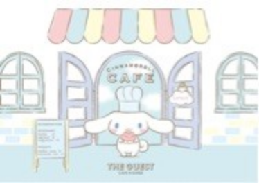
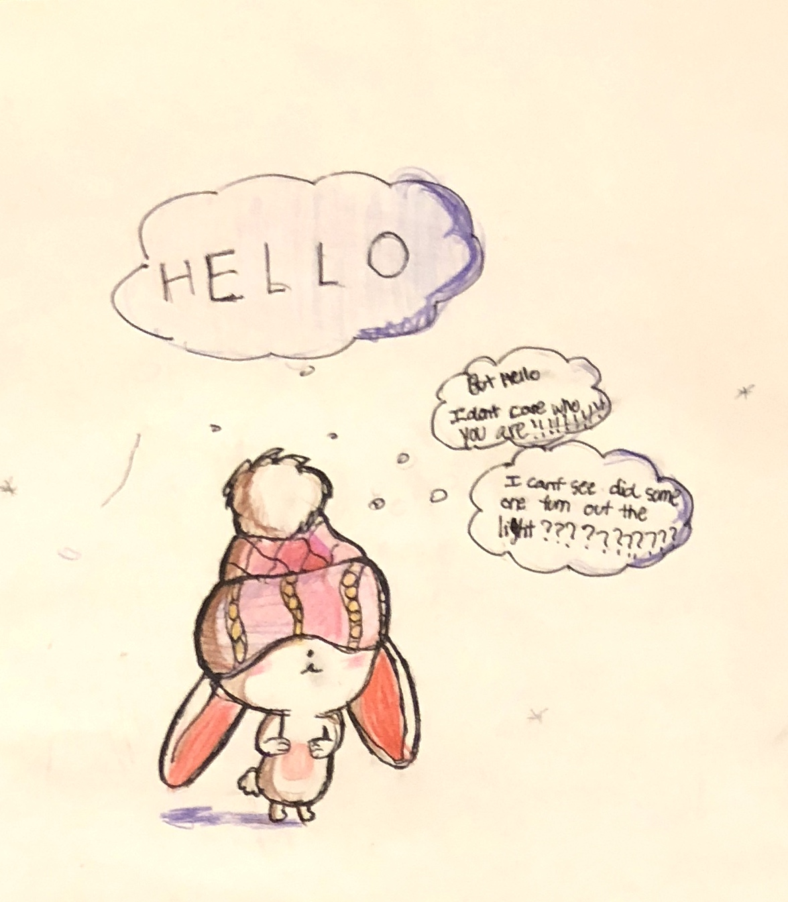

---

date: 2018-01-11 01:28:06
categories:
    - 暖暖写作空间-writing
title: 2018，暖暖的中文日记起步了
description: "2018.1.9 我有一个玩具叫CINNAMOROLL，我要讲讲她的来历；有一个小女孩在一家咖啡馆工作，有一天那个小女孩看见CINNAMOROLL上有一只小兔子。她想，这只小兔肯定是被我的CINNAM..."
image: image_0.png
---

## 2018.1.9

我有一个玩具叫CINNAMOROLL，我要讲讲她的来历；有一个小女孩在一家咖啡馆工作，有一天那个小女孩看见CINNAMOROLL上有一只小兔子。她想，这只小兔肯定是被我的CINNAMOROLL蛋糕 吸引过来的。果然，那个小兔子飞过来了，仔细一看，好巧！那个小兔子的尾巴也是CINNAMROLL蛋糕的形状的！所以现在这个小兔子也叫CINNAMOROLL这个名字。她的中文名字叫小白。她还开了一家咖啡馆呢。

这是她的咖啡馆的照片

PS: 我现在知道我为什么这么喜欢CINNAMOROLL了吗？第一，是我的朋友给我的，第二，我妈妈最喜欢的就是小白，第三，跟我爸爸的名字有缘份，这是怎么回事？不告诉你。

## 2018.1.8

今天是开学第一天，没有好事情，但是有坏事情发生。总共有2件坏事情，我本来不想说，可是妈妈说今天的日记就写写发生什么坏事情，也是蛮好的。

所以我来讲讲这2件坏事情

1\.  我在RECESS的时候发现我口袋有60块钱的学费。我和AYMA在HIDEOUT做了一点淡妆，所以我想去洗手间去检查一下我的妆。我看见校长来了，我大声的叫了一声“我去洗手间！”校长没听见。然后我回我的班去了。校长也跟来了，他觉得我在逃跑，他还告诉我，在我跑到洗手间的路上把 60块钱掉了，然后我把钱拿回来了。

2.下午的时候，AYMA想做TREEHOUSE, 我和GRACE想守学校的规矩，不想再伤害树了，因为我们已经和AYMA已经犯了学校很多规矩。AYMA还是个很坚持的孩子，哪怕刚从校长室回来，她想好的事情从来不会放弃。当我们很真实地告诉AYMA我们的想法的时候，AYMA就很生气，说，“做你们想做的事去吧”，然后就跑走了。她生气的时候还是蛮可爱的，脸会喷红喷红的。我希望明天和AYMA和好。

  

## 2018.1.7

今天妈妈在跟我聊《爱花的牛》的Core Values

我突然说:“我也有Core Values”

妈妈说“说说看？”

“有用VS没用”

妈妈说，“很有意思，STOP，不在这里说了，今天当日记写”

所以今天我打算写我自己的Core Values：有用VS没用

列5个有用的例子和5个没有的例子来说明：

现在我开始打“有用”的：

1．我勤劳的时候会帮妈妈拿手机，手机充电，和各种她不愿意起身去拿的东西。

2．我会抱CINNAMIROLL，这是我的新玩具

3．我会烦姐姐，这很有用的，因为姐姐生气的时候很可爱

4．我能帮家里人吃掉他们都不爱的垃圾食品呢

5．我会咬人，主要是姐姐，肚子饿的时候咬一口是很有用的

接着轮到写没用：

1．我懒的时候不会妈妈的手机充电，她只能让姐姐去帮她。

2．我有时候只管吃和睡不管妈妈了，好吧，我还是会抱抱妈妈的

3．我喝BUBBLE TEA的时候我会象爱花的牛一样不管妈妈了

4．有时候我非常懒，喜欢就躺在那里不动

5．有时候我会抱妈妈不动就躺在哪儿

我在学“爷爷一定用办法”的Core Values的时候学过“没用VS有用”不是个相反的关系，而是个CYCLE的关系，天下万物生于有，有生于无。这又回到了我上面的谈论，勤劳的时候我能感觉自己是有用的，懒的时候我觉得是舒服的，这种舒服的感受也是有用的，也满好玩的。我觉得今天就打到这里就好了，明天见

## 2018.1.6

昨天CYNTHIA来我们家SLEEPOVER，是一点开始的在画画班画了小鸟，然后我们回家，吃了甜品，玩了购物，还玩了化妆。。。。。一直到早上2点还在聊天。

今天早上九点家长们还没起来我们就起来了，玩了购物：我买了有个玩具，名字忘记了。然后一点又去了的画画课，我们做了一个天使帽和小屋子。CYNTHIA和我想今天继续SLEEPOVER，可是她爸爸要回中国差不多一个月，她的妈妈想要她今天晚上陪陪她爸爸，所以我们不能继续SLEEPOVER。再说今天晚上我要和我的UNCLE PETER吃饭。我希望能有2天的SLEEPOVER

  

## 2018.1.4

今天我画了一个很可爱的兔子，如果以后这只小兔子会很严肃的看电脑怎么办？

  
  

  

1， 把他们的电脑没收，如果她们还严肃就PLAN2

2， 给她们一个胡萝卜

3， 让她看一个其他兔子睡觉的照片

4， 叫她的妈妈抱抱她

PS：那些兔子其实是一个大人的例子，我要回去继续画画了，BYEBYE

  

  

  

## 2018.1.3

我三九天爸爸带我在COSCO买了哈跟达斯雪糕,买了一盒，可是妈妈说三九天不能吃哈跟达斯雪糕 , 理由是：

1，哈跟达斯雪糕是冰的，所以是寒冷的，我觉得没道理：因为妈妈在昨年的昨年的冬天买过一模一样的哈跟达斯雪糕回来给我和姐姐吃。

2，会着凉的，这点还是没道理：昨年的昨年我就没着凉。

现在我再来讲讲我可以吃哈跟达斯雪糕的理由：

1, 今天还是新年，新年应该开开心心的吃

2, 我吃不下的LEFTOVERS姐姐能吃, 因为她肚子更大。

让我总结一下：

1妈妈没道理

2妈妈还是没道理

所以我能吃哈跟达斯雪糕了YAY

## 2018.1.2

今天我一直在做作业，为什么大人可以每天一直在看电脑呢？

让我纠结一下为什么这样不公平。

小孩做作业时大人在看电脑

大人在看电脑文章时不抱宝宝了

大人看电脑时候很严肃的时候很可怕

还有好多好多理由我也懒得再说 . 所以我现在回去看书了 BYEBYE.

  

## 2018．1.1

今天我和Cynthia又有了一个Play date。

我去她家时是中午12：00，一直玩到晚上8：00，回家时天已经很黑了。

我们先看了一个电影，看到要杀一只牛的时候我觉得有一点可怕。

看完电影后我们SHOPPING了,买了小孩子的化妆品。在Cynthia家一边化妆一边吃PIZZA。那里最好玩的，可是很可惜只有1个半小时，因为我们又要去吃饭了。

在饭店吃龙虾和烤鸭的时候我和Cynthia和 Jason  , Jason 是个男孩, 玩了一点小游戏，我很开心。

今天玩得好开心！

我希望妈妈会让我和CYNTHIA再有一个SLEEPOVER.

## 2017. 12.31

今天是我和Cynthia的play date ，她12：45分来我家的，我画了小兔子, Cynthia画了杯珍珠奶茶，我们还玩了TUNNELTOWN，4:45分的时候我们都无聊了。在我们玩Monopoly 的时候她的妈妈来接她了。我不想她，因为我明天要和她再有一个play date。我会prepare好，这样我们能吃chocolate。  

