---

date: 2018-01-19 00:47:44
categories:
    - 暖暖写作空间-writing
title: 2018.1 暖暖日记 （八岁二个月）
description: "1.31. 18 今天我想不出什么好玩的，所以我打算要写无聊的事。 比方今天我一到学校，首先有了AYMA的欢迎大邀请，然后我们一起下去上体育课。同学们都在玩篮球，可是我非常怕那个球，那么大个球，我怎么..."
image: image_0.jpg
---

## 1.31. 18

今天我想不出什么好玩的，所以我打算要写无聊的事。

比方今天我一到学校，首先有了AYMA的欢迎大邀请，然后我们一起下去上体育课。同学们都在玩篮球，可是我非常怕那个球，那么大个球，我怎么能不怕呢，我只能躲在角落里，等休息时间。

中午，我陪AYMA采了一点很奇怪的东西，绿色的，上面毛绒绒的。

放学回家后， 我花了两个小时把两本书看了两遍，还完成了这两本书的考试，考了两个十分高的分数，都是八十六分。妈妈考试之前给我了一个帮助方法就是，碰到实在不会选的答案让屁股帮我选，拍拍屁股然后问它答案是A还是B。妈妈说屁股有时候可能会比脑袋聪明。

别问我为什么没考100分，Reading Town 5C的书对我这个三年级的小宝宝来说应该是非常非常难的，5C的意思是五年级的C，是五年级的最高的LEVEL。Reading Town的书都是NEWSBERRY得奖的书，我不太喜欢，得奖的书都很无聊。今天这两本书其实就非常的无聊。一本是讲一个男孩不停的在给他最喜欢的AUTHOR写信，另外一本书是讲一个小孩用枪救他的妈妈。

妈妈看到分数，眯眯笑，笑眯眯地夸我：“这么短时间就看完了两本书还考好了？! 太棒啦！”

我开心地说：“我就是这么棒棒的！我的脑袋不用屁股来帮忙，她已经够聪明啦！！！！！”

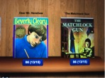

  

  

## 1.27.18

大病毒的最后一天也就是大病毒第⑥天，就是暖暖的平安之日。 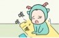

大病毒永远的走了+暖暖的退烧＝暖暖的开心

这次生病我又喝了很多小柴胡，小柴胡是一种药。妈妈为什么这么喜欢小柴胡？每次我看见杯子里有小柴胡，我都看见她和她的亲爱的老公姜汤在一起。她们两个最喜欢在一起的。你知道姜汤和小柴胡生的孩子是谁吗？她们的孩子是世界出名的珍珠奶茶。

其实什么是真的快速的退烧方法呢？答案是就是不停的玩，玩是最最有效的治疗方式。

## 1.26.18 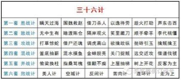

我已经是大病毒五天了，今天说说喝果汁的恐惧。

果汁是一个非常难吃的东西，只是名字叫的好听一点，因为如果汁不叫的好听一点的话，任何人都会一下子疯掉的。

妈妈的大道理为什么暖暖不能不吃果汁：平时完全不吃蔬菜，也很少吃水果，如果再不吃果汁会变小臭臭的

但是吃果汁是天下所有的宝宝们的最最可怕的恶梦，她们都非常害怕有人每天会喂一大碗果汁 。 所以宝宝们天天都在练习被喂果汁时的鬼脸和反抗，还有大哭。

你可千万不要嘲笑她们，因为我喝的果汁是蔬菜汁！包括芹菜，西兰花，西红柿，胡萝卜，茄子。。。。。。这样听上去也很难吃吧！！你吓的得恐惧病了吗？

  

## 1.25.18 

我已经是大病毒四天了，怎么把咳嗽治的完美

一想到治病肯定一定马上想到是西医的方法吗？不是！是中医的方法吗？也不是！

放弃了吗？

告诉你吧，是宝宝们的方法！因为很多宝宝都不知道咳嗽的时候还要喝难喝的药。

你现在知道了吧，这是打给宝宝们看到！所以如果你不是个宝宝的话，请马上退出！！!!

退出了吗？没退出的话我等你们。。。。。。。

宝宝们，我现在告诉你们，把咳嗽治的完美方法就是喝珍珠奶茶！

听完后如果你吃惊的话，说明你是个家长，请快快退！如果你是个的宝宝的话，你应该现在在很开心的鼓掌，回家告诉你妈妈别让你喝小青龙了吧！！！！！！

P.S只有妈妈不算一个大人，姐姐和爸爸都不允许看

## 1.24.18 

我已经是大病毒三天了，你是不是觉得我因为发烧就没力气去欺负别人了？

如果你是这样认为的话就完全错了，如果我是个大病毒的话我能把姐姐和爸爸都变成大大 病毒。

在我生病躺在床上的时候，妈妈经常开窗，说是让风把病毒带走，我很疑惑大大病毒会是想要自由还是想要在我身边

我可不想要大大病毒老陪着我，这样我烧就永远也不会好了，如果大大病毒们不陪我玩的话，我可能会好。姐姐和爸爸总是要到我这个大大病毒房间凑热闹，不停的抱我，还就不走了，他们是想也变成大大病毒的滋味吗？尽管来！！

PS：妈妈今天又把我所有的课都取消了

## 1.23.18

发烧VS饿

这次我发烧的经验就是：如果发烧你就完全不可能觉得饿。

如果你发烧了，即使对面有你最最喜欢的吃的东西，也只有胃口吃一点点。

这样非常难受。因为想吃的东西，但是没胃口吃。

今天妈妈给我喝了好几碗药，我觉得是药在这个世界上喝的最饱的东西了，我感受到小肚子要爆炸了！

## 1.22.2018

我今天一早上起发现发高烧了，莫名其妙的。

我最关心的还是发高烧怎么退烧？？

首先看书是没用的，躺着也没用的，吃面也一样没用，在沙发底下看I PAD上次是有用的，吃烤串上次也是有用的。

那怎么办？我今天试验下来跑步有一点点用处，我最喜欢的方法还是在妈妈的怀里赖着。早上妈妈陪着我学了四首唐诗，两首是讲花花的，还有两首是讲秋天的，我喜欢花花的，最喜欢那句“可爱深红爱浅红”，美美的。

 发烧时，我会非常非常懒，头很不舒服，吃很多药药，撑得肚子很满，非常不舒服！我听到妈妈在和医生微信说：暖暖不喜欢喝中药，就跟妈妈更正，“不是不喜欢，是讨厌，不是喝了难受，是肚子非常不舒服，不要以为我还小，不懂，我学过语法了，在这里需要用程度最重的词。”

妈妈说“你平时就需要对肚子好点，不要着凉，这样就不会生病了”

看着现在鼓鼓的肚子让我突然明白了为什么我刚学的唐诗“镜天无一毫”里的天可以那么漂亮，没有云朵了，因为小云朵都跑到我肚子里来调皮了。

我发高烧了，妈妈已经把我的所有的课都取消了。

## 1.21.2018

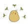小土豆和冰淇淋 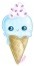

今天去SPEECH最后一趟课，是个登台表演。出门的时候，看到妈妈，爸爸，姐姐都在换衣服，第一个反应就是“千万不要都是去看我的表演!!!!”

妈妈很可爱的傻傻的说“我们都要去当你的小土豆和冰淇淋！”

我歪歪头问“听不懂，难道是吃的那种么??”

妈妈说“只要把台下的人都当成小土豆和冰淇淋，你在台上就不会害怕了，我们就是去当你的小土豆和冰淇淋！”

我很调皮的问“那我表演完了可以冲下来，然后把你们这些小土豆和冰淇淋都吃的么？”

妈妈说“可以啊，当你的表演完成的奖励”

“好呀，那我们走吧！”我们一家四口开开心心地出发了。

P．S: 猜猜我有没有在台上害怕？有没有真的冲下台去吃小土豆和冰淇淋？

  

## 1.20.2018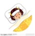

今天我的日记写的是：怎么让你的宝宝，开心，快速，舒服的退烧。

很多妈妈就不停给她们的生病发烧的宝宝喝药吃药，如果你是个小孩碰到这个问题，你是不是觉得你的妈妈老半天的让你喝几次药很烦呀？

很多宝宝都说是的，所以这只是妈妈们喜欢的方法。

那妈妈们，你喜欢你的宝宝感到很烦么？

也不喜欢吧。

今天我就有一点点发烧了，我们本来今天要去烤串的，因为是一点点发烧，妈妈就很犹豫的带我去了。

到了那里我吃了一碗羊肉汤面和2个烤面包片和2个烤冰淇淋。

吃完大餐以后，我烧就退了！

你是不是不信我烧就这么简单地退了呀，不信问我妈妈去。  
  

所以世界上的最好的退烧方法就是去吃烤串，妈妈喝酒，宝宝吃冰淇淋。

P.S:希望这篇日记对你会有用

  

## 1.19.2018

在看这篇日记之前首先检查一下你是中国人吗？你是在中国学校吗？

如果你两个都是，这个对你太简单了，不需要试了。

猜猜是什么？

猜不到吧，。。。。。。

就是考试考零分!

我一年级和两年级都试过想要考试考零分的，这个试验对我很interesting, 我想成为班里唯一一个考零分的小孩子，但都没成功。

你现在是不是很为我的屁股担心？

谢谢！不用担心的，我屁股没有变成猴子屁股，因为我什么都没写也没得到我想要的零分。

为什么我没有成功？

我琢磨了很久，想不明白，姐姐说 ，“ 大概是因为你还是有写你的名字，老师觉得你可怜，所以最后还是给了一分。”

我打算在3年级再试一次，必须考零分！！

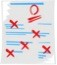P.S :  我妈妈现在开始关心我的成绩单，她以前总说安全和健康是最重要的，可自从姐姐开始考大学，她慢慢改口变成成绩也是学生在学校里第一重要的，所以我三年级这个考零分的计划可能要泡汤了，对不起！

  

PPS:姐姐看了我的日记，叹口气说：“其实我好象也没得到过零分。 真的很伤心！” 

  

  

## 1.17.2018

我今天在学校差点去学校的校长室，学校的规矩实在太多了。

你知道我犯了什么错误吗？

我什么错误也没犯，我只是用了学校的洗手间的水去做了一个小墙然后喂了一下树。

小墙是用土，水和沙做的一个有点SOLID的东西。

小树难道不值得得到一点干净水的吗？

如果你觉得小树不值得得到一点干净的水，我送你我最最好的建议就是到神经病医院去检查一下有没有神经病。

那个叫MONICA 的SRPERVISION就有非常严重的神经病，她都不让我用我自己的水壶做我自己想做的事情。这太没道理了！

当MONICA说BLABLA。。。。。。一大堆话，

AYMA回说：“我能不能让校长打我一下”

MONICA很快就看穿了AYMA想快点结束的小心思，说：“我们学校不是这样的，打你一下，然后再见”最后MONICA说，“你们下次再这样，就真的要去校长室了”

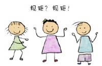学校的规矩太多了，再说她们和他们也没有事先写一个单子，然后就跟你说，你不能做这个，和这个，和这个，。。。。。。BLABLA。。。。。。。。。。我想让妈妈打电话给校长，反映一下这个情况，我倒是也想和校长讨论一下这个问题！

  

  

  

  

## 1.16.2018

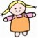如果你觉得世界上的所有的宝宝都是从妈妈肚子里开出来的，先告诉你一下，已经错了！书上说只有非常少数宝宝从妈妈肚子里开出来的，大部分都是从妈妈的屁股里出来的，或者是从我写的这些地方出来的：

1，有些宝宝是从蔬菜里长出来的，大部分这种宝宝长大后非常不喜欢吃蔬菜，因为她们生出来的时候没有妈妈的奶，只能吃很多很多的蔬菜，吃腻了。所以如果你的宝宝不喜欢吃蔬菜的话，她或者他可能是个蔬菜宝宝。

2，你还有可能生了一个云朵宝宝，云朵宝宝很软。如果你认识一个人叫云云或者这种名字的话，她或者他可能是个云朵宝宝。

3，还有可能你生了一个仙女宝宝，那种宝宝有一对透明的翅膀，如果你仔细的看她们的话，可能会看见她们身体旁边还有一点点图案，如果下面有一朵小云朵在吐舌头的话，能说明今天你会很开心。

4，如果你生的是一个臭臭或者一个傻傻宝宝，这种宝宝是非常容易发现，她们非常讨厌听“我是小臭臭”这样的歌。

5，超市宝宝就是一种很调皮的宝宝，她们很喜欢吃。她们非常讨厌超市。

6，最后一个，也是最多可能性的是垃圾筒宝宝，大多数妈妈都跟自己的宝宝说过，“你是垃圾筒里捡来的”，我还曾经建议过二年级的老师把她的宝宝也象我的妈妈一样把孩子放在垃圾筒里拍张照，她很认真地想了想，说：“我会考虑的”

如果你生了一个宝宝，请告诉我你生的是哪种。

P.S:我爸爸可能就是一个云朵宝宝，

而我的姐姐极有可能是第四种和第五种的混和宝宝

至于我呢，要去问我的妈妈，“我是什么宝宝？”

妈妈说，“我这么看下来，只知道了我大概是仙女宝宝，你呢，可能是。。。。。。。？？”

  

  

  

  

## 1.15.2018

日记VS作业

我一直以为我现在写的是日记，因为主题是暖暖日记。

既然是日记，我就可以决定今天是写还是不写。

可是妈妈很确定的说“不是，不是，你现在写的是一个规定的作业”

我提问道，“既然这是作业，那为什么主题是暖暖日记？”

妈妈很兴奋的回答说“这个问题问的非常好，因为日记就是一个每日都要做的记录，每日是每天，记是记录，所以每天需要做的记录，就是作业的意思”

我听了觉得很无聊，只能说“你不能说的更有道理一点的吗？”

妈妈把眼睛睁得大大的，“你不觉得这听上去已经是最有道理，最正确的吗”

爸爸在旁边听后凑热闹，“每件事情都是人生的作业” 【你是不是觉得爸爸的话听上去很象唐孙】

PS：我爸爸就是唐孙，唐孙就是一半唐僧一半孙悟空，

一边念着阿弥陀佛，一边教你怎么打妖精。

  

  

  

## 2018.1.13

今天一个可恶的人把我的妈妈冻死了，更可恶的是他把妈妈饿死了，你肯定想那个人是谁呢？你就猜猜看吧。我妈妈早饭都没吃就去姐姐的同学家长聚会，会上妈妈只吃了一小块面包，然后到下午一点才散会，妈妈刚刚走到街上一个人就拉住她然后跟她BLABLA。。。。。。。。。讲家长会喜欢听的东西，为了姐姐考大学有更多的学校消息，妈妈只好在街上站着和她聊了一个多小时。

回家来妈妈第1件事就是开壁炉，第2，拿暖宝宝和热水袋，第3喝热水，第4，一直说冷死了。

现在猜猜看那个可恶的人是谁，你想知道吗？是姐姐！因为那个把妈妈拉住的人是一直在讲姐姐的事。

PS：我和爸爸妈妈吃晚饭的饭店旁边有CHATTIME，爸爸妈妈不让我去，我不开心。可是，妈妈说明天可以带我去任何我想要的蛋糕店。

  

  

  

  

  

  

## 2018.1.12

  

今天在学校，我和ELLA去LOST AND FOUND整理东西。我拿方块的纸做了一个FORTUNE TELLER，可以告诉你的FORTUNE，我做好给ELLA玩,她翻到了”她爱的一个人”，她告诉我她爱一个男孩宝宝，是个婴儿。

她问我有没有爱的男孩子，我告诉她“我没有”

她说“你只是不承认”

我说“我真的没有”

她说“你有的。“

我看她这么坚持，于是我放弃了，说，“那你说说看”，

她说我爱ANDREW，我说“没有，他是我的敌人。”

然后她说我爱JAMES，我一边叫一边喊“不可能，没有！他是我教室里的第一敌人”。

然后我说‘PROVE IT”

她说“我来的那天，你的眼睛不停的往他们俩看。”

五分钟整理时间到了，我们要回到班上去。

一路上我还在想我是怎么爱上两个我的敌人了呢？

PS：今天是我最LUCKY的DAY, 我现在在吃哈跟达斯雪糕。我已经一年半没吃雪糕，雪糕说它很想我，很想我吃  它。我想我最爱的应该是哈跟达斯雪糕，而不是男孩子。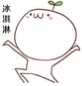

  

  

  

  

  

## 1.11.2018

  

今天妈妈买了两杯bubble tea，现在家里有两杯bubble tea和一碗鸡汤。

我现在要开始面对的问题就是bubble tea VS鸡汤，小孩子和大人喜欢哪样？

因为所有的小孩子在我们班都喜欢bubble tea超过鸡汤，所以小孩子是100 PERCENT喜欢bubble tea。关于小孩子是不是所有的小孩子都喜欢bubble tea这个问题，妈妈提出来了。她问“外国孩子也喜欢吗”

“当然”我说“AYMA就很喜欢，不过她是一半的外国人”

“纯的外国人呢”妈妈继续问

“也一样的”爸爸说，

“真的吗？”妈妈显得很吃惊

“是的，美国很好的大学旁边如果有bubble tea店，一样很受欢迎。”爸爸说

我以后一定要去一个有bubble tea店的大学！！

然后现在再来说说bubble tea VS鸡汤，家长喜欢哪个？

大部分的家长都喜欢鸡汤，因为：

第1鸡汤很健康

第2 bubble tea 对家长来说是垃圾食品。因为她们（妈妈们）和他们（爸爸们）都觉得bubble tea里面的bubble是塑料做的（事实上是用面 粉做的）。

所以大概也是100 PERCENT。

既然都是100 PERCENT，bubble tea VS鸡汤，怎么判断哪个赢呢。

既然都是100 PERCENT，bubble tea VS鸡汤，只能两个都赢呗 。

其实我想要bubble tea 赢的 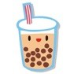

  

  

  

  

  

## 2018.1.10

我今天在和AYMA看一本书叫I am Pusheen the cat . Pusheen的妹妹是STORMY。看到书里有一页说她们都有魔棒，我和AYMA很羡慕。所以我们RECESS的时候拿了一根木头然后没完没了的磨。我觉得这样不会成功的。

后来我们上课时能有IPAD, 我们就偷偷的查怎么做哈里波特的魔棒，我想做特别的可爱的。你知道CINNAMOROLL的咖啡店里的玫瑰茶是怎么样的吗？玫瑰茶上有一朵云，我想要在魔棒上放差不多的东西。因为我最近我迷上了小白，所以好像有点偷了她的想法。其实就是把一个筷子打扮的漂亮一点，做成我们自己想要的样子的磨棒。

如果成功的话我会告诉你的，明天见，日记。