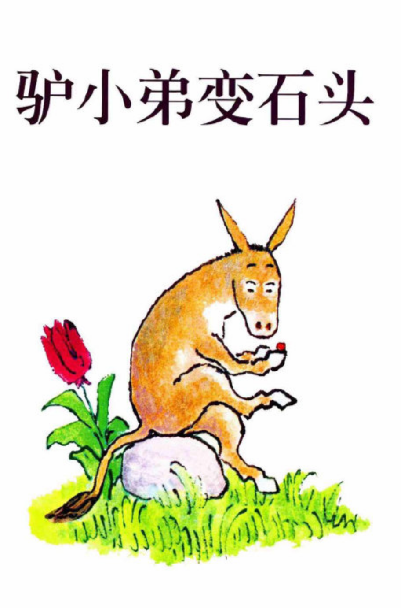

---

date: 2018-01-28 10:21:55
categories:
    - 书香书享（想）亲子共读
title: 馨暖聊绘本15：驴小弟变石头
description: "妈妈：首先思考这样一个问题。驴小弟拿到的那个神奇的石头。象征着什么？ 暖暖：实现愿望 妈妈：实现了驴小弟的愿望了吗？ 暖暖：实现了，既有好的一面，比方帮驴小弟弄出太阳和雨，也有不好的一面，把它变成石头..."
image: image_0.png
---

   
妈妈：首先思考这样一个问题。驴小弟拿到的那个神奇的石头。象征着什么？  
  
暖暖：实现愿望

  
妈妈：实现了驴小弟的愿望了吗？

  
暖暖：实现了，既有好的一面，比方帮驴小弟弄出太阳和雨，也有不好的一面，把它变成石头了

  
妈妈：这个就叫双刃剑，双刃剑”是什么意思：两面都有刃的剑，其实剑都是双刃的，单刃的就叫刀了。用来形容事情的双重影响性，既有利也有弊。利是怎么会变成弊？好的怎么会变成坏的？

  
暖暖：里面有个middle,  
  
中间

  
妈妈：是，中国有个成语，也可以作为一个双刃剑的CV：一分为二，过犹不及，形容事情做得过头，就跟做得不够是一样，都是不合适的。所以中国人很讲究你刚才说的那个字：“中”。“中”，也是东方哲学，中国文化的精髓。

  
现在再说回来，这块神奇石头对驴小弟象征什么，

  
暖暖：象征着不可控制的

  
妈妈：是，充分自由。“自由”也是双刃剑，就像这个神奇石头，孩子难以分辨其副作用，“自由”对孩子来说，既有好处，也有不好的地方。  
  
给孩子自由，本来出发点是非常美好的，可孩子有能力对付这个“自由”吗？  
  
如果孩子的能力不足以处理这个“自由”的时候，就可能到了事情的反面。  

  

  
关于双刃剑的认识引申：  
  
双刃剑  
  
遇到那种对自己特别有利的事情，一定不要丧失理性，以防乐极生悲。

驴小弟拿到的那个神奇的石头象征着双刃剑。  
  
可以带来财富幸运，但如果用不好，就会弄伤自己。

阿拉丁神灯也是双刃剑：神灯带来了幸福，也带来了灾祸。

科学技术也是双刃剑：  
  
爱因斯坦在总结自己的人生时说道：  
  
我不能肯定我哪一项发现会流传，我甚至后悔我的一生……  
  
核电站能够给人带来益处，但是灾难也不可设想。  
  
克隆人的技术，看起来好，但是为何各国要限制？

财富是双刃剑：  
  
许多中彩票的人，后来人生不幸，  
  
因为他还没有管理那么大笔财富的能力。

  
妈妈：这块石头最后去哪儿了

  
暖暖：驴的爸妈把它放在保存箱里了，

  
妈妈：为什么呢？

  
暖暖：因为很不安全

  
妈妈：不安全的本质是什么？

  
  
驴小弟刚拿到这块石头的时候有没有想过它是不安全的

  
暖暖：没有，觉得它可以变很多驴小弟想要的东西

  
妈妈：驴小弟如果不变成那块石头，那块石头对它是不是安全的？

  
暖暖：不会，因为还可能发生别的事情，如果它想石头把它变成火，那会有更大的灾难。驴小弟没有能力控制这块石头，因为它没有想到结果。

  
妈妈：所以说驴小弟变石头这件事本身是偶然的，还是必然的，为什么

  
暖暖：必然，因为这件事的本质是驴小弟还没有能力控制这块石头，所以怎么都会出危险，这次不发生，下次也会发生

  
妈妈：对的，能力！

  
暖暖：这块石头对驴小弟来说不安全本质是因为驴小弟没有能力控制。

  
妈妈：所以这块神奇石头象征什么？

  
暖暖：危险，不能控制

  
妈妈：不能控制！这块石头只是一个象征，象征着一种孩子难以掌控的东西。

  
暖暖：所以驴小弟的爸妈后来把石头放在安全的地方

  
妈妈：是的，这里有个CV是控制VS？

  
暖暖：能力,  控制VS能力

  
妈妈：对的，不被控制也能安全的能力叫自由，这个自由是需要有基本的保全自己的能力的，需要让父母都放心的能力的。控制VS自由，风险VS自由。

  
就象你现在看IPAD的时间有规定，睡觉的时间有规定，很多事情还在父母的控制里，获得自由的基础是什么？

  
暖暖：能力

  
妈妈：是的，自由是能力之后水道渠成的产物。根据能力给予自由，自由跟着能力走，而不是为了自由而自由。积累能力，慢慢扩展自由的边界，而不是自由自己跑到前面去了。自由VS.能力

  
暖暖：有能力的自由是好事，没有能力的自由就是DISASTER。

  
妈妈：德不配位，必有灾殃。如果德薄而位尊,   
智小而谋大，   
力小而任重的结果是什么

  
暖暖：崩溃掉

  
妈妈：是，对一个事情，有好有坏，弹性思维。一分为二看问题是一种重要的思想方法，可以更全面地认识问题。各个学科都有涉及，可以说是每个学科的核心思想方法。  
  
比如说地理方面，寒潮我们一般理解很不好，带来许多灾害。  
  
但一分为二的看，寒潮也有许多益处。  
  
比如，北方冬季比较干旱，此时寒潮来了之后，可以带来大雪。  
  
大雪融化后，可以极大缓解干旱。  
  
看一个人也是如此，一分为二的看，可以更全面的认识。没有绝对的坏人，也没有绝对的好人。类似的概念是过犹不及。有些好的东西，过分了就不好了。  
  
辩证思考也是类似的概念。

  
德不配位，必有灾殃  
德薄而位尊,  
  
智小而谋大，力小而任重，反受其害

妈妈：最后再和暖暖聊一聊思维方式，也就是思考方法，思考问题的方法。我们今天又碰到了”双刃剑“，一分为二，过犹不及的辩证思考方法

到 现在已经通过这段学了哪些思维方法？

暖暖：弹性思维VS僵化思维,

妈妈：弹性思维包括：W思维，一分为二的思维，开放思维，辩证思维，变通思维

僵化思维包括：IT思维，一根筋思维，偏执思维

我们最主要是学具体问题具体分析弹性思维，避免僵化思维。

比如因材施教是具体问题具体分析。  
策略应试就是一分为二看问题。也就是具体问题具体分析。  
分类讨论也是具体问题具体分析的变体。  
站高一线，是用发展眼光看问题。全面看问题。看问题要长远，要全面。

  
  
  

  

CORE VALUES:

1,   
  
双刃剑：两面都有刃的剑，其实剑都是双刃的，单刃的就叫刀了。用来形容事情的双重影响性，既有利也有弊。利是怎么会变成弊？好的怎么会变成坏的？是一分为二的辩证思维方法

2,   
控制VS自由，风险VS自由，自由VS.能力

  
  
能力不到，德不配位，必有灾殃  
  

  
  
德薄而位尊,   
智小而谋大，力小而任重，反受其害

  
  
家长不给孩子自由的同时，要让他负责任，要帮助他培养能力和技能。

  
  
今天自我管理得好不好，好在哪？什么地方要改？明天能不能更好些？如果有进步，我就再多放手些。   
自由背后，是庞大的能力做为依托。

3,   
一分为二的看问题，可以更全面的认识。是辩证思维，弹性思维。

4，与一分为二地看问题类似的概念有个成语叫：过犹不及\-----形容事情做得过头，就跟做得不够是一样，都是不合适的。所以中国人很讲究你刚才说的那个字：“中”。

  
  
“中”，也是东方哲学，中国文化的精髓。

  
过犹不及：

  
道德经12：五色令人目盲；五音令人耳聋；五味令人口爽；驰骋畋猎，令人心发狂；难得之货，令人行妨。是以圣人为腹不为目，故去彼取此。

  
道德经44：名与身孰亲。身与货孰多。得与亡孰病。是故甚爱必大费；多藏必厚亡。知足不辱。知止不殆。可以长久。

5， 思维方法总结：弹性VS僵化 

弹性思维包括：W思维，一分为二，过犹不及的思维，开放思维，辩证思维，

僵化思维包括：IT思维，一根筋思维，偏执思维

我们最主要是学具体问题具体分析弹性思维，避免僵化思维。

比如因材施教是具体问题具体分析。  
策略应试就是一分为二看问题。也就是具体问题具体分析。  
分类讨论也是具体问题具体分析的变体。  
站高一线，是用发展眼光看问题。全面看问题。看问题要长远，要全面。