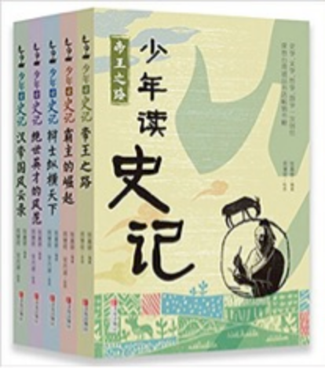

---

date: 2018-01-31 09:58:16
categories:
    - 书香书享（想）亲子共读
title: 馨暖聊历史1：《少年读史记》尧舜禅让
description: "少年读史记： 建议阅读顺序： 帝王之路 霸主的崛起 辨士纵横天下 绝世英才的风范 汉帝国风云录 妈妈的话： 学历史最根本的目的 在我看来： 一是建立历史思维，史观。二是鉴古知今，以史为鉴。 道德经有言..."
image: image_0.png
---

少年读史记：  建议阅读顺序：   
帝王之路  
霸主的崛起  
辨士纵横天下  
绝世英才的风范  
汉帝国风云录 妈妈的话： 学历史最根本的目的 在我看来： 一是建立历史思维，史观。二是鉴古知今，以史为鉴。 道德经有言：执古之道以御今之有。能知古始，是谓道纪   
我带小暖学历史 中国几千年的历史长河，内容是极浩瀚的， 我带小暖学历史，并不是想让她知道多少史实， 这个如果她长大有兴趣，可以顺着脉络慢慢找补。 我带小暖学历史的初心，就是试着给她建一条这样的脉络。   
从历史的故事里谈文化，聊哲学，会比较有根， 在有根有据里，通过一些重大的历史事件和人物作点简单的分析和归因， 中国几千年的历朝历代的兴亡，都是在不断地重复，我只想讲透一两个朝代，两三个皇帝，四五个哲人 随之去寻找文明和文化的脉胳，初步建立史观，学习历史的思维方法。 《道德经》《大学》《皇帝内经》《金刚经》，甚至唐诗宋词， 这些平时背过的一点东西也能跟着史观的初步建立找到各自的脉胳的脉点，可以鲜活立体起来， 通过这些其实是还很有限的点线面串连。。。。。 从中能对中国几千年的朝代更替兴亡的共性是什么？ 中国文化和中国哲学是什么？中国人的道德观大概是什么？ 这些都是从哪里来的？ 有初步的了解。   
这样，即使她之后对历史这块完全没兴趣，脑子里已有的也不是些零敲碎打的小故事。 这样，以后她听到人家说到中国的故事，都能很快归因并有能力参加探讨，而不是茫然不知其所云。 这样，她以后也可以尝试用同样的思维方法去学习，对比，和总结西方历史和世界历史 妈妈：尧为什么要把帝位传给舜 暖暖：因为他要把帝位传给有能力的人 妈妈：是，传贤不传子。尧的心目中舜具备了哪些做帝王的能力 暖暖：用对的人做对的事情 妈妈：你说的很好，这是什么意思 暖暖：找合适的人，找有能力解决问题的人 妈妈：对，这是做帝王应该具备的能力的第一个CV:知人善任VS任人唯亲 舜选择对的人做对的事,选择人不选择亲信而是 暖暖：选择有能力的人。 妈妈：舜还具备了哪些做帝王的能力 暖暖：他的家人对他很坏，但他不委屈他们 妈妈：这是以德报怨VS以怨报怨 ，舜是哪个？ 暖暖：以德报怨。 妈妈：是舜对亲人害他的做法是以德报怨，最终改变了亲人。舜在取得帝位的过程中顺利吗 暖暖：不顺利，他弟弟差点杀了他。但他没有害怕磨难，而是努力去SOLVE PROBLEM. 妈妈：对，逆境VS顺境，这里还有个底层代码： 反脆弱： 给我们带来最大利益的并不是那些试图帮助我们的人，  
而是那些曾努力伤害我们但最终未能如愿的人。 增上缘的意思是帮忙，又分为两种，顺增上缘VS[逆增上缘](http://qqaaa.net/misc.php?mod=tag&id=2908)： 顺增上缘，是从正面来帮助人； 另一种是[逆增上缘](http://qqaaa.net/misc.php?mod=tag&id=2908)，是用打击来帮助人。 就象舜的弟弟一直努力地想害舜，但事实上呢 暖暖：舜还对他很好，而且尧知道了很开心，知道他选了个有能力还很GENERROUS的人 妈妈：尧为什么一定要选一个对家人好的人管天下 暖暖：因为他觉得做要先管好身边的人，才管好更多的 妈妈：你说得很好，《道德经》63章提到，天下大事，必作于细。 暖暖：为无为，事无事，味无味。大小多少。报怨以德。图难于其易，为大于其细；天下难事，必作于易； 天下大事，必作于细。是以圣人终不为大，故能成其大。 妈妈： 这段总的来说就是，把大化成小。天下所有的大事都是一件件小事组成的。只要我们把一件件小事做好了， 大事自然就成了。大生于小，多生于少。 老子非常智慧的看到了这个事情的真相，所以任何事情，任何东西，都是由很小的东西去组成的。 暖暖：所以尧考验舜的第一步就是看他能否管好家 妈妈：是的，尧考验舜的第一步就是看他能否治理好家庭，能治家才有希望治国。 逆境和反对舜的人都成为舜的逆增上缘。逆境反而成就了他。尧看到了这些， 觉得舜可以做到厚德载物（VS德薄而位尊），我们刚学过驴小弟变石头，如果反过来德薄而位尊 暖暖：会造成各种灾难。 妈妈：好，我们在这里基本上把尧心目中帝王应该具备的能力梳理了一下，我等会儿会把你划出的重点作总结。 接下来我们把这章主要讲的政治结构理一下，尧舜禅让，让的是什么？ 暖暖：尧舜禅让，让的是帝位 妈妈：很好，是公天下还是私天下。什么叫公天下，什么叫私天下 暖暖：公天下。公天下就是天下是大家的，私天下是自己的，是皇帝那家人的 妈妈：是，所以也叫家天下。公天下VS.私天下（家天下）。什么叫天下 暖暖：所有的人的天下 妈妈：是，有句古语说："天下非一人之天下也，天下之天下也。” 天下不是皇帝一个人的，是所有老百姓的的天下，用现在的话来说，是人民的天下。  
妈妈：尧舜之后，中国之后几千年的历史就再也没有公天下 暖暖：变成了家天下 妈妈：谁变成家天下，建立什么朝代 暖暖：禹后面那个，叫启，建立夏朝 妈妈：禹的儿子启，在大概是在5000年前 暖暖：5000！！ 妈妈：是，因为中国第一个朝代叫夏，所以我们中华民族也叫自己是华夏民族  
  
妈妈：我们再简单来简单聊聊世袭制和禅让制各有的好处和坏处 暖暖：禅让制的好处是可以找到一个好皇帝，用一分为二的思维方式， 坏处就是有可能找不到一个好的皇帝，老百姓就惨了 世袭制的坏处是儿子可能不是个好皇帝，好处是（朝代更替）不会太麻烦 妈妈：说得很好，禅让制如果找不到一个好的皇帝，之前的皇帝又快死了，天下就会不太平， 世袭制也一样，好处是比较稳定，一代代传，相对更稳定。 坏处是儿子可能不适合做皇帝。所以世袭制和禅让制共同的风险是 暖暖：找不到好皇帝 妈妈：说得很好，权力过于集中，都集中在皇帝手上，所以风险很大 暖暖：现在我们国家是什么制度？ 肯定不是世袭 妈妈：对，排除法做得很好，那么是禅让制吗？是前面一个总统找后面的总统 暖暖：也不是，是大家选出来的 总结： 尧的心目中舜具备了哪些做帝王的能力 1， 厚德载物VS德薄而位尊 2， A ：逆境VS顺境 B ： “增上缘”，增上的意思是帮忙。[逆增上缘](http://qqaaa.net/misc.php?mod=tag&id=2908)VS顺增上缘； 增上缘又分为两种：上面所说是顺增上缘，是从正面来帮助人 另一种是[逆增上缘](http://qqaaa.net/misc.php?mod=tag&id=2908)，是用打击来帮助人。   
C ： 反脆弱： 给我们带来最大利益的并不是那些试图帮助我们的人，  
而是那些曾努力伤害我们但最终未能如愿的人。\--[逆增上缘](http://qqaaa.net/misc.php?mod=tag&id=2908)， |  3，以德报怨VS以怨报怨 舜对亲人害他的做法是以德报怨，最终改变了亲人。 4，知人善任VS任人唯亲 舜选择对的人做对的事 5，《道德经》63章天下大事，必作于细。 尧考验舜的第一步就是看他能否治理好家庭，能治家才有希望治国。 五帝之尧舜 在中国的历史地位上，尧舜简直就是贤德的典范。已经树立成立道德典范的标杆。 如果你想知道中华文明所倡导的道德是什么， 那么，读读尧舜的故事就可以了。 尧舜的故事，其实是中华文明的最最主流的观点。那么这些观点有什么？ 对帝王道德的理想化标杆\--尧舜 1、受人民爱戴，也爱戴人民； 2、人要修身养性，注重自身的品德； 3、为人要诚实，诚恳； 4、要孝顺，遵守伦理常纲； 5、修身，治家，治天下，一脉相成的道理； 6、会用人，会办事 一路总结下来，看看尧舜的故事，你就是知道这个中华文明所倡导的美德，似乎更象出自于儒家的手笔 政治结构： 1， 公天下VS私天下/家天下：集体利益VS个人利益 2， 尧舜禹之后，禹传位给了儿子启，建立夏朝 ，中国之后五千年的帝王史就再也没有公天下，一直是家天下   
3， 简单聊聊世袭制和禅让制各有的好处和坏处 禅让制的好处是可以找到一个好皇帝，用一分为二的思维方式， 坏处就是有可能找不到一个好的皇帝 世袭制的坏处是儿子可能不是个好皇帝，好处是朝代的更替更容易，相对更稳定。 世袭制和禅让制共同的风险是权力过于集中，都集中在皇帝手上，所以风险很大  
---  
  
参考资料：

  

帝王之路 p10  
  
三分钟关键：  
  
在中国漫长的历史上，权力的转移总是不太平和。改朝换代之际，经常伴随着腥风血雨。  
  
从这样的现象来看，发生在“五帝”（黄帝、颛顼、帝喾、尧、舜。）

时期的“禅让政治”，可说是古代权力转移的—种典范。  
  
传贤不传子的做法，是基于"公天下"的理念。  
也就是不把帝王的位置当做家产，而是当作天下所共有的，  
被大家公认最有品德和才干的人，才能执掌天下。  
  
有句古语说："天下非一人之天下也，天下之天下也。”  
  
我们今天读《史记》记载的尧舜禅让的故事，应该思考“天下”一词的含意。  
  
我们不是每个人长大后都会从事政治工作，也不是每个人  
都有机会当上国家的领导人。但是不论你从事的是什么领域的工作，  
我们都会遇到"公”与"私"的问题。—旦你遇到这样的问题，  
你是不是也会像尧舜那样"大公无私”呢？  
  
关键词：家天下，公天下，权力转移  
  
底层代码：公与私  
  
待研究问题：  
  
1、什么尧舜之后，变成了家天下？有何历史必然性？  
2、西方什么时候变成了公天下？  
3、中国什么时候又变成了公天下？  
  
  

少年读史记 22页

  
三分钟读后感：  
  
我们读历史，会发现那些曾经创造非凡成就的人，都有他  
的非凡之处。舜就是一个典型的例子。  
  
舜年少时多磨难，而这些磨难来自家庭暴力。想想看，当  
一个人每天都得提防父亲、后母和同父异母的弟弟的联合加害，  
这种生活该怎么过？令人惊讶的是，舜不仅没被逼得发疯，还  
以德报怨，加倍孝顺父母，友爱弟弟。这种心胸实在不是—般  
人能有的。  
  
舜的一生遭遇过很多考验，但都能一一通过这些关卡，因  
此，他的故事除了让我们认识到遵从家庭“伦理”的重要，也  
给我们上了一堂“求生学”的课：当你被迫陷在困境里时，一  
定要运用智慧，想办法跳出逆境，就像舜靠着挖掘暗道逃出深井，或是凭着精确的方向感， 走出暴风雨的荒山。  
  
磨难和考验造就了舜的成功之路，这对我们每个人来说，  
也是同样适用的。唯有经得起挫折和磨难的考验，才能获得最终的胜利。  
  
思考：  
1、你觉得舜的做法可取吗？  
2、你觉得舜的故事是真实的吗？  
---