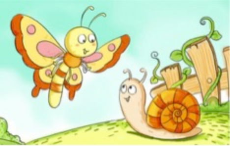
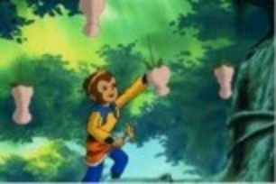

---

date: 2018-02-28 02:00:31
categories:
    - 暖暖写作空间-writing
title: 2018.2 暖暖日记（八岁三个月）
description: "2.28 根据这个图，构思一个故事。 注意表达结构的运用。 1、往往几个场景就把故事讲清楚了。不啰嗦。 2、前面是平铺直叙，但有时候中间发生转折，还有的结尾出人意料。 怎么让你的故事更加精彩呢？ 这是..."
image: image_0.png
---

2.28

根据这个图，构思一个故事。

注意表达结构的运用。  
  
1、往往几个场景就把故事讲清楚了。不啰嗦。  
2、前面是平铺直叙，但有时候中间发生转折，还有的结尾出人意料。  
怎么让你的故事更加精彩呢？  
  
  

  
  

这是个关于蝴蝶，蜗牛和黄油面包的故事。

有一天，蝴蝶在飞,突然有一只蜗牛出现了，蜗牛说，“你要跟我比赛么？”

蝴蝶说，“我懒的跟你比赛”。

蜗牛说，“如果你赢的话，我就给你一块黄油面包吃”

蝴蝶马上就兴奋说，“好呀，好呀”因为蝴蝶的名字就叫BUTTERFLY，跟黄油面包BUTTERBREAD的感觉很像。

为了防止跑步比赛的时候，万一下雨翅膀可以不湿的落下来，蝴蝶打算自己做把伞，所以马上回家做了一个很大很大的黄油三明治，打算下雨的时候躲在下面。

可是不幸的是，蜗牛做了一个能变大的PIXIE DUST 。

比赛的那一天，蝴蝶骑在黄油面包上面飞去赛场，蜗牛把自己变得天一样大，才匆匆忙忙去赛场的。

巨大蜗牛还没吃饭就到赛场了，它看到了蝴蝶的黄油面包就完全馋了，一大口就吃掉了。

比赛开始了，蝴蝶很担心，因为它的黄油面包雨伞被蜗牛吃掉了，跑了一半路真的下雨了，蝴蝶匆匆飞到蜗牛的壳里面去了。这样它们都有一个暖和的地方。

这样，它们同时到达终点，都赢了。于是，它们都请了对方吃黄油面包。但是蜗牛太小气了，加上它太懒了，蝴蝶请了蜗牛吃一大大块黄油面包，蜗牛只请回了蝴蝶一小块黄油面包。

THE END

  

  

2.25 偷吃人参果，是谁的错 

《西游记》里偷吃人参果，大部分人都会认为是悟空的错，我今天写这个日记的原因就是想要证明在这个故事里没有一个人是完全对的或者完全错的。

首先，人参果没犯错，它们只是长得可爱了一点，才会惨被吃掉。人参果应该怪的是唐僧，因为如果唐僧把人参果吃下去的话，后面的悲剧就都不会发生了。清风和明月就不会把人参果吃掉。

可是也不是完全是唐僧的错，清风和明月就非常贪吃，是她们先吃的，所以她们有一部分的错。

八戒听见清风和明月在吃人参果，八戒就馋了，“馋”就是八戒名字里面一个得戒掉的一样事情，所以八戒也有一部分的错。

然后呢，八戒被清风踢飞了，踢到了悟空那里，八戒本来就不应该把这事情告诉悟空，因为全世界都知道悟空最最热爱的就是桃子和长生不老。

其实呢这个故事的本质就是呢，是镇元大仙的错，因为呢，他没把人参果公平地分配，如果他给的是公平的数量，每个人就会各各满足，一起开开心心的吃人参果，就不会有这个故事了。

可是也不能说就是这个神仙的错，这个故事里面没有一个人是完全对的或者完全错的。

2018.2.20 

我今天对爸爸用“调虎离山”计。因为今天是我的PLAYDAY，我想在拿我的I PAD，而IPAD在爸爸妈妈的房间里，为了好玩（爸爸很好玩的）我打算用“调虎离山”计。

调虎离山计里面你得把“王”拿掉然后呢就好办了。房间里只有爸爸这么一个人，所以我只有把他引走就行了。我一进房间，爸爸就问我,“干什么？”我没说我是来拿I pad，说了就用不成计了。所以呢，我就跟他说，“你得下去吃晚饭了。”但他肯定知道我在有“调虎离山”计，因为他坚决地说，“我不去！！！”

过了几分钟真正要吃饭了，他还不下来，他说要打电话，为了不让妈妈老烦他下去吃晚饭，他让我去用围魏救赵，瞒天过海，声东击西，空城计。。。。。。反正意思就是让我去围住妈妈不要去烦他。但我没这样干，用了三十六计最后一计，走为上策， 我饿了，要去吃晚饭了。。。。。。

2018.2.18 过年 

今天是年初二，在加拿大过新年是一件最最无聊的事情,一点都不好玩。反而很普通。你看这篇日记前先要把中国的热闹忘掉。因为在这里正相反，无聊，非常普通。现在我就围绕着“无聊，普通”这个中心点讲一讲我新年是怎么过的：

学校里新年头几天都没有一个PD day, 更过分连一个派对都没有，最最受不了就是学校只有一个游戏表演，可那个表演差级了！！学校新年零食也准备的很差，只是饼干！我看到的时候快要疯掉了，可想不到放在嘴里还是蛮好吃的。

除了学校以外,在家里也还有很多无聊的事情呢,比方天天早饭都吃年糕是一个非常好的例子，也算是最无聊的。到处拜年也是非常糟糕的一个活动，得拿一个电话，不停地对着它很傻的说“新年快乐！！”更烦的就是在家里依然需要天天做作业 瞧，我现在就在写日记，超级超级普通和无聊。我最最讨厌做作业！！！新年在家最最最无聊的事情就是需要吃很多的饭, 我爸妈和阿姨（特别是爸爸）总是在试着把我喂成猪，因为我怎么喂也喂不成猪。

“ 新年都未有芳华，二月初惊见草芽。白雪却嫌春色晚，故穿庭树作飞花。”我们这里新年这几天也下了超级大的雪，本来这可以算作一件不普通的事，可是这就搞得春天比冬天更冷，所以千千万万不要在过新年的时候来加拿大。

  

  

2.6 

题目：早春  
根据苏轼的诗《惠崇春江晚景》\--竹外桃花三两枝，春江水暖鸭先知。蒌蒿满地芦芽短，正是河豚欲上时。

提炼背后的模式，写一篇小作文。

  
要求：

1，这首诗是讲春天的变化。小作文的题目可以是“春天来了”。1，总的变化 2，视觉：3，触觉：感受到什么4，味觉：吃的东西怎么样了。5，总结

2，根据这首诗的模式，可以提炼出这些感官的活动。 从这个角度去观察早春。从多种感官的角度。 所以观察不仅仅是看，还要动用多种感官，协同进行。 3，尽量运用，引用最近学的二十首唐诗  

  

今天是立春的第二天，在后花园里，“竹外桃花三两枝”，蓝莓，玉兰开始有花苞了，这让我非常烦，早春真的是要来了。我感觉早春是一年里最最冷的时候，这两天外面吹大大的风，重点是我们学校规定休息的时候所有人都必须去操场，我想坐着安静的情绪总要被打扰。

“天街小雨润如酥，草色遥看近却无”的早春里，没完没了的下雨是非常无聊的事情，你只能坐在没有雨的地方看书，但旁边总会有一大堆人在唧唧呱呱，烦。

早春来了，“正是河豚欲上时”，笋也跟着上市了，就是熊猫的最爱，因为熊猫只吃笋和竹子，熊猫一定比我更很开心早春的到来。

  

我希望我有能力能消灭早春，盼望“春光懒困倚微， 桃花一簇开无主，可爱深红爱浅红”的春天快点到来。

2.5 

爱兔说 （仿写爱莲说）

动物都是很卡通的。妈妈独爱鼠。自有狗以来，世人皆爱狗。予独爱兔。兔能帮我吃蔬菜，十分可爱，蹦蹦跳跳，毛毛绒绒，可抱玩焉而不可不理。

予谓鼠，动物之最聪明也；狗，胆子大也；兔，可爱也。噫！鼠之爱，妈妈之最也，兔之爱，同予者何人?狗之爱，宜乎众矣。

2.2  

今天，妈妈在给我讲《史记》和坏皇帝的事，等我听到昏君和暴君不一样，昏君主要管吃喝玩乐的，我很羡慕！所以我今天的日记主题就是“暖暖要当昏君”。

当一个昏君应该是个非常简单的事情，吃喝玩乐不是一件非常简单的事情吗？这么简单的事暖暖一定能做好！！

吃喝玩乐4样东西我都能做到！！不在话下！！

吃＝吃点心

喝＝喝珍珠奶茶+热巧克力

玩＝玩毛绒兔子

乐＝抱妈妈。

瞧，我把吃喝玩乐的计划排的多么好。如果你的国家需要一个坏皇帝\---昏君，快快找我!