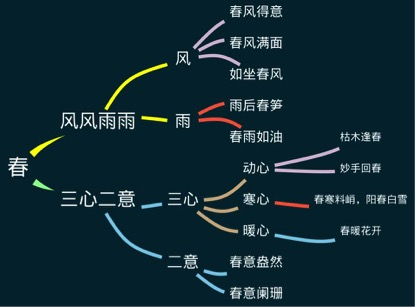
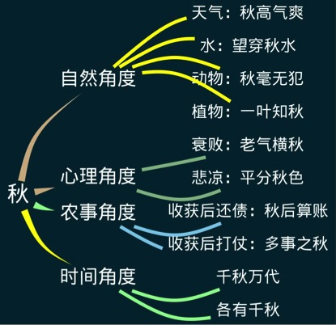

---

date: 2018-03-03 02:22:05
categories:
    - 大语文
title: 2018 三月唐诗，古文，字词成语
description: "
梦游天姥吟留别 
 
李白
 
海客谈瀛洲，烟涛微茫信难求。
 
..."
image: image_0.png
---

  

## 
梦游天姥吟留别 
             

李白

海客谈瀛洲，烟涛微茫信难求。
  

越人语天姥，云霞明灭或可睹。
 

天姥连天向天横，势拔五岳掩赤城。
 

天台四万八千丈，对此欲倒东南倾。
  

我欲因之梦吴越，一夜飞渡镜湖月。
   

湖月照我影，送我至剡溪。
   

谢公宿处今尚在，渌水荡漾清猿啼。
   
 

脚著谢公屐，身登青云梯。
   

半壁见海日，空中闻天鸡。
   

千岩万转路不定，迷花倚石忽已暝。
   

熊咆龙吟殷岩泉，栗深林兮惊层巅。
 

云青青兮欲雨，水澹澹兮生烟。

  

列缺霹雳，丘峦崩摧。
 

洞天石扉，訇然中开。
 

青冥浩荡不见底，日月照耀金银台。
   

霓为衣兮风为马，云之君兮纷纷而来下。
   

虎鼓瑟兮鸾回车，仙之人兮列如麻。
 
 

忽魂悸以魄动，恍惊起而长嗟。
   

惟觉时之枕席，失向来之烟霞。
   

世间行乐亦如此，古来万事东流水。
   
 

别君去兮何时还？
   

且放白鹿青崖间，须行即骑访名山。
   

安能摧眉折腰事权贵，使我不得开心颜！
   
 

|   |         |       |              | 
| --| -------| ------| --------------------------------| 
| 1 | 兰溪棹歌 | 戴叔伦 | 凉月如眉挂柳湾，越中山色镜中看。兰溪三日桃花雨，半夜鲤鱼来上滩。   ---春  | 
| 2 | 游园不值 | 宋 叶绍翁 | 应怜屐齿印苍苔，小扣柴扉久不开。春色满园关不住，一枝红杏出墙来。  ---春  | 
| 3 | 雨过山村 | 唐 王建 | 雨里鸡鸣一两家，竹溪村路板桥斜。妇姑相唤浴蚕去，闲着中庭栀子花。| 
| 4 | 山居秋暝 | 王维 | 空山新雨后，天气晚来秋。  明月松间照，清泉石上流。   竹喧归浣女，莲动下渔舟。 随意春芳歇，王孙自可留。
| 5 | 过故人庄 | 孟浩然 | 故人具鸡黍，邀我至田家。  绿树村边合，青山郭外斜。   开轩面场圃，把酒话桑麻。 待到重阳日，还来就菊花。
| 6 | 乡村四月 | 宋.翁卷 | 绿遍山原白满川，子规声里雨如烟。乡村四月闲人少，才了蚕桑又插田。| 
| 7 | 游山西村 | 陆游 | 莫笑农家腊酒浑，丰年留客足鸡豚。山重水复疑无路，柳暗花明又一村。  箫鼓追随春社近，衣冠简朴古风存。从今若许闲乘月，拄杖无时夜叩门。| 
| 8 | 渭川田家 | 王维 | 斜阳照墟落，穷巷牛羊归。野老念牧童，倚杖候荆扉。  雉雊麦苗秀，蚕眠桑叶稀。田夫荷锄至，相见语依依。即此羡闲逸，怅然吟式微。| 
| 10 | 社日 | 王驾 | 鹅湖山下稻粱肥，豚栅鸡栖半掩扉。 桑柘影斜春社散，家家扶得醉人归。  
| 11 | 春晚书山家屋壁 | 贯休 | 柴门寂寂黍饭馨，山家烟火春雨晴。庭花蒙蒙水泠泠，小儿啼索树上莺。| 
| 12 | 终南别业 | 王维 | 中岁颇好道，晚家南山陲。兴来每独往，胜事空自知。  行到水穷处，坐看云起时。偶然值林叟，谈笑无还期。| 
| 13 | 宿建德江 | 孟浩然 | 移舟泊烟渚，日暮客愁新。野旷天低树，江清月近人。|  

秋色宜( 人 )；秋( 高 )气爽
( 金 )秋十月；春种秋( 收 )
仲夏之( 夜 )；( 华 )夏子孙
三( 伏 )盛夏；冬暖夏( 凉 )
满( 面 )春风；春暖花( 开 )
春色满( 园 )；春雨贵如( 油 )
 

---
## 黄
脸色蜡黄；头发枯黄；黄连很苦，炎黄子孙；面黄肌瘦
---
## 东，西
各奔东西；西天取经；夕阳西下
声东击西，拆东补西

---
## 左，右
左膀右臂，左右开弓，左思右想，左邻右舍，左顾右盼

 
顾，盼都是看的意思。
例：这小偷得手后，左顾右盼，恐怕被人发现。
左右逢源；左右为难
逢：遇到；源：水源。左右都能遇到水源，形容办事能力强，得心应手。
也可用作贬义，形容一个人圆滑，精明。
 

## 相形见绌
牢记：丝不足，就是绌（四声）。
相形见绌：就是一比较，就看到不足。
例：跟大师比起来，他的字就相形见绌了。
左支右绌：就是这边支出了，那边就不足了。
例：这几件事使他左支右绌，疲于应付。
左右为难。图中这个人，正在高薪与稳定之间左右为难。
----
## 南，北：
泰山北斗：形容在某个领域声望极高。
例句：牛顿是物理学领域的泰山北斗。
活用：小强的语文学的不错，他在班里号称语文方面的泰山北斗。
 

大江南北：泛指全中国。
例句：他的名声传遍大江南北。
活用：小强有个志向，就是让自己的作品能够传遍大江南北。
 

北雁南飞：
例句：到了秋天，北雁南飞，活跃在田间地头的昆虫也销声匿迹了。
活用：写秋景时可以用上。
 

南来北往：
例句：节日期间，火车站大厅挤满了南来北往的旅客。
活用：写旅游的时候可以用。
 

南橘北枳
例句：南橘北枳，国外的经验到了中国未必能行得通。
活用：底层代码：独立思考vs盲从
 

南拳北腿
例句：中国武林有南拳北腿之说，各有各的长处。
活用：底层代码：各有所长。
 

走南闯北：
例句：他一生走南闯北，阅历很丰富。
活用：写人物用得上。
 

南腔北调:
例句：车站的人真多啊！他们南腔北调的，来自祖国的四面八方。
活用：写旅行的时候用得上。
 

南辕北辙：
例句：图书馆在左边，你往右走，这不是南辕北辙吗？
活用：底层代码：快与慢。欲速则不达。方向准确很重要。
 

南征北战：
例句：解放战争中，他南征北战，成了大英雄。
活用：写人物的时候用得上。
---
## 上，下：

每况日下  七上八下 不耻下问
潸然泪下  居高临下 寄人篱下
上蹿下跳  上吐下泻 上行下效
成千上万  低三下四 扶摇直上
声泪俱下  锦上添花 雪上加霜 赤膊上阵
 

每况日下：这个孩子的成绩每况日下，得想想办法了。
七上八下：成绩快出来了，我的心七上八下的。
不耻下问：孔子经常不耻下问，向学生求教。
 

潸然泪下：听到好朋友转学的消息，小强不禁潸然泪下。
居高临下：这个人架子很大，对下属经常居高临下的讲话。
寄人篱下：在实力不足的时候，寄人篱下不失为聪明之举。
 

上蹿下跳：黄金的价格上蹿下跳的，让人难以捉摸。
上吐下泻：他食物中毒了，上吐下泻，没完没了。
上行下效：他的父母天天玩牌，结果上行下效，作儿子的也沾染了这一恶习。
 

成千上万：这个节目不错，吸引了成千上万的观众。
低三下四：为了孩子上好学校，他不得不低三下四地到处求人。
扶摇直上：孩子们一放手，气球便立即扶摇直上。
声泪俱下：因为确实受了委屈，她在向老师诉说时，声泪俱下。
锦上添花：在描写一个东西时，适当用上比喻等修辞，往往会使文章锦上添花。
雪上加霜：今年本来就干旱，又遇到蝗灾，这无疑是雪上加霜。
 

赤膊上阵：不顾严寒，小伙子赤膊上阵抢修水管。
---
每况日下  七上八下 不耻下问
潸然泪下  居高临下 寄人篱下
上蹿下跳  上吐下泻 上行下效
成千上万  低三下四 扶摇直上
声泪俱下  锦上添花 雪上加霜 赤膊上阵
 

每况日下：这个孩子的成绩每况日下，得想想办法了。
七上八下：成绩快出来了，我的心七上八下的。
不耻下问：孔子经常不耻下问，向学生求教。
 

潸然泪下：听到好朋友转学的消息，小强不禁潸然泪下。
居高临下：这个人架子很大，对下属经常居高临下的讲话。
寄人篱下：在实力不足的时候，寄人篱下不失为聪明之举。
 

上蹿下跳：黄金的价格上蹿下跳的，让人难以捉摸。
上吐下泻：他食物中毒了，上吐下泻，没完没了。
上行下效：他的父母天天玩牌，结果上行下效，作儿子的也沾染了这一恶习。
 

成千上万：这个节目不错，吸引了成千上万的观众。
低三下四：为了孩子上好学校，他不得不低三下四地到处求人。
扶摇直上：孩子们一放手，气球便立即扶摇直上。
声泪俱下：因为确实受了委屈，她在向老师诉说时，声泪俱下。
锦上添花：在描写一个东西时，适当用上比喻等修辞，往往会使文章锦上添花。
雪上加霜：今年本来就干旱，又遇到蝗灾，这无疑是雪上加霜。
 

赤膊上阵：不顾严寒，小伙子赤膊上阵抢修水管。
---

### 1、竞争

争先恐后
前仆后继：仆pū：向前跌倒：～倒。
后来居上
名列前茅
停滞不前

### 2、空前

前无古人，后无来者
空前绝后
盛况空前
史无前例

### 3、思考

瞻前顾后
三思而后行
前事不忘，后事之师

### 4、打击

先礼后兵：一位接近军方的匿名人士23日对《环球时报》表示，中国的军事文化战略是后发制人、先礼后兵，同时也言出必行。

后发制人

秋后算账

### 5、其他

前倨后恭：倨jù：傲慢。记法：有个人居住在一个大房子里，所以特别傲慢。

前仰后合

骑虎难下

## 记忆法

我根据这些成语编了一段文字，可以帮助记忆。

旁听申请
 
李广在不毛之地立下了不世之功，却被怀疑有不臣之心，蒙受了不白之冤。
而那些不法之徒，却身居高位，大肆窃取不义之财。
皇帝为何如此昏庸，至今仍是不解之谜。
李广为自己做的辩解，虽然并非不刊之论，但也不是不经之谈。
在不惑之年，我与李广研究结下了不解之缘。
现在我有一个不情之请，请允许我这个不速之客旁听您的课。
并给我开个证明以备不时之需。为您带来不便之处，敬请谅解。
 
不速之客：速：邀请。指没有邀请突然而来的客人。
例：我们正在聚餐时来了一位～。
不刊之论：刊：削除，古代把字写在竹简上，有错误就削去。指正确的：不可修改的言论。这些经典著作，都是～，应该好好地阅读。
不解之缘：不可解开的缘分。例：他从小就和足球结下了～。
不解之谜：不能弄明白的事物。
例：迄今为止，金字塔仍是人类的不解之谜。  
为什么人类，乃至所有的动物都需要睡眠仍是个不解之谜。
不情之请：不合情理的请求（提出请求时的客气话）。
例：阿姨，我有一个不情之请？不知您能否答应（我想跟您换个座位）
不便之处：指不方便的地方。
例：前面正在修路，请您绕行。不便之处，敬请谅解。
不义之财：不义：不正当，不合理。不应该得到的或以不正当的手段获得的钱财。例：
君子爱财，取之有道；不义之财，分文不取。
不惑之年：不惑：遇到事情能明辨不疑。以此作为40岁的代称。例：老师说自己已经到
了不惑之年，看问题更加明白了。
不毛之地：不生长草木庄稼的荒地。形容荒凉、贫瘠。
例：当年被称为不毛之地的北大荒，如今已成为我国重要的粮食生产基地了。
不世之功：指非凡的功绩。不世：不是每代都有。
例：他把匈奴赶出中原，立下了~。
不白之冤：指好人不明不白受了冤屈。
例：小强，这是你闯的祸，你怎么能推卸责任，让丽丽蒙受不白之冤呢？
不经之谈：荒诞无稽、没有根据的话。
例：现在有种看手相的书，里面大都是些～。
不臣之心：不臣：不守臣子的本分，不忠君。后也指犯上作乱的野心。
不时之需：不时，跟陆游的无时差不多，就是不定时。
例：夏天出门最好带把雨伞，以备不时之需。