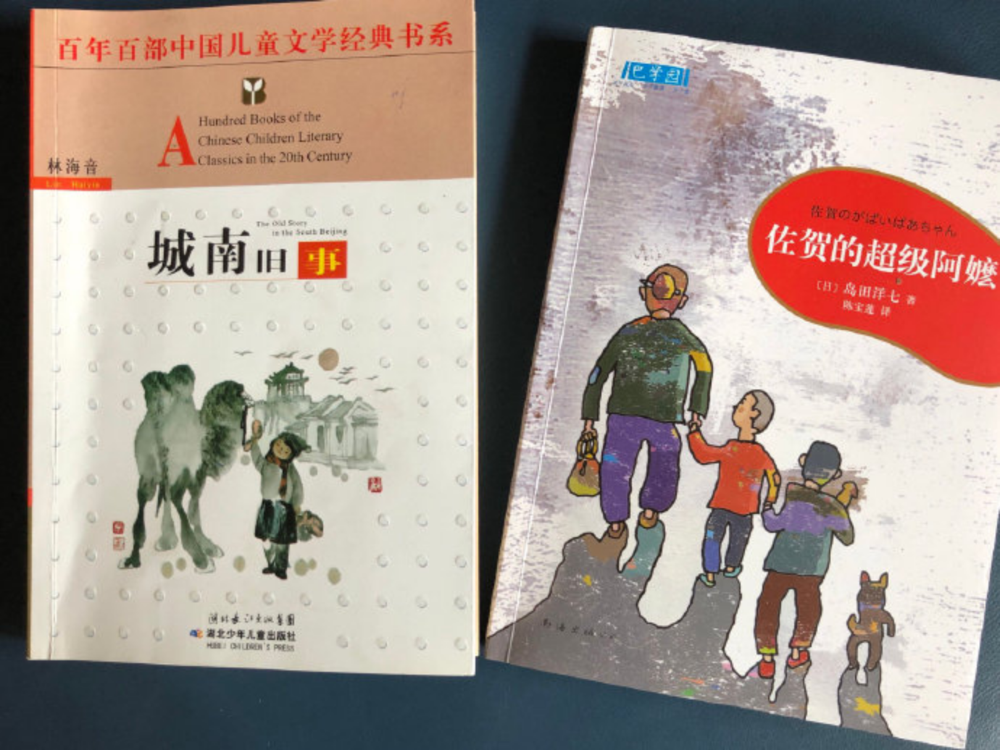
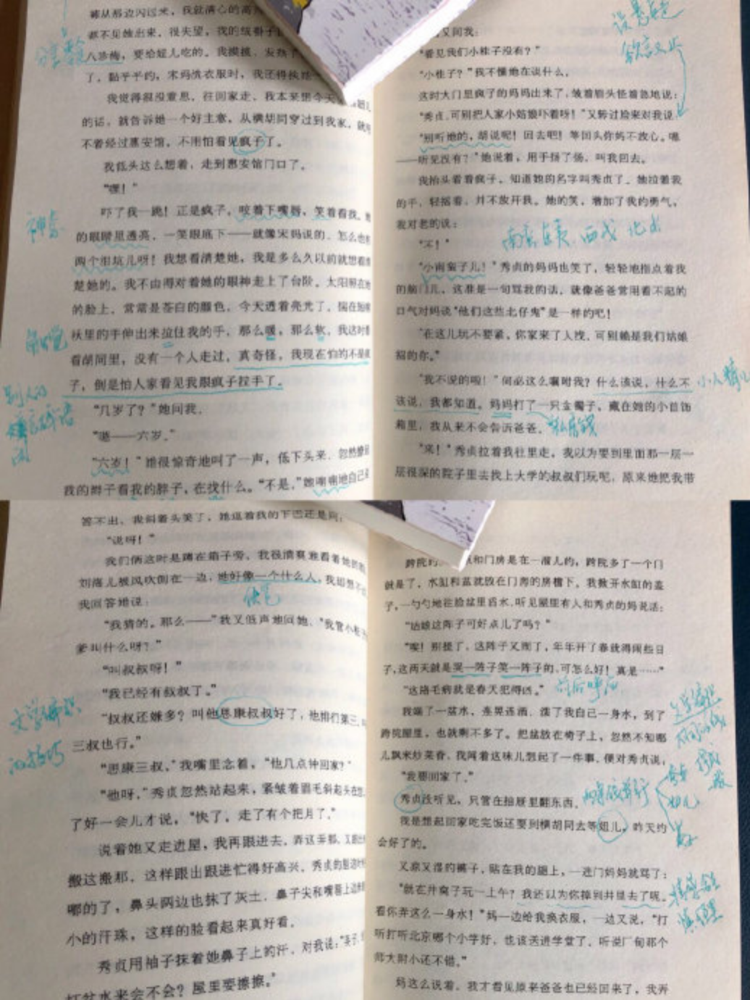
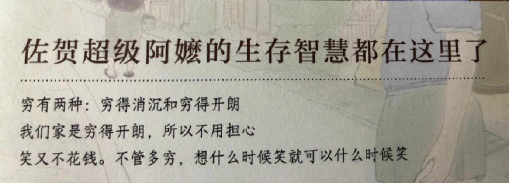
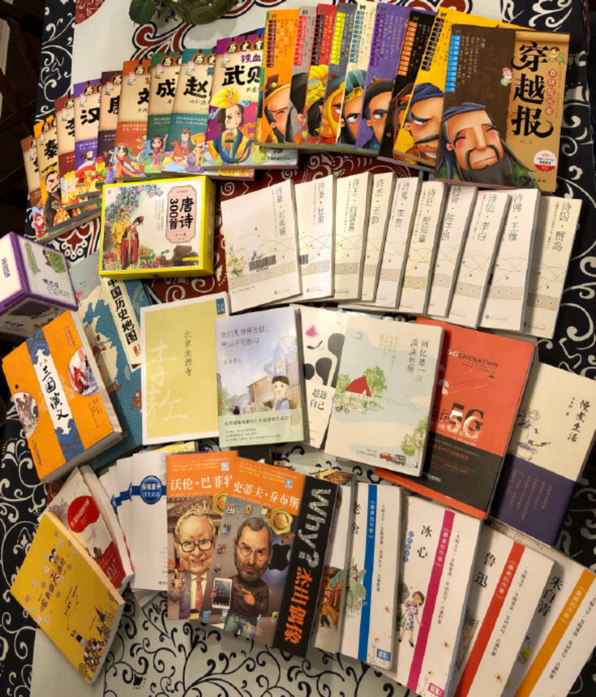
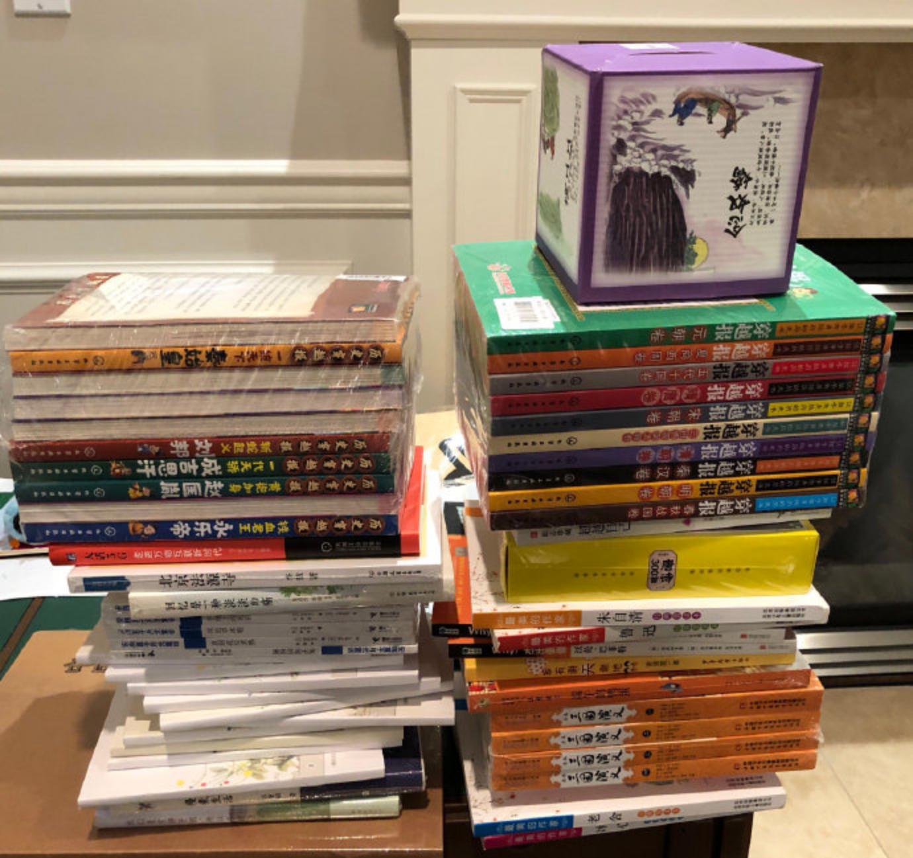

---

date: 2018-06-01 05:30:00
categories:
    - 书香书享（想）亲子共读
title: 城南旧事  and  佐贺的超级阿嬷
description: "这些日子妈妈和小暖一起精读的两本书：城南旧事 and 佐贺的超级阿嬷 佐贺的超级阿嬷 虽然是译本，但文字超有趣，因为作者岛田洋七是生长于战后日本的相声演员。 他的另一本著作的题目足以展示了其作品的人生..."
image: image_1.png
---

这些日子妈妈和小暖一起精读的两本书：城南旧事 and 佐贺的超级阿嬷

  

  

  

  

  

佐贺的超级阿嬷 虽然是译本，但文字超有趣，因为作者岛田洋七是生长于战后日本的相声演员。

他的另一本著作的题目足以展示了其作品的人生观：我们穷得开朗，所以不用担心。

  

  

  

  

  

  

这是爸爸这次搬回来的中文书：

  

  

  

