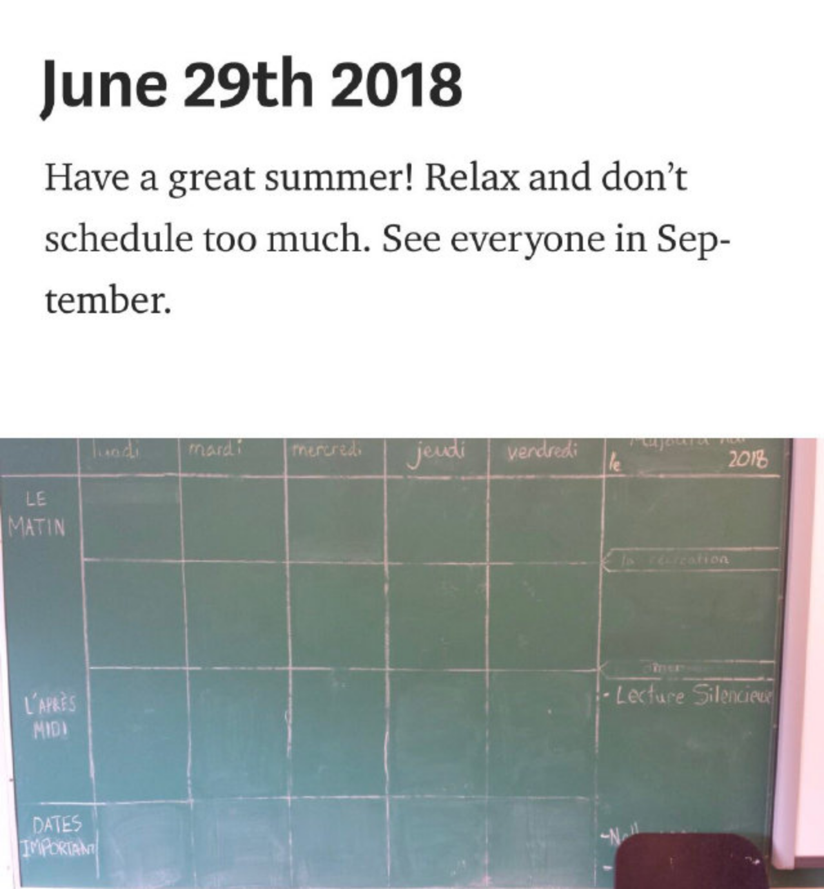
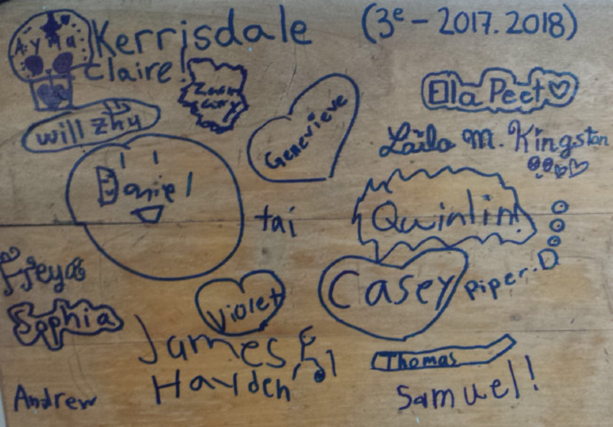
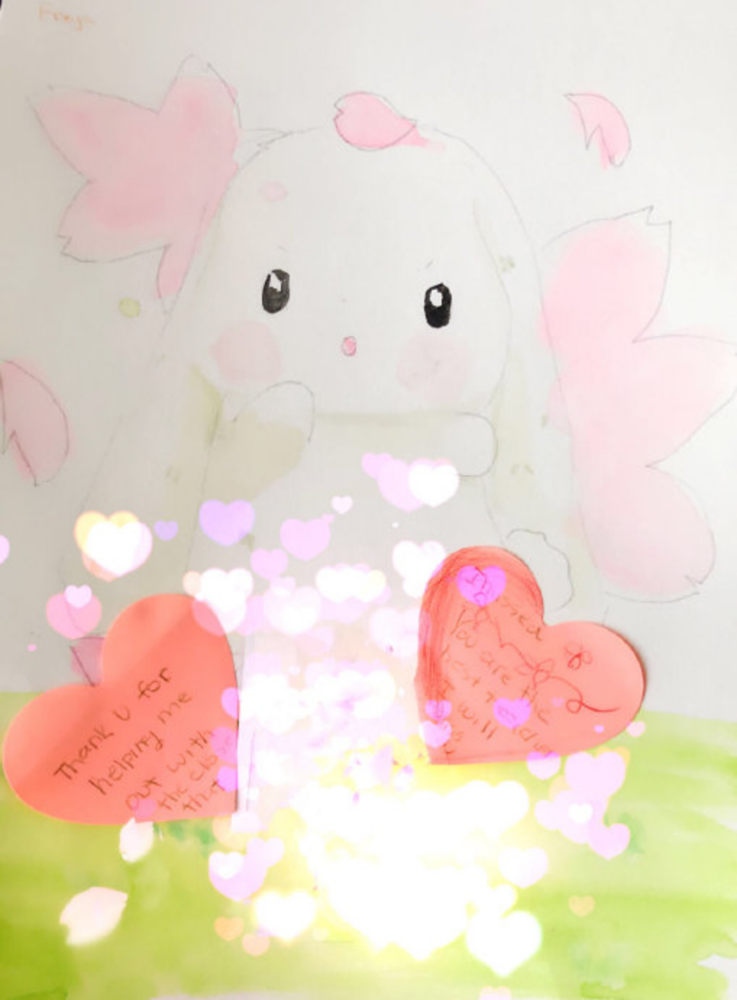
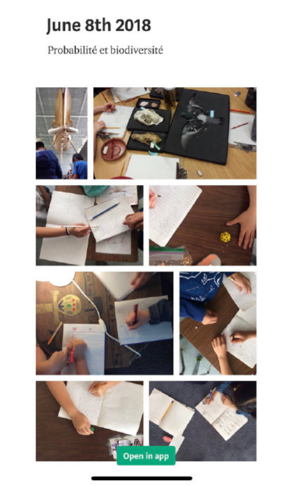
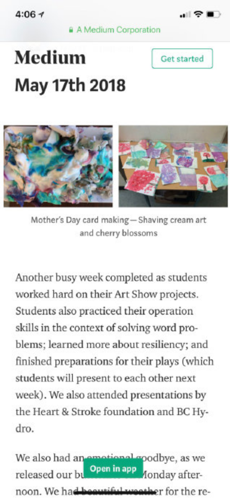
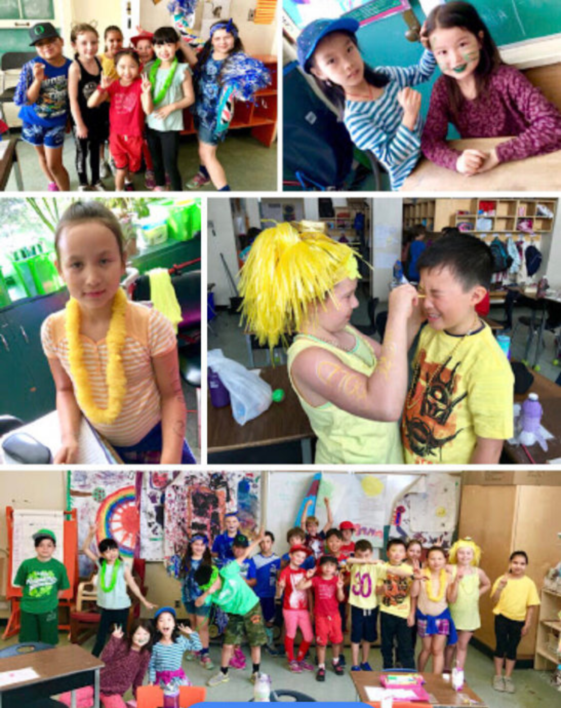
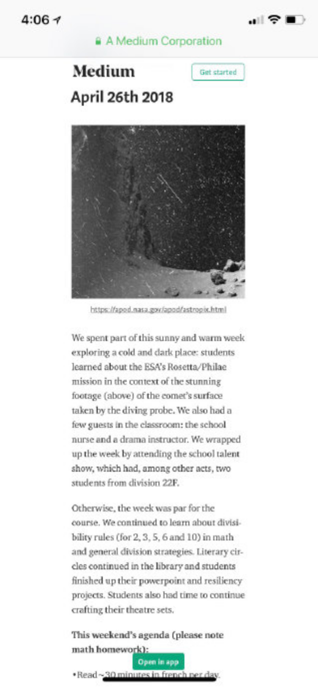
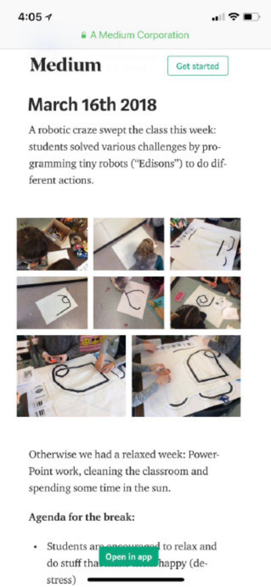

---

date: 2018-06-08 06:00:02
categories:
    - 暖暖的写意生活-life
title: 暖暖的小学三年级生活2017-2018G3LIFE

description: "G3 LIFE: 2017-2018 Dear Parents, Thank you Parents of Division 22F for your generous gifts and messa..."
image: image_0.png
---

G3 LIFE: 2017-2018

   

  

  
Dear Parents,

  

  
Thank you Parents of Division 22F for your generous gifts and  
messages yesterday. Thank you also for your support and enthusiasm  
throughout the year. It was a great privilege to have taught your  
children and I look forward to watching them grow up over the next  
few years. As my first cohort at Kerrisdale, they will hold a  
special place in my heart.

  
Thank you again and have a great summer,

  
Samuel Couture

2018.6.29

  
  

Agenda

for the

winter

break:

•Read ~30 minutes in French per day.

•Relax and get some fresh air

•Scholastic

•Some students need to finish their instruments and passion

projects at home.

Hello parents, the beginning of week 16 has been eventful. On

Monday, we continued to work on our “Alice Inanimée”

stories.

This

project will have to be completed in the new year so as to

give

each student a chance to do their best work. In the

afternoon,

students participated in an Ocean Ambassadors event,

rotating

between several stations and learning about recycling and

the

impacts of non-recycled plastics on the environment.

Tuesday morning was more routine: we visited the Library for

our

weekly book exchange and continued work on our Instrument

and

Passion projects. Tuesday afternoon was for Gingerbread

House

building and decorating. It was a great (and messy) success.

Looking forward to the rest of the week:

  * Thursday is winter clothing day (bring ski goggles, toques 

and

mittens).

  * Thursday will also be our Big Clean day, students will only 

be

able

to keep a shoe box size worth of belongings in the class

over

the

break (spare set of dry clothing excluded).

  * Friday will be a class pyjama day.
  * The class winter party will take place Friday afternoon.

Week 14 was all projects, presentations and presents. The “Ma

culture” PowerPoints were completed, presented and

uploaded

to

FreshGrade this week. I was extremely impressed by the

passion

and

time students put into their presentations. Most students

have

already self-evaluated their work on this project, all

that

is

left

is my evaluation and then it will be shared to parents.

Students

continued to work on their “Alice inanimée” stories with

instruction from Mme F and their landscape model projects.

Students

also began to plan their instruments, I am excited to see

their

progress as they build their creations.

We continued our 2nd step program with Mme Yee, learning

about

conflicting emotions and active listening. And finally

Friday

afternoon was dedicated to wrapping all our purchases from

the

Santa Sale. Creative thinking was definitely being

utilized

by

students as they worked to wrap all their gifts.

Unfortunately, we did not have any time to begin the Math

Expo

project. As for literacy and numeracy, we did our

“personnes

de

la

semaine” and a quick review of subtraction.

Division 22F is entering peak project season: students are

finishing up their culture PowerPoints, while also

continuing

to

work on their Inanimate Alice stories, Landscape models

and

Passion

projects. Next week students will start work on their Math

Expo

project and their Instrument build.

We continued to work on subtraction together this week, and

we

will

keep working on it until we are all comfortable with

borrowing

(i.e. converting tens to units).

This week, with the exception of Friday, was chaotic and  
loud

for

division 22F. Despite this, some learning was done. In

numeracy

students started to develop and apply their subtraction

skills.

In

literacy, students built book summary fortune tellers with

their

big buddies, continued to compose their Explain Everything

stories,

studied high frequency sentence structures via “Les

personnes

de

la

semaine” and “Les phrases de la semaine” and we learned

about

the

sport of high kick and enjoying life through Radio Radio’s

song

Dekshoo.

Elsewhere, we learned more about respecting the diversity of

learners while exploring what careers exist for folks of all

intelligences, we learned about empathy and how to recognize

emotions and we had our first 2nd Step lesson with Mme.

Yee.

We

also rounded out the week with our usual class meeting

(where

the

strike system was a hot topic) and Passion Project work.

  
This weekend’s agenda:

•Read ~30 minutes in French per day.

•Bring materials for your passion project.

  
This week’s “phrases de la

semaine”

(emphasis on the “ê”):

•Je ne vais pas être fatigué après mon café.

•Tu n’es pas prêt pour notre randonner dans le forêt.

•Nous n’allons pas dormir dans un hôtel ce soir.

•Tu montre beaucoup d’intérêt dans le camping.

Another short week, but productive nevertheless. On Tuesday

we

continued to work on additions (adding 2 digit numbers to

2

digit

numbers), we also continued to work on our paper mâché

landscape

models. On Wednesday, we did our “Personnes de la Semaine”

activity

and continued to work on our Culture PowerPoints. On

Thursday,

we

did a trial run of our Freshgrade portfolios, there was a

few

hiccups that I will try and straighten out before inviting

parents

to see the portfolios online. That day, we also built our

class

brain and explored tempo, tone, and other characteristics

of

music.

On Friday, we examined our “Chanson de la semaine” (Jour

de

Paix

by

113), had our Math quiz and “Personnes de la semaine” quiz,

performed our weekly class meeting and had free time to

work

on

projects.

This week was short but sweet, with many important

activities.

The

highlight was definitely the Gregg LeRock concert on

Wednesday,

many students had a chance to dance and sing on stage with

the

rock

star. Students also attended N’Nato Camara’s West African

Dance

Workshop on Wednesday, making it an eventful day.

Students also learned this week about the Christmas Truce in

1914

in preparation for today’s beautiful Remembrance Day

ceremony

(in

which 6 students from the class participated).

We

also completed our monthly budgets today, while also

continuing

our

work on the landscape models. Earlier in the week, students

continued to create their PowerPoint presentations and

began

to

assemble their FreshGrade portfolios.

We finished off the week with a math quiz, “phrases de la

semaine”,

“chanson de la semaine” and a class meeting.

In Sciences Naturelles, Students began the planning stage of

their

landscape models.

I have decided to assign seating for the next two weeks due

to

students being too chatty. They will regain their control of

seating after the two weeks.

  
This weekend’s agenda:

  * Read ~30 minutes in french per day.
  * 2$ for the West African Dance workshop.
  * Sign VSB email communication consent form

  
Phrases de la semaine:

  * Charlotte va chercher son chouette chat et son chameau.
  * Le chat chouette est chaud.
  * Le chameau va manger des choux et des champignons.
  * Je vais échanger mon chandail chanceux.
  * Je vais chanter la chanson dans ta chambre.

Thank you to everyone who supplied

treats,

plates and napkins for our Halloween party.

Despite the excitement and anticipation for the upcoming

festivities, Division 22F was productive Monday and

Tuesday.

In

numeracy, we continued to explore addition: beginning to

look

at

carrying over and regrouping. In literacy, we began to

explore

plot

summaries and other story characteristics with our big

buddies

and

with Mme. F. Students also continued to work on their

passion

projects. Tuesday afternoon was dedicated to Halloween with

students indulging in treats and watching a few episodes of

“L’heure de peur”.

Since yesterday’s update 99 items, our total collections for

the

food drive has bumped up to 116 items. Thank you to all

families

that brought additional donations.

This week has been a roller coaster, but it ended positively

with

peaceful reading among the trees and sun on the school

grounds,

followed by a Halloween activity with the neighboring

Grade

4

class.

In Math, we started the Operations unit with a look at adding

units. We also continued to work on the “My Culture” Power

Points.

Students were most excited by the introduction of Passion

Projects:

the classroom is already occupied by cardboard structures,

models

and knitting needles.

This weekend’s agenda:

  * Read ~30 minutes/day in French.
  * Family Survey for those students who have not done it.
  * Food Bank Drive.

The

elusive rollerblading, lentil soup spitting giant mosquito

featured

in our “Histoire de la semaine”

Wednesday and Thursday of this week were rainy, but

productive

days

in Division 22F. Wednesday, we talked about Gord Downie

and

his

legacy, in particular his work involving reconciliation. We

listened to the first song of The Secret Path, taking that

opportunity to remember our past discussion about

Residential

Schools. Furthermore, we did procedural work involving

place

value

in numeracy and studied Ivorian musical group Magic

System’s

song

“Magic in the Air” in literacy. We also began our “Ma

culture”

PowerPoints, in which students will present the

information

they

gathered from the Family survey.

Thursday, we did our “Phrases de la semaine” (please find

sentences

below), wrote a Math quiz and read our “Histoire de la

semaine”.

We

also had a positive class meeting where students expressed

a

desire

to move faster along in Math and to study cursive. To end

the

week

we watched a “C’est pas sorcier” video about mountain

formation.

Below: Agenda and “Phrases de la semaine”. No new math

worksheets.

  
This weekend’s agenda:

  * Read ~30 minutes per day in French.
  * Family Survey
  * Form for the concert field trip
  * Food Bank Drive (we will continue to collect even tough we 

have

surpassed our goal)

  * Return cross-country jerseys.

This

morning we discussed residential schools given that it is

Orange

Shirt Day today. In particular, we talked about the

importance

of

culture and family, and the effect that systematic

assimilation

has

on those facets of our lives.

Highlights of the last few days were: calculating times in

different time zones; a lesson with Mme F. on making

connections

(self-text, text-text, text-world); our continuation of

“Personnes

de la Semaine” and the storytelling that goes with it; the

classes

first ever “Chanson de le Semaine”; and the first paycheck

activity.

I also want to thank everyone for attending Goal-Setting

Conferences, hearing your perspectives and experiences was

informative and important in developing goals for the

students.

New procedures in the class this week: Copains d’esprit and

Voting.

Both are hopefully allowing students to feel more invested

and

secure in the classroom.

Monday: We began to examine time in numeracy, emphasizing the

skill

of reading an analog clock; Students met their Big

Buddies,

they

then read the Big Buddy’s favourite book together; we also

began

to

discuss the diversity of learning in the classroom.

Tuesday: Looked at time zones using analog clocks; visited

the

Library where Mme F led an activity on making connections;

students

completed a survey on their strengths and challenges.

We

are approaching normality in the classroom: students are

beginning

to see what a typical week will look like. On Monday we

started

“bâton de français” system for speaking french in class.

We

also

discussed what made Terry Fox a true hero. So far this

week

in

numeracy we explored the variety of even and odd number

sequences

and in french we continued working on visualization

through

the

reading of an album. This afternoon students filled out a

basic

CV

to apply to their dream job.

Agenda for Monday and Tuesday:

  * Recommended french reading ~30 minutes.
  * Scholastic orders due September 21st.
  * Photo pre-order

Hello Parents,

It was nice talking to you all yesterday during the Meet the

Teacher night.

Agenda for the weekend:

  * Photo pre-order form and Scholastic form.
  * Terry Fox Pledge
  * 30–45 minutes of reading in French