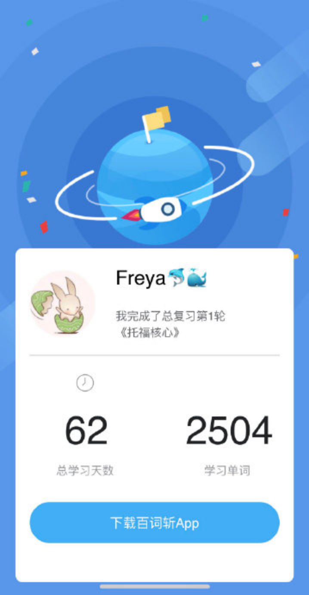
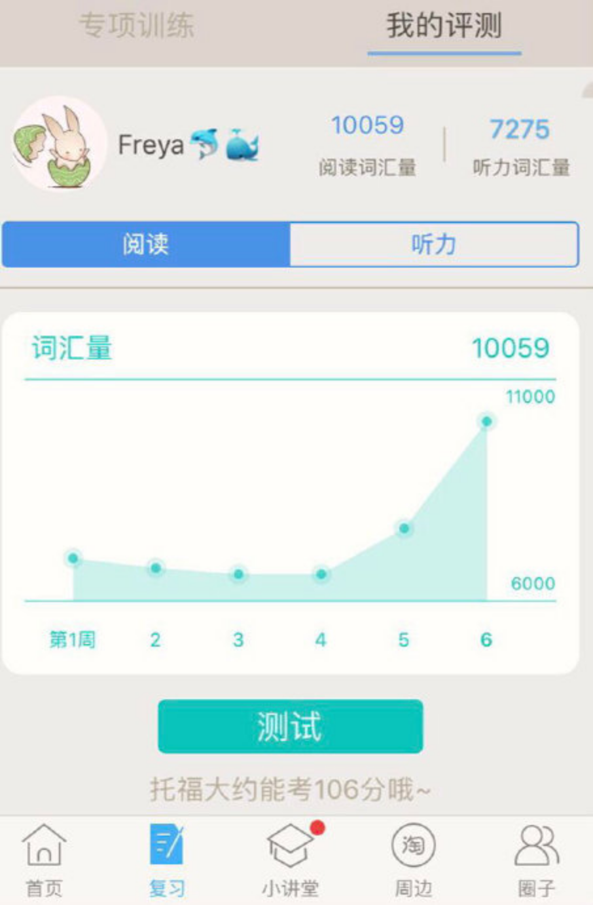
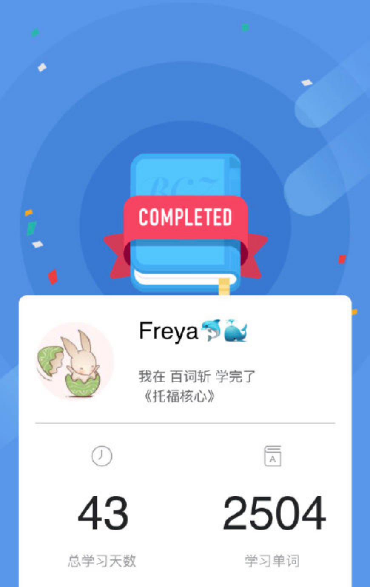
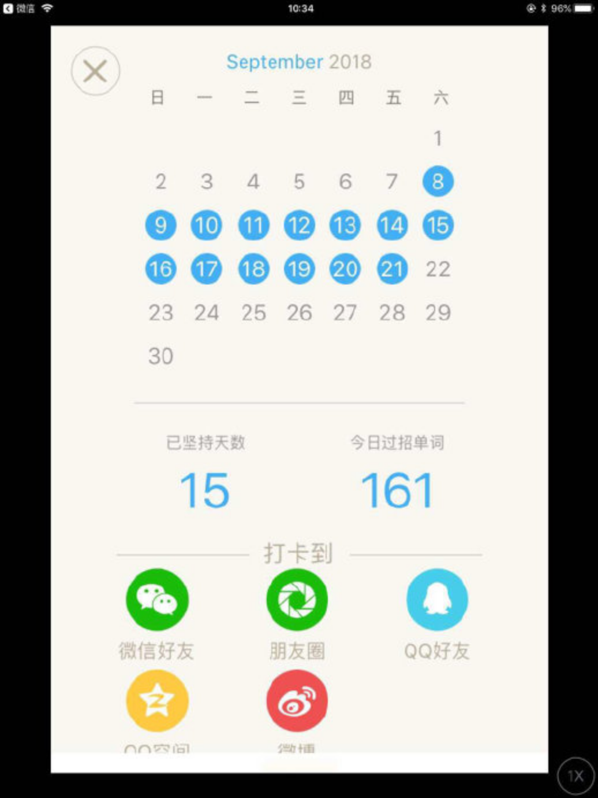
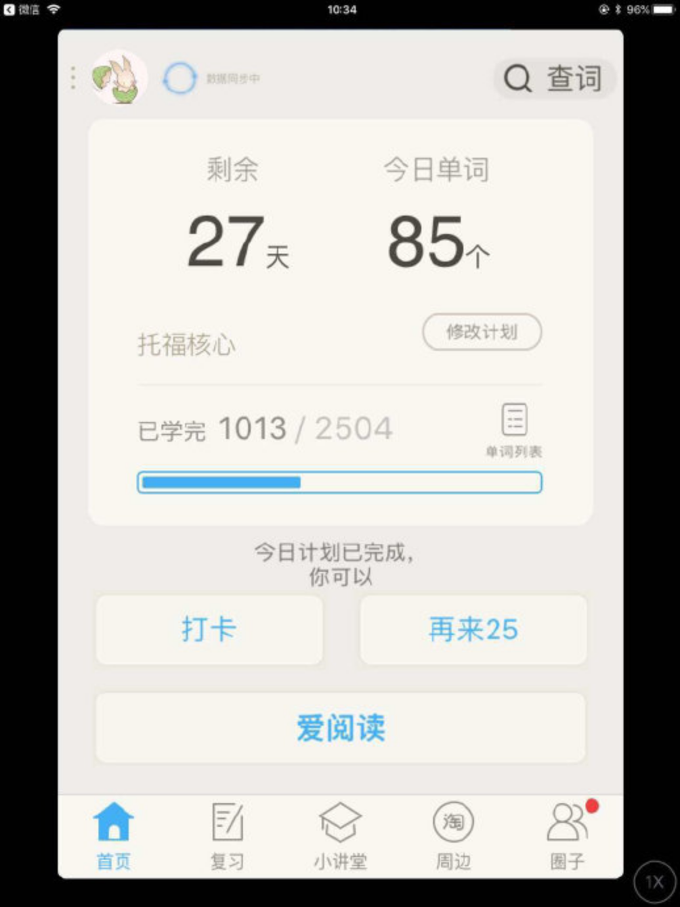
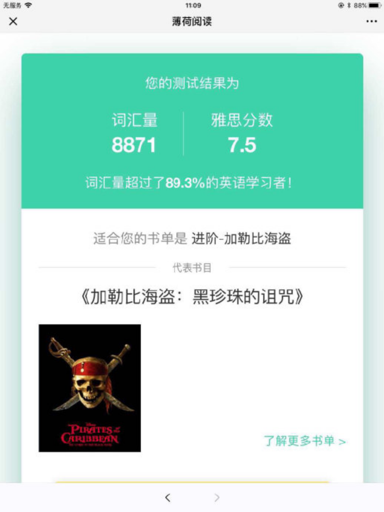
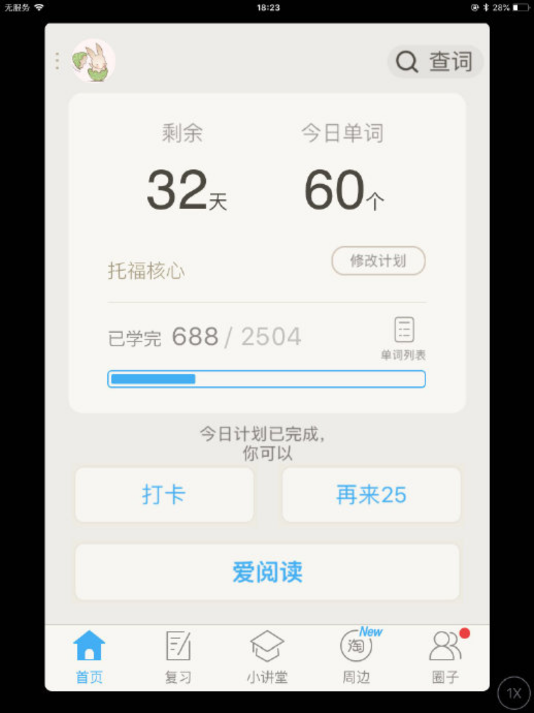
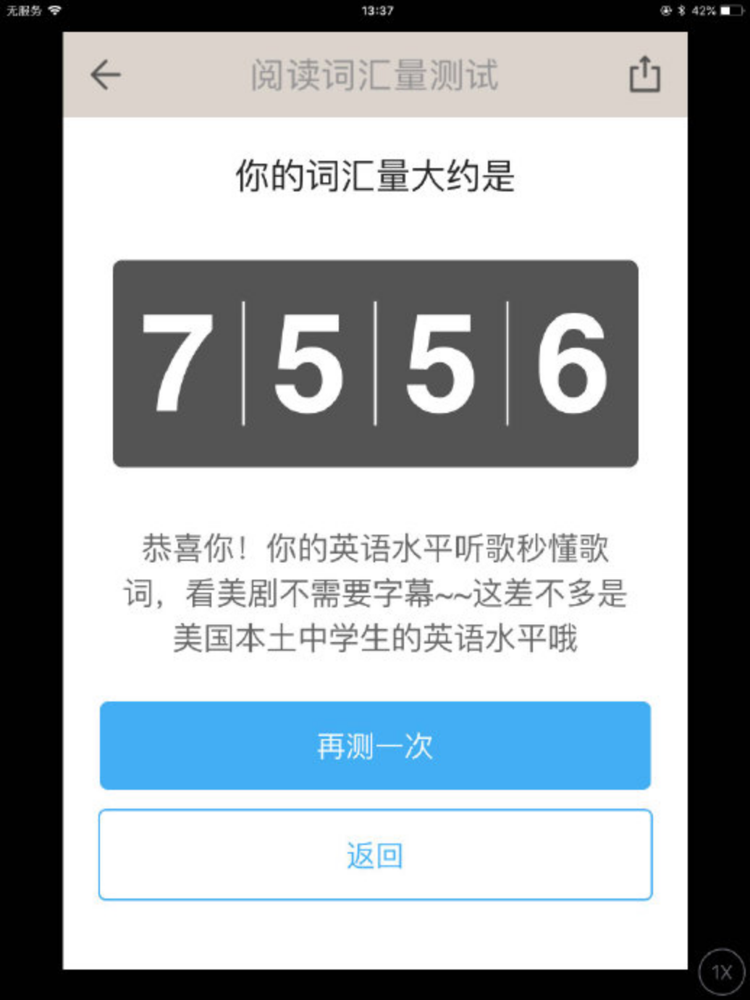
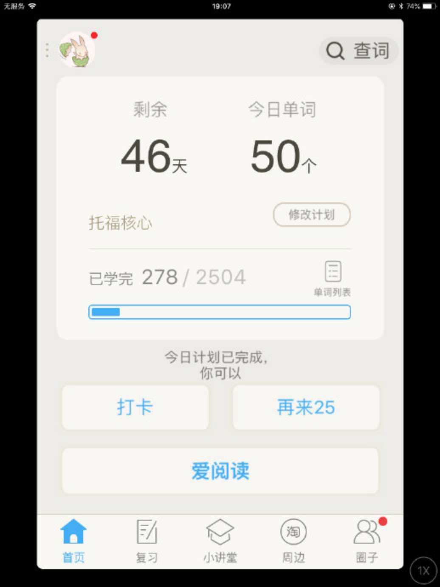

  

  

  

  

11.20 托福核心2504个单词第一轮复习结束，

  

   

  

11.9 托福核心2504个单词第一轮复习结束，

  
收藏单词第一轮复习同时结束

11.5 阅读词汇量增至10059

2018.10.20 托福核心2504学完，总计43天

2018.9.21

   

妈妈日记2018.9.16：

一直在想怎么提一提小暖的英文单词量，

因为孩子日常没有正式的学校英文语境，

我的思路一直局限在要有准确发音，要英英翻译。

上半年试了wordwisely 3000, QUIZLET，用得都不太顺。

无奈下，研究了国内群的朋友推荐的APP。

最后琐定在百词斩，极光。

试下来效果竟不错。

不知不觉，学了有一周了，过了六百多个单词。

感觉这轮下来，中文英文的书面语言理解能同时上个台阶。

真心佩服小暖，佩服她的中文！

尤其在测词汇量的时候，感觉她选得比我还快。

2018.9.16 8天

 

2018.9.10 三天

