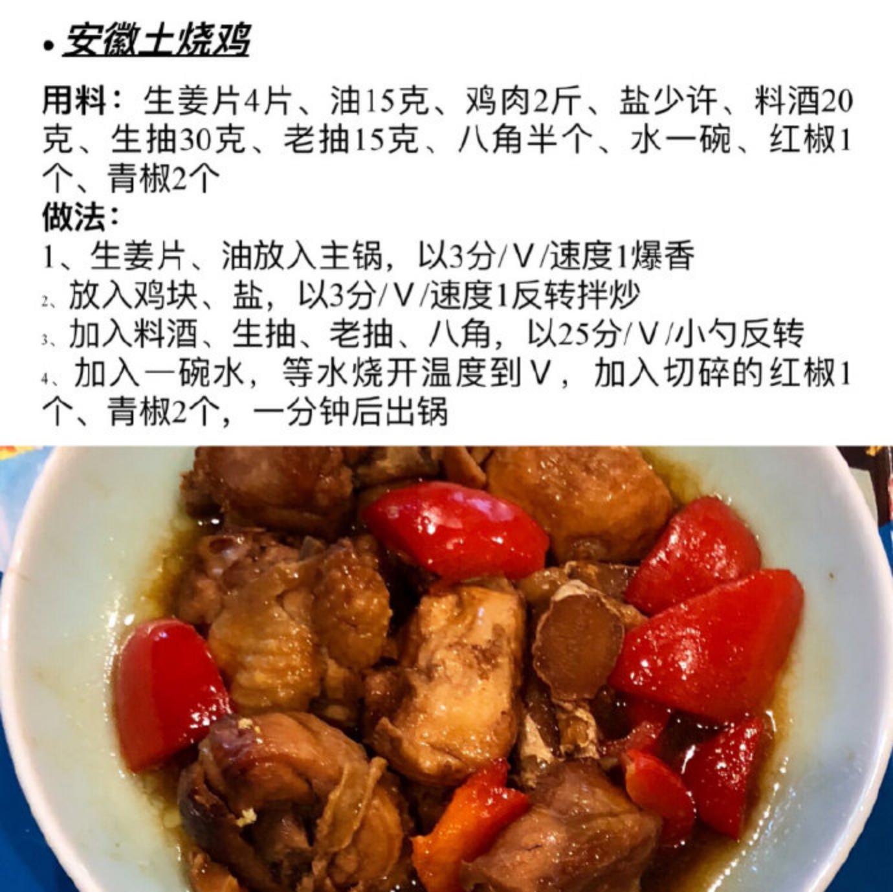
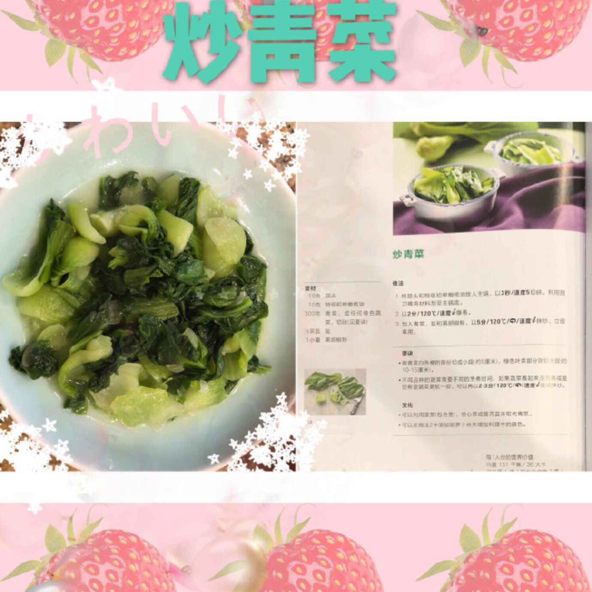
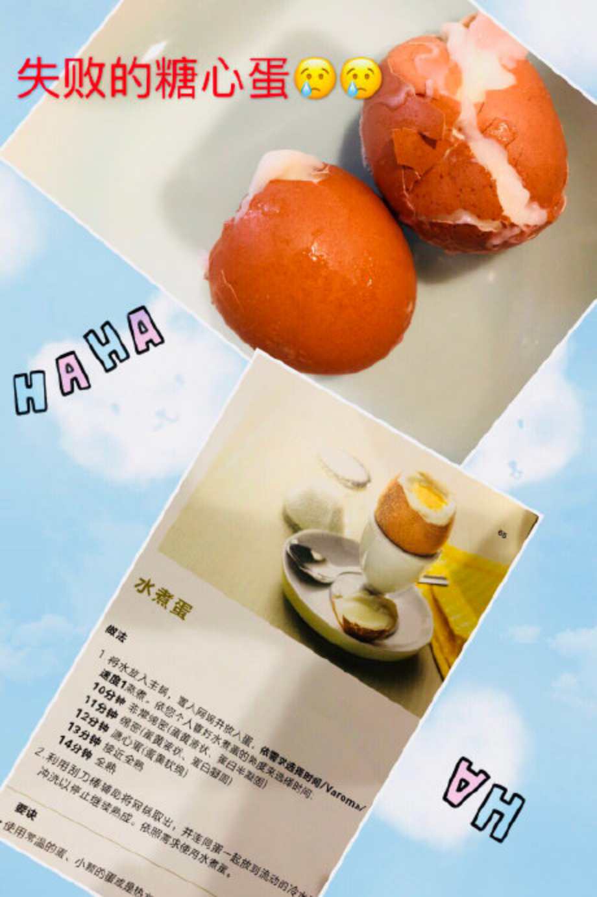

---

date: 2018-09-21 08:58:24
categories:
    - 暖暖的写意生活-life
title: 玩转“小美”EnjoyCooking
description: "Enjoy Cooking 酱油和料酒和老抽和生抽都少一半，盐不用放。 多加4勺糖 糖醋排骨：生抽老抽减半 度数360，黄油饼干配方增减： 所有减半 葱烧排骨配方增减：生抽，老抽减半，葱任意，水以后可..."
image: image_0.png
---

Enjoy Cooking 

   

  

酱油和料酒和老抽和生抽都少一半，盐不用放。

多加4勺糖

 糖醋排骨：生抽老抽减半

度数360，黄油饼干配方增减： 所有减半

葱烧排骨配方增减：生抽，老抽减半，葱任意，水以后可以加倍，油加倍

糖心蛋不能在机器里打啊，都打碎打扁了，但我是按着配方选的速度1啊 

今天有个坏消息啊，要不要听？

坏消息就是糖心蛋做失败了

今天还有个好消息啊，好消息就是一口气把失败的蛋蛋吃到肚子里去了

失败的原因找到啦：鸡蛋没有按要求放在网锅里

奶昔配方增减：草莓换成香蕉了，没放糖已经够甜了，一边放冰淇淋一边偷吃

暖暖说：妈妈，今天是大成功！最好吃的一次！

唔，这种奶昔配方放什么都好吃！

油爆虾 配方增减：盐没有放，酱油三分之二 ，可以适量再多放点水