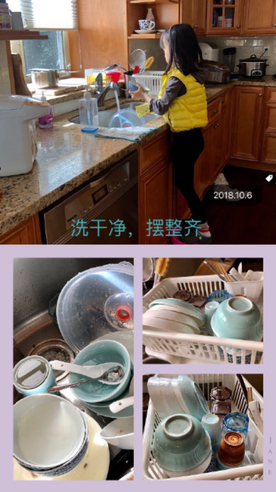
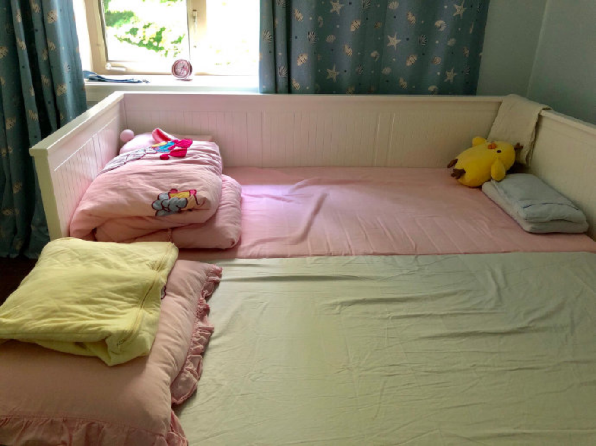
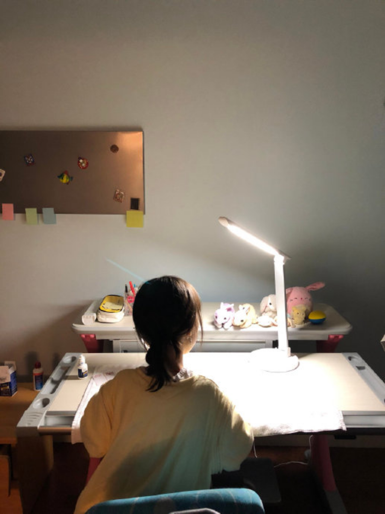
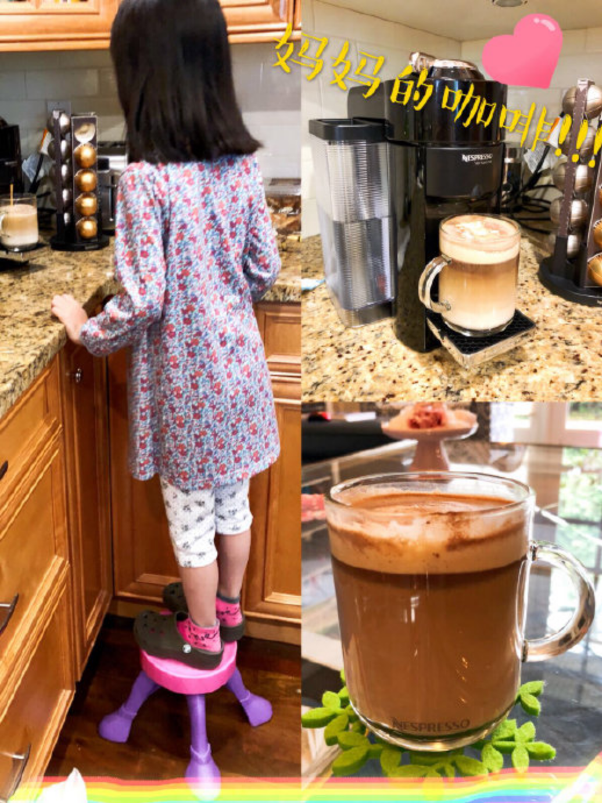

---

date: 2018-10-01 11:51:55
categories:
    - 暖暖的写意生活-life
title: 能力VS自由，学做家务学长大
description: "妈妈的话： 捧在手心里长大的小暖暖，不知不觉竟然四年级了！ 我还一直把她当低幼的小宝宝一样呵护着 时不时不经意地说：来，快，妈妈帮你穿上衣服，该上幼儿园了 妈妈和你一起洗澡，洗头，妈妈陪睡觉，妈妈来喂..."
image: image_2.png
---

妈妈的话：

捧在手心里长大的小暖暖，不知不觉竟然四年级了！

我还一直把她当低幼的小宝宝一样呵护着

时不时不经意地说：来，快，妈妈帮你穿上衣服，该上幼儿园了

妈妈和你一起洗澡，洗头，妈妈陪睡觉，妈妈来喂，。。。。。。

怎么真的就这么夸张呢？

心心小时候，我可没这么“不正常”

老了，老了，。。。。。真的是妈妈老了的缘故吗？

  

  

话说回来，该做的事做起来，永远不晚：

1 洗碗

2 洗小的衣服：内衣裤袜

3 独立在聪明机（小美）上操作做菜和点心。

4 简单地使用微波炉：红豆袋，准备早餐。

5 早上自己设闹钟起来：叠被子整床铺。

晚上睡前把第二天衣服选定放好

6 叠衣服。

7 独立完成作业。

8 遇到事情懂得思考怎么积极解决。

9 会表达自己的想法，独立表述自己

10 帮妈妈吹头发

  

10.8 小暖准备的早餐：微波炉热点心，给自己做巧克力牛奶

  

  

