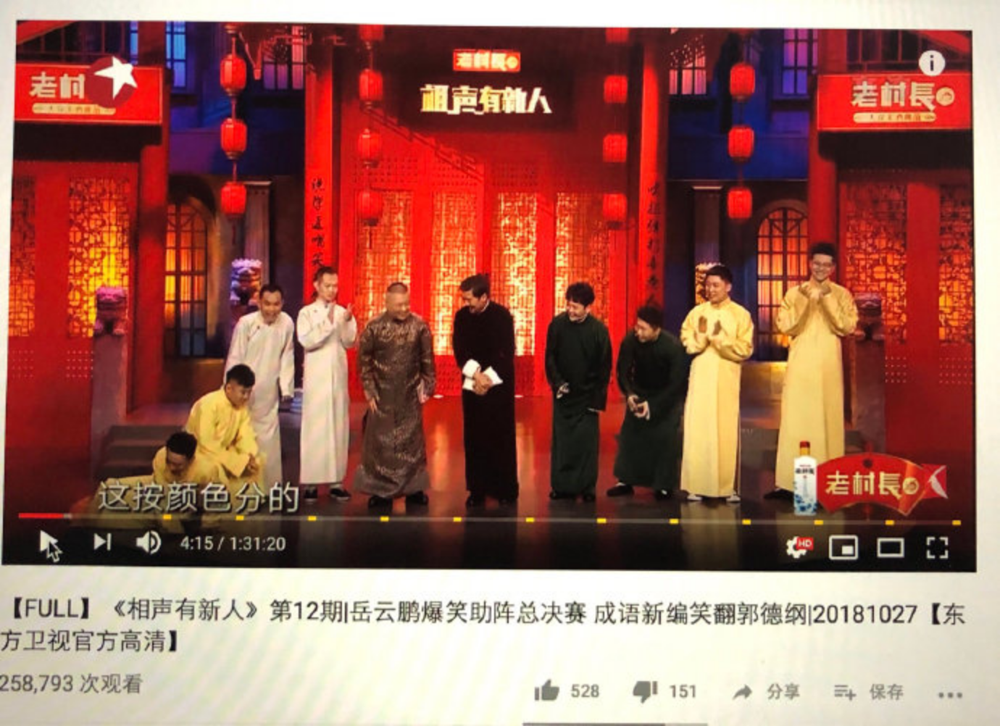

---

date: 2018-11-09 01:23:22
categories:
    - 暖暖的写意生活-life
title: 这两天看相声，笑哈哈
description: "这两天看相声，笑哈哈，小暖十二期<<相声有新人>>看下来，对相声有所了解并喜欢上了。。。。。 不仅是小暖，我这一路相伴陪看下来，也忍不住狂搜知乎：我的天呐，这季参加的哪是新人，斗得猛的多是当今相声业的..."
image: image_1.png
---

这两天看相声，笑哈哈，小暖十二期<<相声有新人>>看下来，对相声有所了解并喜欢上了。。。。。

不仅是小暖，我这一路相伴陪看下来，也忍不住狂搜知乎：我的天呐，这季参加的哪是新人，斗得猛的多是当今相声业的中流砥柱，德云社的，大逗相声的，嘻哈包袱铺的。。。。。怪不得辣么好看！同时因为比赛着意在“新”上，都是跟着赛程现编的段子，难得看相声看得都有连续剧的感觉，其间反应了相声的现状，中国传统曲艺的艰难生存之道，甚至还有相声业近年的恩怨情仇，象李寅飞落败时和郭德纲那段对话，虽然我之前从来不识李寅飞为何人，但直觉就是里面有故事，知乎一搜，果然唉https://www.zhihu.com/question/293906856。。。。。。。。怪不得辣么好看！

小暖呢，一期一期看得可带劲，到点不肯上床睡觉是经常的事，总决赛还得到爸爸的长途电话特批恩准，一口气看到凌晨一点，混了个“自然睡”，第二天迟到了一个小时上学。从中，她知道了些相声的形式，基本功，知道了郭德纲，张国立，现今一看我搜知乎，就怪笑怪叫：我要看相声，看郭德纲。。。。。。

