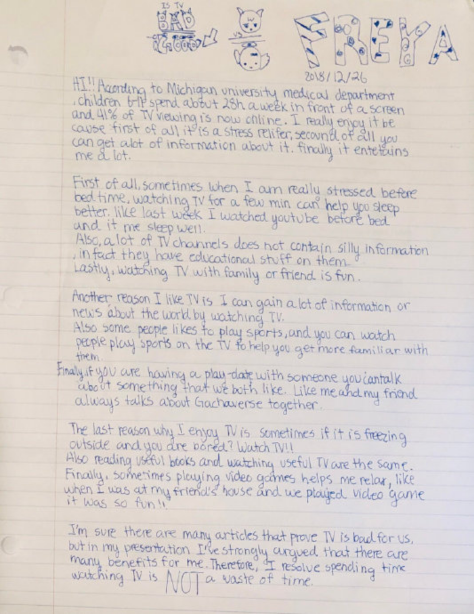
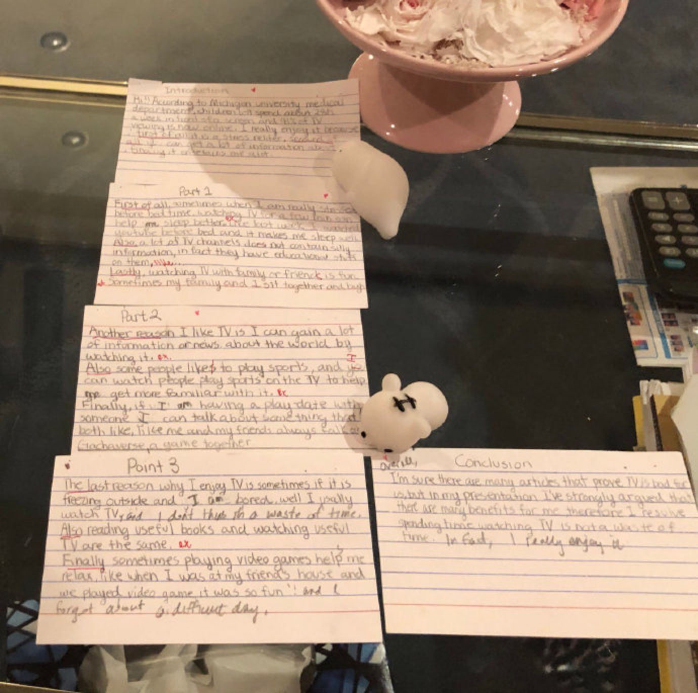
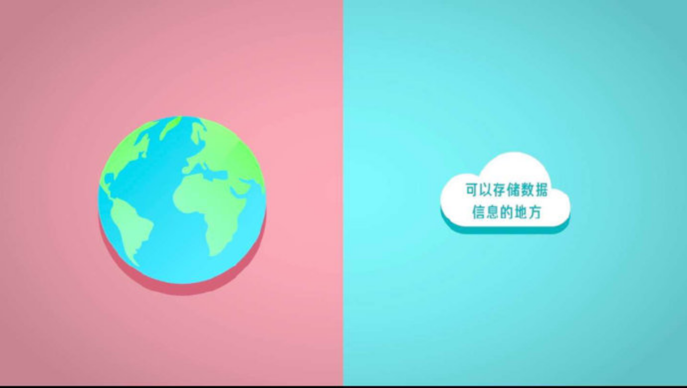
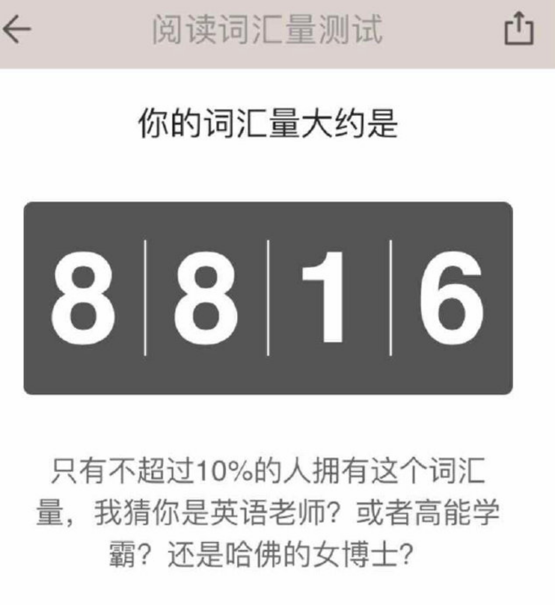
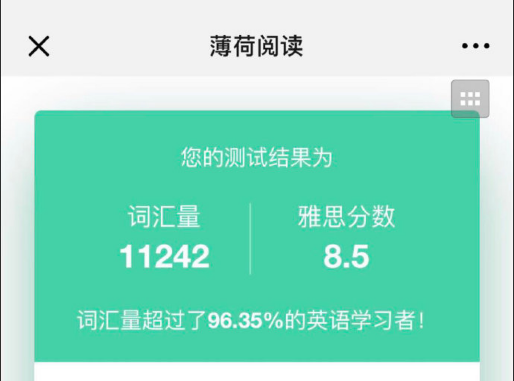

---

date: 2018-12-29 06:08:10
categories:
    - 暖暖的写意生活-life
title: 2018.12--2019.1四年级寒假生活
description: "小暖12.26—12.30 ， 报了个四天演讲辩论班 除了要写一篇ARGUE的文章，还要拿一样东西去做PRESENTATION，只听她自言自语说：我拿什么好呢？拿钱去吧，这是我每天最需要的东西。最需要..."
image: image_2.png
---

  
  

  
  

  
  

  
小暖12.26—12.30   
  
  
，   
  
  
报了个四天演讲辩论班

  
  
  
除了要写一篇ARGUE的文章，还要拿一样东西去做PRESENTATION，只听她自言自语说：我拿什么好呢？拿钱去吧，这是我每天最需要的东西。最需要，不是欲望哦。。。。。最后抱去的是一个长得象猪一样的兔子

【编程进阶E】-《云变量》开课啦

3 节课 + 两周完成

（12.28-1.11）

#在《云变量》项目中，我们的学习目标是

1、掌握在 Scratch 3.0 中，怎么创建并且使用云变量和云列表

2、了解互联网和云是什么

3、知道怎么用云变量和云列表设计一款可以联机的 Scratch 游戏云变量项目中，编程环境将升级到Scratch3.0

Scratch3.0的优点

Scratch 3.0是使用主流Web技术编写的，相比Scratch  
  
2使用的Flash具有更好的兼容性和更高的效率，同时孩子的学习体验也会更加流畅

2018.12.26测了个词汇量

  

   

