---

date: 2020-01-11 07:21:47
categories:
    - 暖暖阅读脚印-reading
tags: 
    - 英语
title: Reading Town - 2020.1.9
description: "2020.1.9ReadingTown---continuedGrade7 2020.5 老师说之后没有初中程度的书了 2020.4 3.4 2.27 小的说今天运气好，RT,---五点十五分到家，七..."
image: image_0.png
---

2020.1.9ReadingTown---continuedGrade7

2020.5

老师说之后没有初中程度的书了

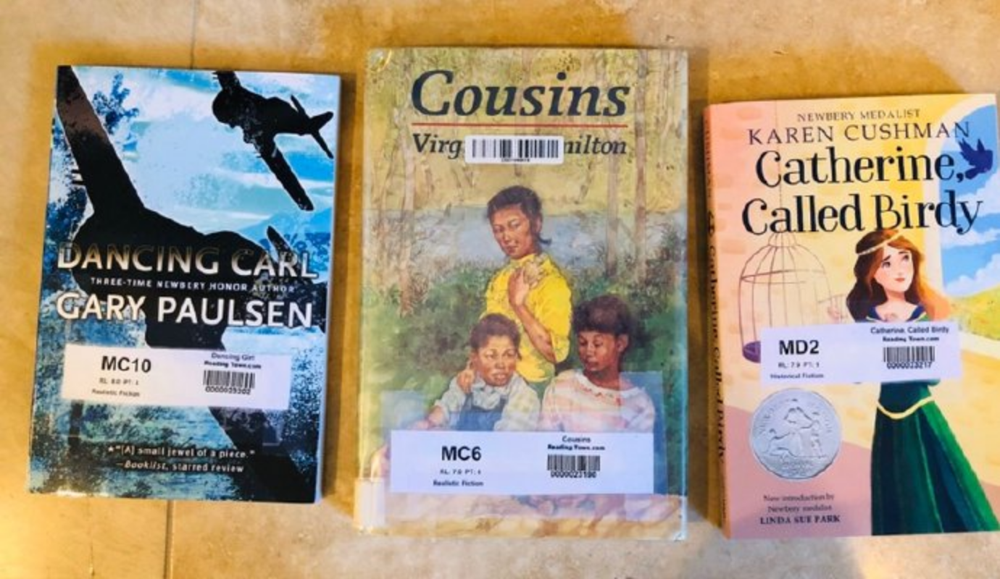

2020.4

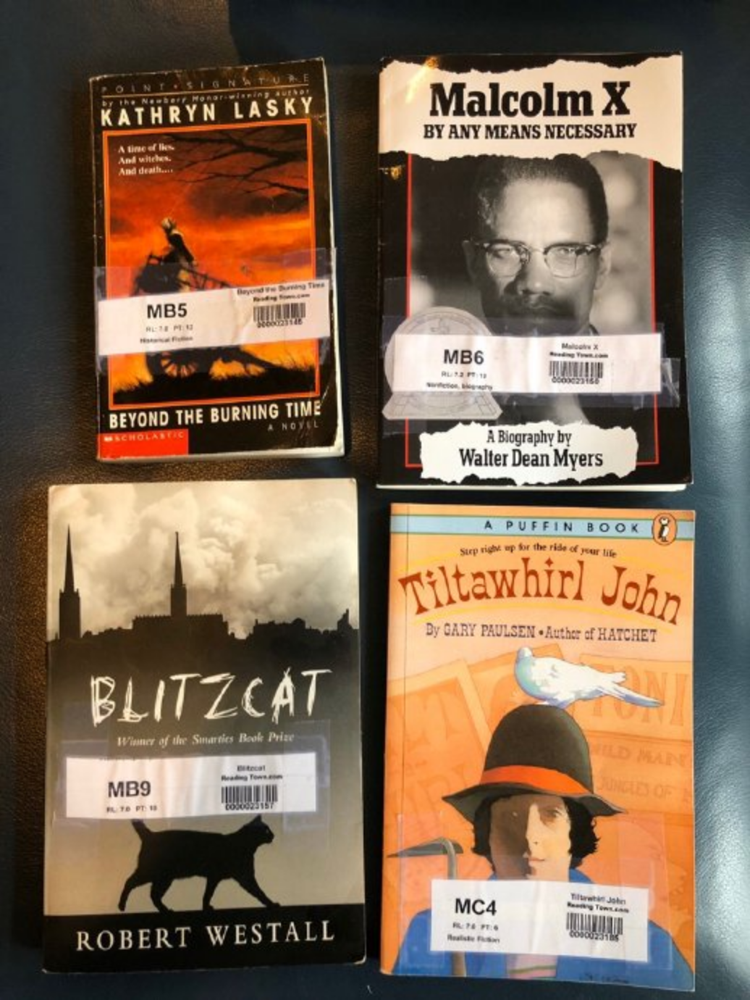

3.4

2.27

小的说今天运气好，RT,---五点十五分到家，七点半考，273页，8.4的难度，最高的一次，读了两遍，满分

2.20

RT，五点十五分回家，七点考，抛去晚饭时间，一个半小时，又一本8.0的书一次过

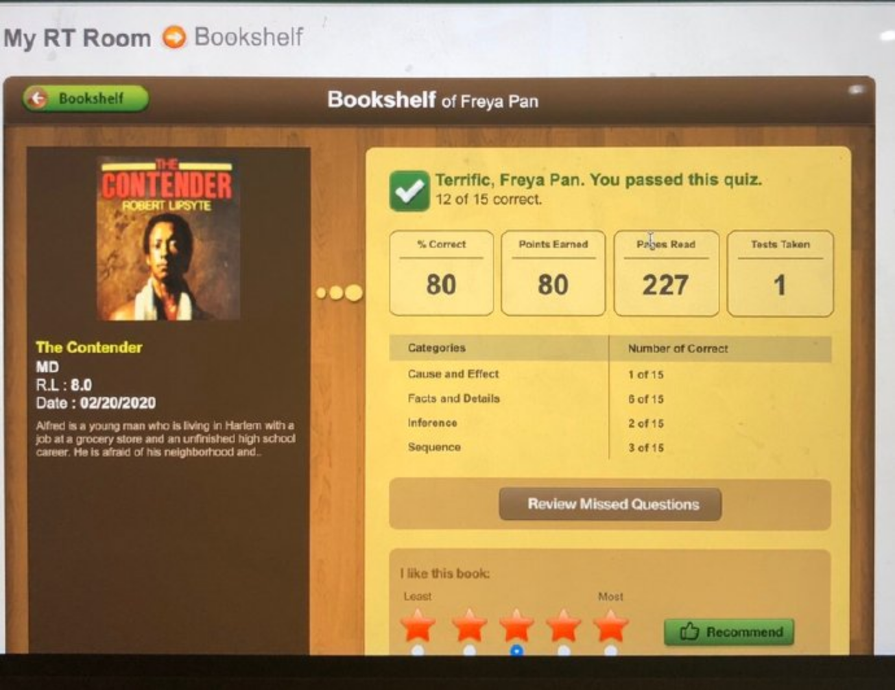

2.14

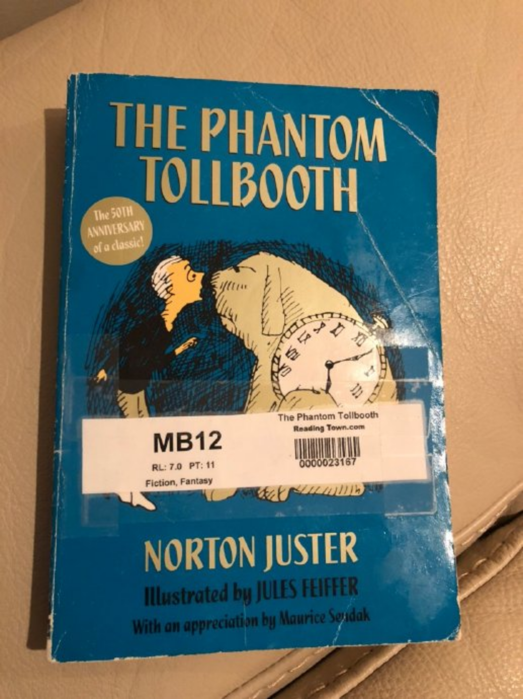

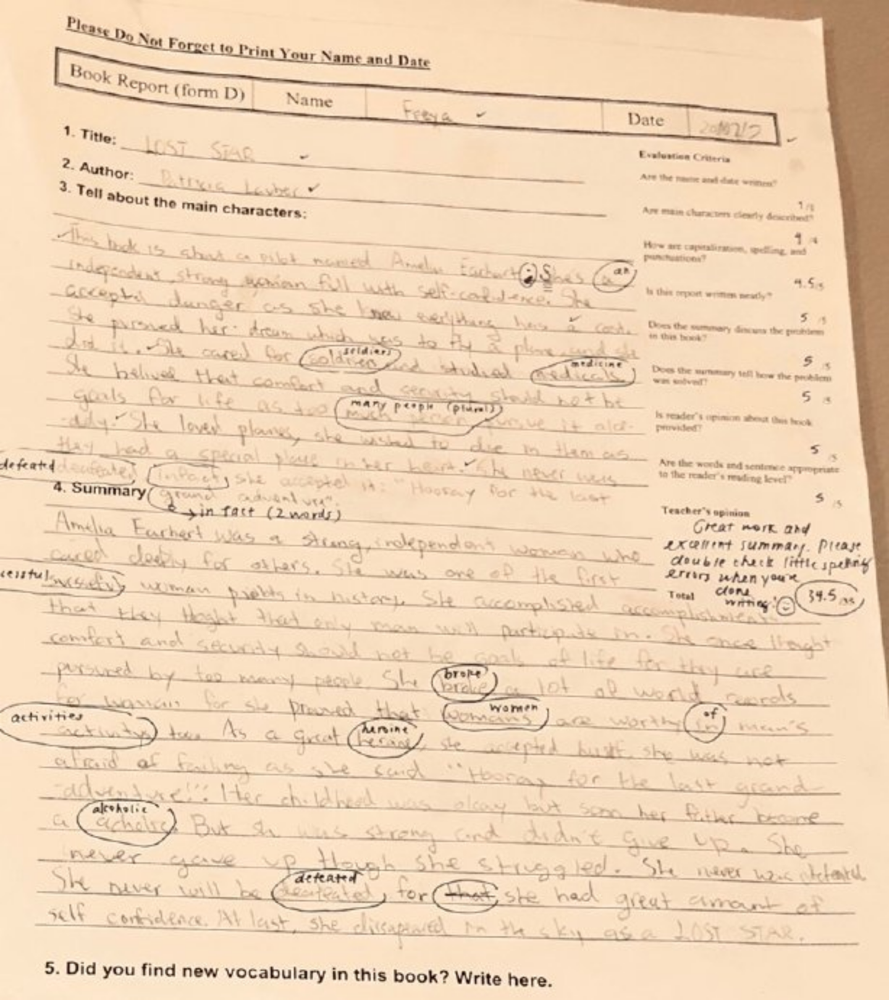

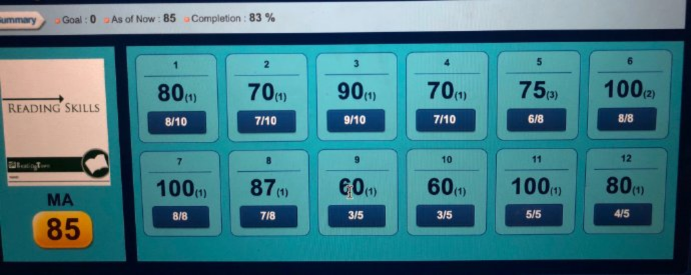

MA－七年级A的语法测试

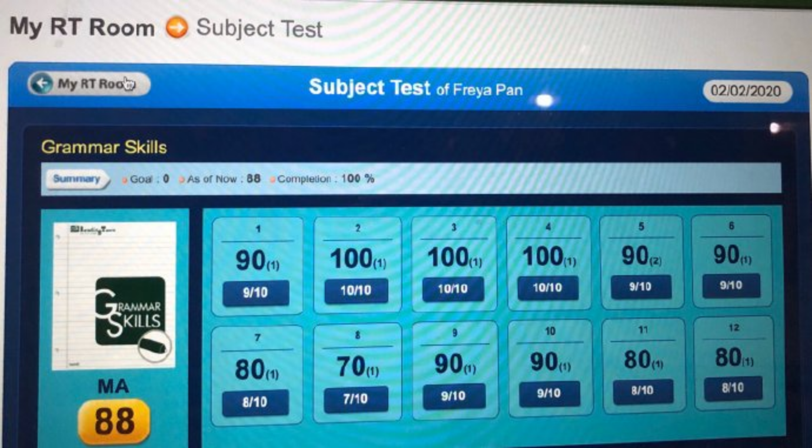

1.30

firsttimetoreadlevel8.0，书拿回来当晚，阅读一个多小时，两个小时不到，两遍！一次过！

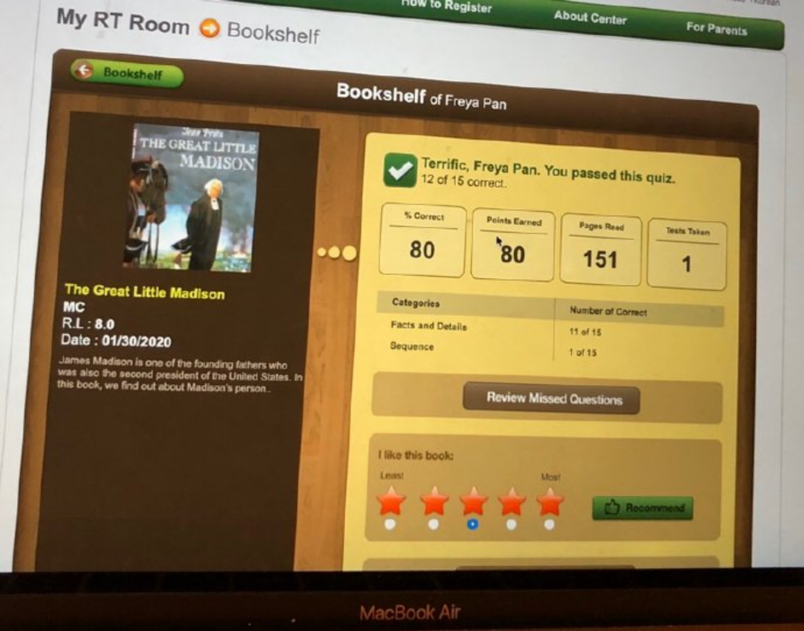

1.26.2020

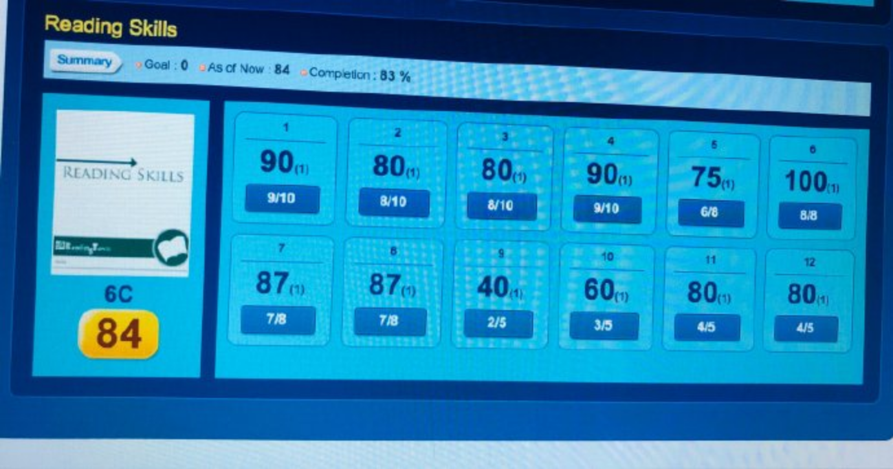

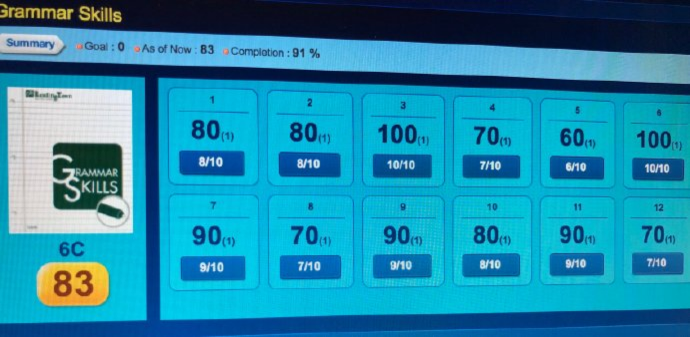

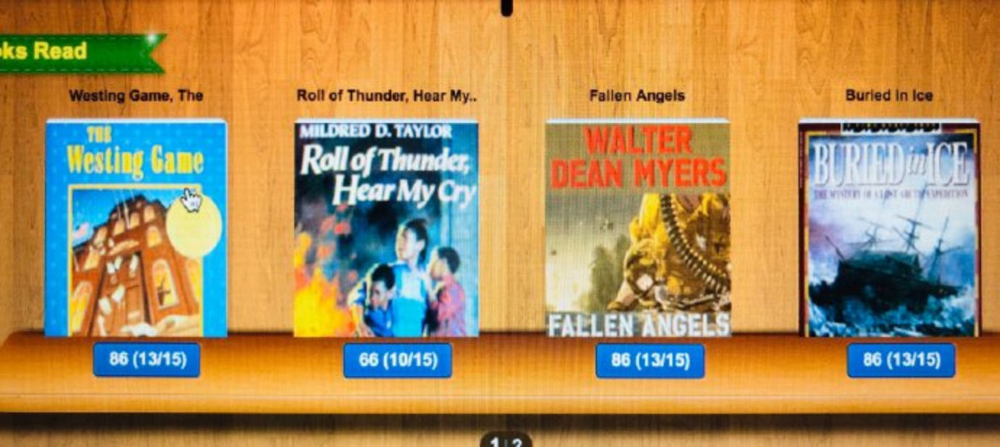

