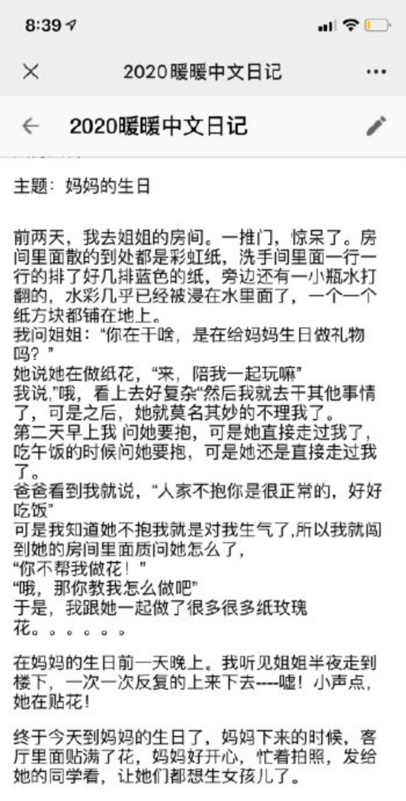
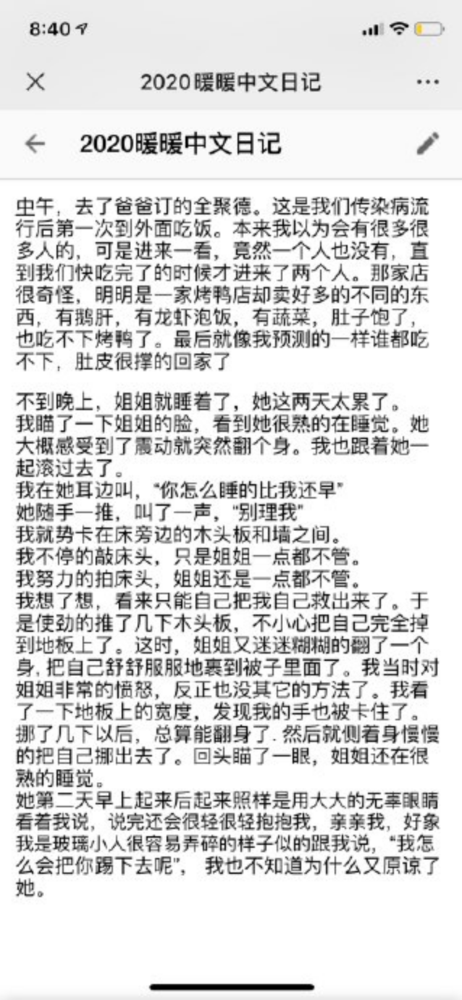

---

date: 2020-06-12 11:10:51
categories:
    - 暖暖写作空间-writing
title: 中文日记：妈妈的生日+母亲节
description: "5.16 ** ** 母亲节之前，妈妈说她很想要礼物的。姐姐给他画了一张卡，只画了我坐在一个很大的兔子上面，可是想了一下，这其实不是妈妈喜欢的而是我喜欢的。所以就擦掉了. 大概想要我帮忙，所以就跑下来..."
---

  

  

5.16

**  
**

母亲节之前，妈妈说她很想要礼物的。姐姐给他画了一张卡，只画了我坐在一个很大的兔子上面，可是想了一下，这其实不是妈妈喜欢的而是我喜欢的。所以就擦掉了.  大概想要我帮忙，所以就跑下来，问我可不可以画妈妈。

我说，“你知道我最最不喜欢画人的，可是我能做点纸花，然后再做个巧克力蛋糕”。

她说“啊，我做这些好了，你去画妈妈”。吵来吵去后，

爸爸来了，

我跟爸爸说，“你让姐姐干自己擅长的事” 

姐姐说：“你让暖暖多点信心”

最后爸爸被我们搞晕了就走了。

**  
**

姐姐说，“我们也做不了吃的，所以我们点很多外卖把！”

**  
**

最后就买了一大堆食物包括凉皮，还有做了很多很多荷包蛋。

姐姐还画了一个小女孩吊在气球上的卡。

就这样，母亲节我们一家开开心心地就吃了一天的好吃的。

妈妈说，她吃了七个荷包蛋。生日不想再吃同样的了。叫我们开动脑筋，继续努力，拿出爱心，再接再励！