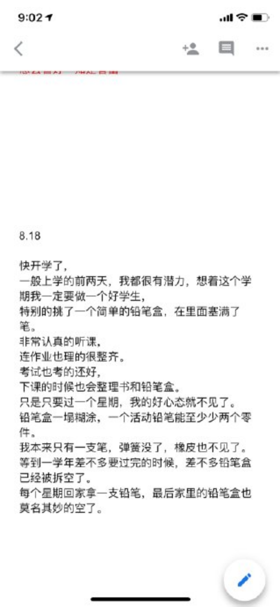
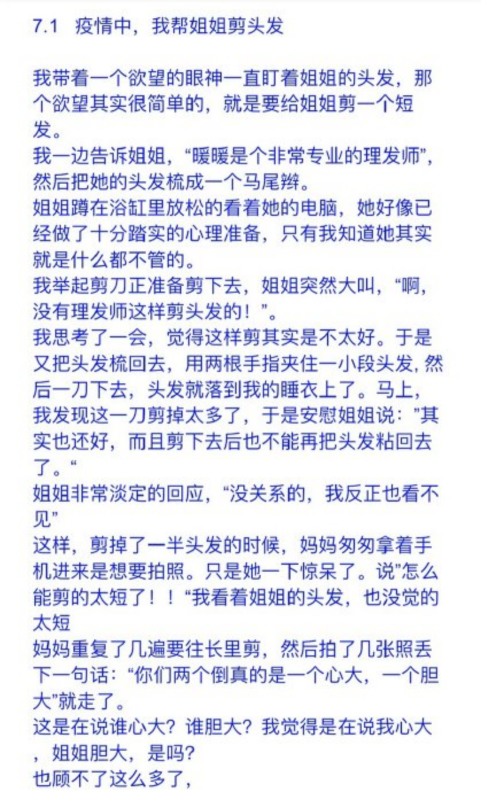
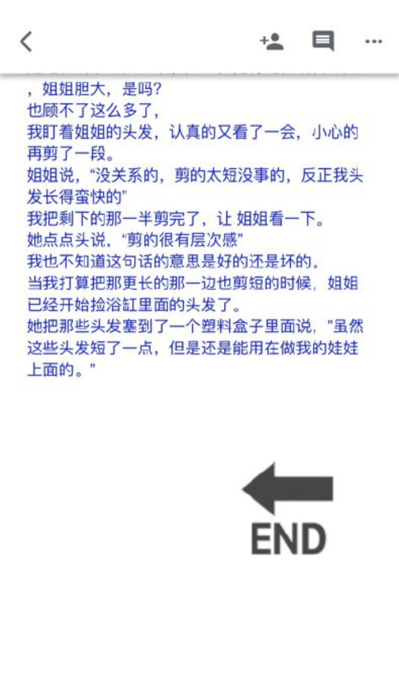
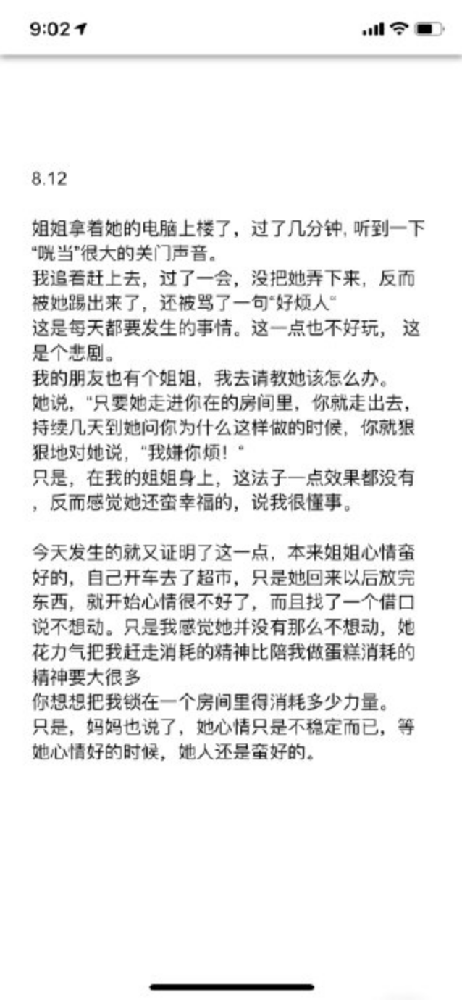

---

date: 2020-08-27 09:06:38
categories:
    - 暖暖写作空间-writing
title: 2020中文暑假日记
description: "7.29 妈妈 上画画课的时候姐姐一直在看着我，不知道为什么她特别喜欢烦我。 正好需要画手，我让姐姐帮我画。 姐姐认真的看着那个手，然后转过头来看着我说，“我真的不会画手的，你画的很好的” 也不知道姐..."
---

7.29  妈妈

  

上画画课的时候姐姐一直在看着我，不知道为什么她特别喜欢烦我。

正好需要画手，我让姐姐帮我画。

姐姐认真的看着那个手，然后转过头来看着我说，“我真的不会画手的，你画的很好的”

也不知道姐姐为什么这么会装傻，平常一点都不会演戏的人竟然怎么会装傻。

我硬抓姐姐的手，她勉强的给我画了一个手，然后很有兴致地加了好几块肉。

画完手后，姐姐觉得没事干了就不停的玩我。

只是我明明生下来不是给她玩的，像妈妈一直说的那样，生男孩子是拿来用的，生女孩子是拿来爱的，给姐姐生个妹妹，是给她爱的，给她当一辈子的最好的朋友，当闺蜜的。她好好应该听妈妈的话，好好爱我。

  

妈妈本来是个蛮好的妈妈。她现在在学佛，一直重复的对我说所有人的心里面都住了一个菩萨，只是因为被人的欲望给埋起来了，所以得把这些欲望给卸掉，用清静心供养心里的那个不爱理我的菩萨。我本来想象学佛的人肯定更善良，脾气也会好很多。只是这个人不光脾气没好很多，反而时常说自己心很静，一个人拍一下手，就会被吓一跳。然后被吓一跳的结果就是她的脾气会不好，会马上赶人。

  

看到这里，你肯定会问，世界上会有谁怎么这么讲究的呢？那个人其实是我的妈妈。前几天她很骄傲的说，“我最近打坐又有长进，我现在一坐下来就能很静”

但本来她能正常的欢欢喜喜的跟我一起看电视。现在却说她只能忍耐地陪我看电视。

大概因为有点内疚，我听到她问刘医生，“刘医生，现在我每次陪暖暖看电视，连看平常娱乐节目我都觉的好吵，更别说武侠剧了，这是什么原因呢？”

刘医生说，“很好哦，这说明你心更静了，是件好事”

“这样啊，”妈妈很开心只是看了看我，继续问刘医生，“可有没有方法减少一下看电视时或者生活中怕烦的情绪“

“这是个阶段，会过去的”刘医生的回答让妈妈很安心

因为刘医生的每句话都会让妈妈很安心

  
  

想到妈妈学佛，我还很担心她会像老子写的道德经里面说的把每个人都当刍狗。那她对我的感受就跟马路边的一个醉汉子一样了。而且学佛之后她对所有的东西都没要求了，就不能体会到我无限制的唠叨有多烦人了。

  

总而言之，学佛是件很难的事情，稍微把身体练练好就行了。

  
  
  
  
  

7.8  我的期待

  

今天饭桌上妈妈猛夸我和姐姐竟然会看着YOUTUBE发面团切面做出了面条，还相当好吃，我和姐姐听了都相当地得意，尤其这个面是我用脚踩出来的。唯有爸爸说，“你们下次应该试着做拉面，更有挑战性一点“

姐姐说，”我看过做拉面的视频，做拉面其实蛮难的，而且会弄得很不干净“

爸爸说，“一点都不难的，今天晚上我就拉个面给你看

我很好奇，“你会拉面？你拉过面吗”

“我曾经在餐厅里面，看到过人拉面“爸爸回答

“那我也看到过”

”而且我还这么聪明，最多再看一个视频就会了“爸爸听了我的话补充了一句，

我一直盯着爸爸，等他说完后说：”我会从嘴里喷火“

“喷火？你不能瞎讲的呀”爸爸依然在兴头上

“没有瞎讲，因为我在马戏团表演看过喷火”

妈妈听着又大笑，夸我聪明，反应快，表达精准

爸爸却还在他的世界里信口开河“你不能把这两样东西一起比的，喷火是有危险的，但做拉面。。。。。。“

“暖暖这是用夸张来表达”连姐姐也听出来了。姐姐早就吃完了，等不及了，开始把爸爸旁边的剩下一点点的菜抢了过去.因为现在收拾饭桌和洗碗是她的事，她想快点做完

“喂，我还没吃好呢“爸爸一边叫， 一边快速的再抓了几口菜

而他讲要做拉面的事，很快忘了。。。。。。。

我曾经很期待，爸爸的成功的拉面。

  
  
  
  
  
  
  
  

6.21

  

我的爸爸：

  
  

姐姐一到餐桌, 看到本来她盛的两碗饭一碗变多了，一碗变少了。

她马上转身看了一下爸爸，心里已经大概明白答案了，可是还是问了一声，“爸爸，怎么一碗饭多了，一碗少了。

爸爸很骄傲的说，“暖暖在长身体,得多吃一点“ ，后面还跟着补了一句, “你看，我多伟大，牺牲了自己就为了让你们吃多一点“

可是，我其实是吃不下那么多的.

我非常勉强的忍受了他的善意, 他真的是宽容心太大了，一样都不少. 加完饭以后还加菜，一边说着，“你过两年想长也不能长了，男孩最多能长到十八岁, 可是女孩子只能长到13岁, 好好珍惜这两年.”

我听说很多小孩子小时候一直背唐诗，我相信爸爸小时候就一直在背大道理。

  

客厅外，突然听见一声大叫，“暖暖，吃完饭我要看你的数学的！” 

这时，我立马开始行动,。只听见房间外一大堆噼里啪啦的门和抽屉被翻来翻去。终算找到一个合格的地方。把纸塞到一个袋子下面。

吃完饭后，他竟然不管。直到我发作业的时候，

我看他还不问就把我的数学拿出来了，他拿了一个杯子路过说，“你是我的女儿，数学对你来说应该是简单到不算是一个事“ 

我马上忽视了他这些非常自恋的观点。

因为我和姐姐都习惯了爸爸一直在显摆自己从小怎么全班最高分，虽然他明明也承认了自己小学的时候很落后的。只是他竟然能把小学的时候的落后最后发扬成正能量的优点。

  

今天，爸爸一直在抱怨我们怎么会在吃饭的时候做蛋糕

然后我不知道回应了些什么，

爸爸说，“你就像妈妈，你跟她都一样坏“

我说，“女儿都是遗传爸爸的”

他愣住了

妈妈大笑，直夸我聪明反应快

其实爸爸一般都会说我和姐姐每个好的地方都遗传他，不好的地方都是遗传妈妈，特别是遗传了妈妈的坏。