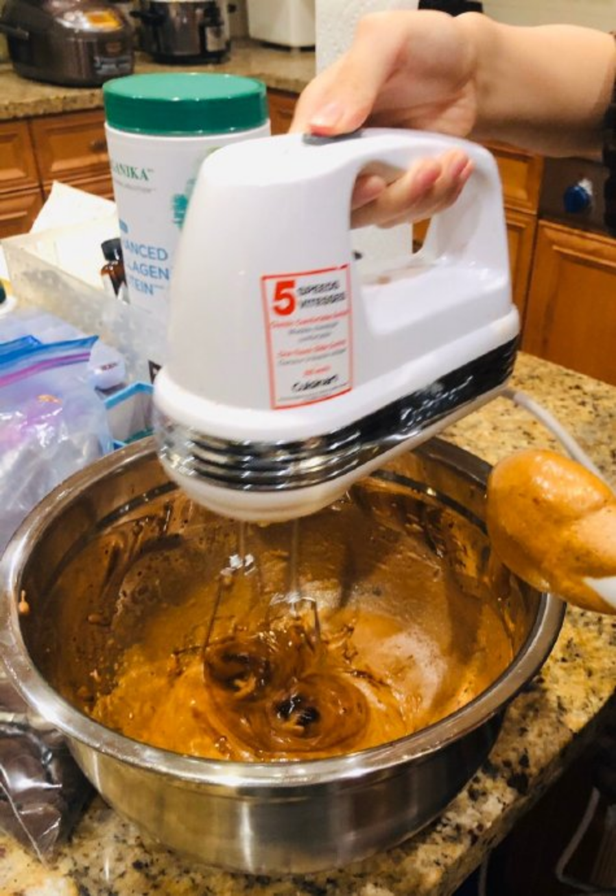
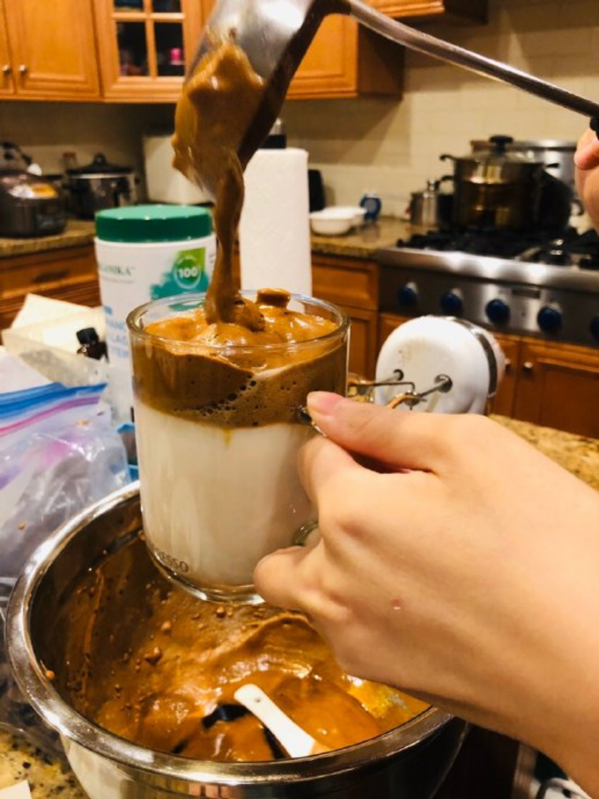
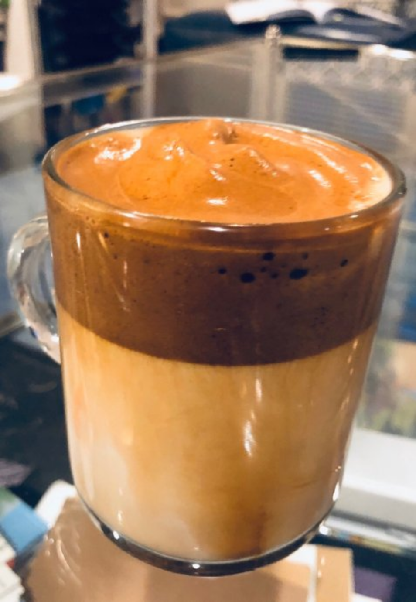

---

date: 2020-10-01 01:16:58
categories:
    - 暖暖的写意生活-life
title: Whipped Coffee
---

# Whipped Coffee

https://tasty.co/recipe/whipped-coffee

## Ingredients

for 1 serving

  * 2 tablespoons hot water(28 g)
  * 2 tablespoons sugar(24 g)
  * 2 tablespoons instant coffee powder(12 g)
  * milk, to serve
  * ice, to serve

##  Preparation

  1. Add the hot water, sugar, and instant coffee to a bowl.
  2. Either hand whisk or use an electric mixer until the mixture is fluffy and light.
  3. To serve, spoon a dollop over a cup of milk with ice in it and stir.
  4. Enjoy!

  

  

  

