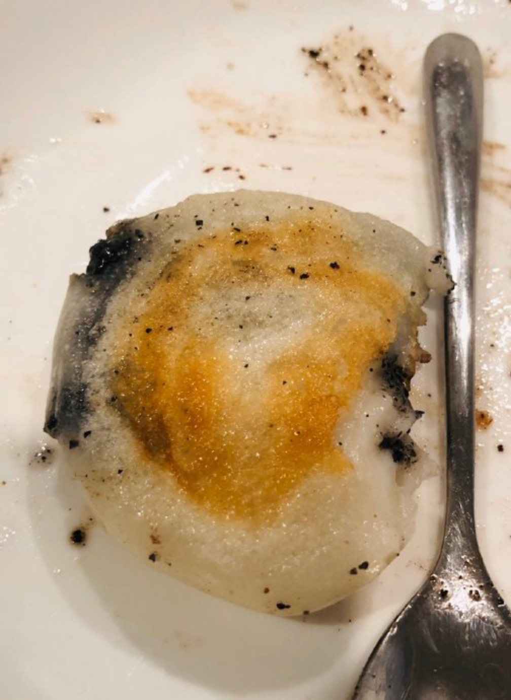

---

date: 2021-01-29 01:26:22
categories:
    - 暖暖的写意生活-life
title: 油煎黑芝麻糯米团
description: "https://www.chinasichuanfood.com/sticky-rice-cake-with-black-sesame-filling/ Sticky Rice Cake with B..."
image: image_0.png
---

https://www.chinasichuanfood.com/sticky-rice-cake-with-black-sesame-filling/

# Sticky Rice Cake with Black Sesame Filling

## Ingredients

1/4 cup black sesame filling, you can referto thispost to make your homemade version.
1 cup sticky rice flour
1/4 cup hot boiling water
1/4 cup cold water

## Instructions

Place the sticky rice flour into a large bowl, add hot boiling water in the center, only cover 1/3 to 1/2 of the flour and wait for 10 to15 minutes until the hot part is cooled.
Then pour the cold water.
Grasp to form a dough and keep kneading for couple of minutes until smooth; shape the dough into a long log so you can divide them intosimilar pieces in the following step.
Since we add boiled waterfirstly, the dough should be quite soft but not sticky.

Divide the dough into 8 similar portions.Take one piece and shapeit to a bowl carefully (tips at Note 1). Then scoop around ½teaspoon of black sesame filling into the center. Seal the ricedumpling completely. Then flat the round balls.

Grease the pan and the place the cakes in. Fry for 3-4 minutes overmedium fire until one side is golden brown. Turn over and fry foranother 2-3 minutes. Furthermore, you can stand the cakes up andfry for another 1 minute to maximize the crisp shell.