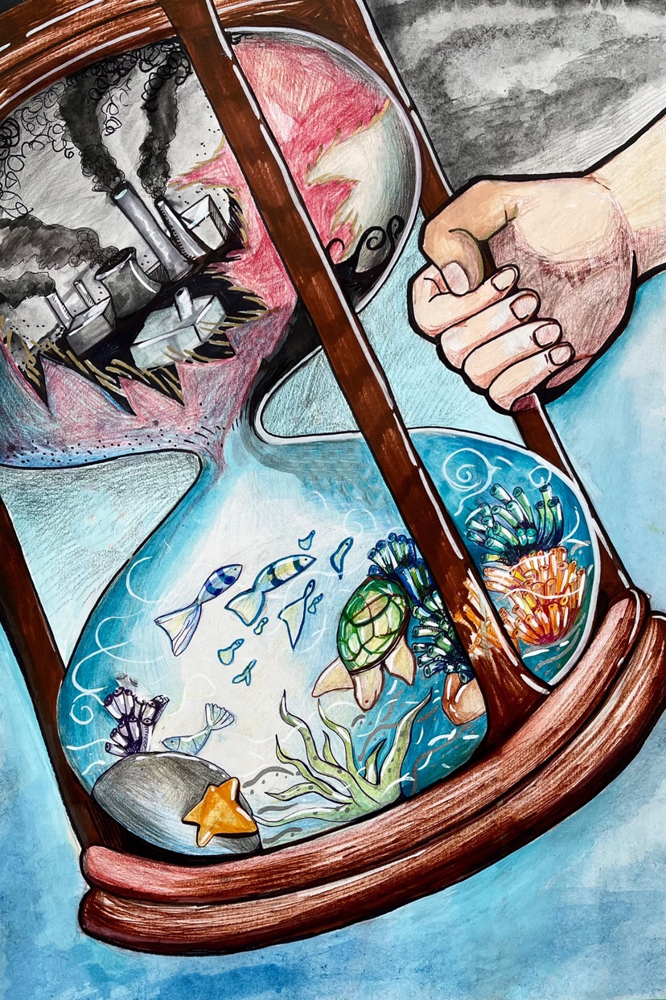

---

date: 2021-07-08 01:06:16
categories:
    - 暖暖艺术画廊-art
title: Pollution vs Purity
description: "For my drawing, I drew an hourglass with two glass bulbs. In one bulb, I drew smoke and pollution co..."
image: image_0.jpg
---

For my drawing, I drew an hourglass with two glass bulbs. In one bulb, I drew smoke and pollution coming out of factories. In the other bulb, there is clean ocean water that has not yet been polluted. Smoke is escaping out of the shattered hourglass, and pollution is slowly disappearing from our world until only the clean water remains.

Human activity and water pollution has become a threat to the oceans and to the whole planet.

With industrialization, we started to want more than we used to have. The materials we use everyday came from factories which are one of the largest contributors of water pollution.

Not only do factories dump dangerous chemicals and industrial waste into the waters, many items created in these factories aren’t made to last for long. Instead of making products more durable, companies are encouraging consumers to buy new items to replace old ones. This causes more dumping and creates more waste. Usually, the dump goes to a nearby dumping ground to degrade, but they can also find their way into rivers and into the ocean. This can cause huge harm to the ocean as many common materials such as glass, plastic, and styrofoam can take a long time to degrade. These non-degradable materials can trap animals, and animals can even swallow the plastic and suffocate.

Pollution also causes global warming, which is a dangerous threat to the environment. Due to human activity, the climate is getting hotter every year. We are cutting down forests, burning fossil fuels and a lot more. Giant icebergs are melting, which causes raising sea levels, warming oceans, and changing animal habitats.

In my painting, there is a hand holding the hourglass. We are the ones who are causing water pollution, and we are able to change it back.