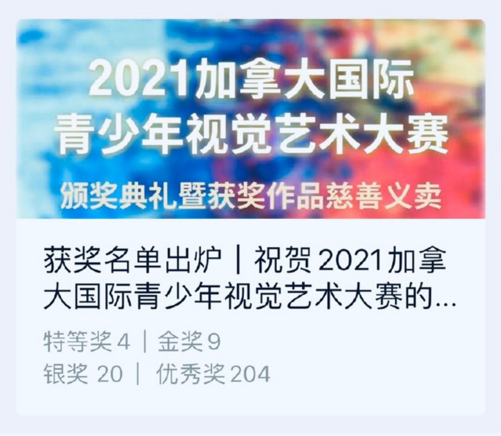
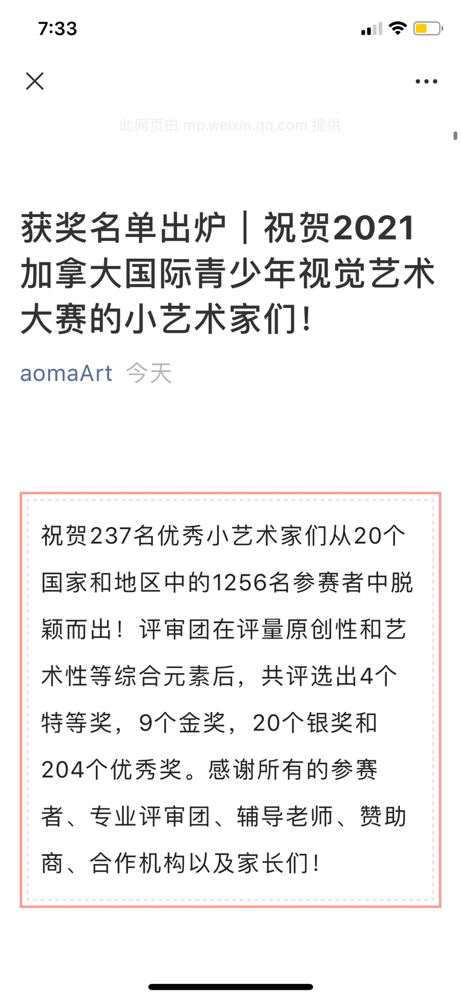
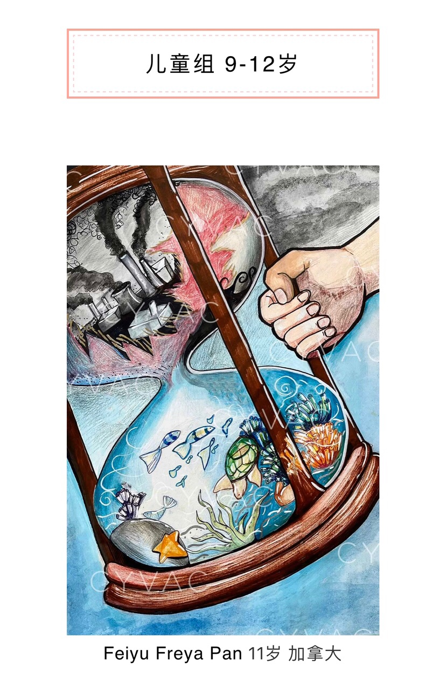

---

date: 2021-09-06 16:06:02
categories:
    - 暖暖的写意生活-life
title: Gold Prize Winner of the 2021 Canada Youth Visual Art Contest!
description: "金奖 Congratulations! We are pleased to inform you that your work has been selected as a Gold Prize Wi..."
image: image_0.png
---

## 金奖

Congratulations! We are pleased to inform you that your work has been selected as a Gold Prize Winner of the2021 Canada Youth Visual ArtContest! 

Thank you so much for your remarkable submission! The Gold Prize Winner will receive a $100 scholarship, a letter of congratulations signed by the BC Minister of State forChild Care, as well as an award certificate, and a digital catalogue. If your artwork is sold in the charity sale, you will also receive a charity donation certificate. We will announce how to claim the prize and certificates at the Award Ceremony.Please stay tuned with our social media and Email. 

Please check out this link for thefullaward recipient list through our website orWeChatPlatform.  We received 1,256 entries from 20 countries, and a total of 4 Grand Prize, 9 Gold Prize, 20 Silver Prize, and 204 Outstanding Artworks were selected. Congratulations to all the winners!

恭喜您！您的作品已获得2021加拿大国际青少年视觉艺术大赛金奖！感谢您的投稿参与！金奖的获奖者将获得奖学金加币100元或人民币500元、加拿大BC省儿童厅特别颁发的获奖贺信、获奖证书和电子版获奖作品集；在慈善义卖中售出作品的参赛者还将获得慈善捐款证书。如何领取奖金及证书，我们会在颁奖典礼上宣布。请随时关注我们的社交媒体账号以及邮件！

请前往我们的官网或微文查看完整的获奖名单。本次大赛共收到来自20个国家和地区的1256名参赛者投稿，共评选出4个特等奖，9个金奖，20个银奖和204个优秀奖。恭喜所有获奖者！

我们诚挚地邀请您参加颁奖典礼、慈善义拍以及领取奖品；请在9月8日之前回复此邮件确认是否参加颁奖典礼。

## 颁奖典礼详情：

日期：2021年9月11日（周六）

时间：晚上6:45点至9点 （北美太平洋标准时间 - 温哥华时间）

地点：Zoom （请看下面的会议号）

## Topic: 2021 CYVAC颁奖典礼暨慈善义卖

从五月征稿开始到九月十一号颁奖典礼暨线上获奖作品义卖，2021加拿大国际青少年视觉艺术大赛顺利圆满的落幕[鼓掌][鼓掌][玫瑰][玫瑰]

  

截至颁奖典礼，所有作品义卖所得加币6335+捐款网页上加币8371，大赛为联合国儿童基金会教育专项筹得善款已逾14000加币。

  

用艺术连接世界，汇聚爱心[爱心][爱心]让更多贫困地区孩子可以受到教育[愉快][愉快]

  

感谢所有的支持[抱拳][抱拳][拥抱][拥抱]感恩所有与我们一起的朋友[玫瑰][玫瑰][玫瑰][太阳][太阳][太阳]

  

这两天继续有增加来自德国小朋友的筹款小组，网站上204幅非常棒的优秀奖作品也等您去观赏和挑选[强][强][强]

  

Ins,FB,YouTube上有很多参赛者的其它作品和花絮。颁奖典礼没看现场的朋友，可以点以下链接上网了解

  

  

获奖的237幅作品是评委们化了很多时间和精力严格精心挑选出来的，名次不说明作品的差别[呲牙][呲牙]没有获奖的很多作品也非常优秀[强][强][强]希望大赛能给到参赛者鼓励和信心，还有爱和希望[烟花][烟花][爱心]
