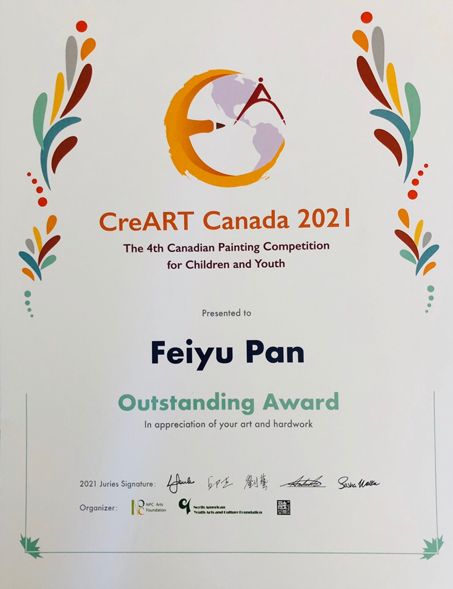

---

date: 2021-09-22 06:00:19
categories:
    - 暖暖的写意生活-life
title: "Outstanding Award: Canadian Creative Painting Competition for Children &Youth CreArt Canada 2021"
description: "“CreArt Canada 2021 Canadian Creative Painting Competition for Children & Youth” sponsored by the NP..."
image: image_0.jpg
---

“CreArt Canada 2021 Canadian Creative Painting Competition for Children & Youth” sponsored by the NPC Art Foundation officially started in March 2021. The call for entries was closed on June 15th, and the award ceremony will be held on September 19th.

由NPC艺术基金会主办的「CreArt Canada 2021 加拿大青少年创意绘画大赛」于今年三月正式拉开序幕，6月15日截止作品征集，颁奖典礼将于9月19日举行。

  

CreArt Canada 2021，加拿大青少年创意绘画大赛， FREYA 获了优胜奖。

  

  

#  CCanadian Creative Painting Competition for Children & YouthCreArt Canada 2021

Canadian Creative Painting Competition for Children & Youth

2021 Painting Competition

Topic: My 2020

Online Registration: March 15 ~ June 15, 2021.

我的2020

  

2020 passed by so quickly, however what happened in year 2020 is still vivid. 

During the coronavirus period, some of you might memorize the peaceful moment while you stayed at home with your family. Some students might experienced their first online class of their entire life. Some people might escape into the mother nature to enjoy a second of fresh air. Meanwhile, there are people who see the medical workers form daily news, and couldn’t forget about their strong spirit of fighting for patients’ life. You can choose to use your brush to record these marvellous memories. 

Forest fire took away many lives from mother earth, people around world were praying for them. You can use your creativity to paint down your little wishes, and tell people to love earth, protect lives, so we may build a brighter future for our homeland together.

There were numerous things occurred in year 2020, forest fire, flood, Covid-19, everyone’s heart was filled with different memories, what was your story among all those events? You’re welcome to hold a paintbrush in your hand, to draw, to paint, to picture your own words, and your memories. Let the beautiful  stories converge from here. 

  

  

#